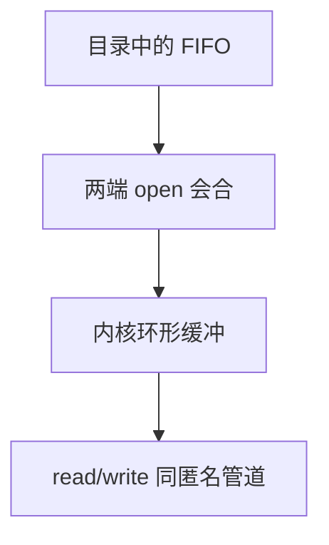

# 命名管道

FIFO 把管道这种内核缓冲挂进目录：无亲缘进程也可以用路径打开同一条字节流。

<footer>—— 据 POSIX FIFO；Stevens, UNIX Network Programming；Bach 整理</footer>

[上一课](/cs/ipc-pipe)的匿名管道只靠继承描述符。[inode 与目录](/cs/inode-dir) 已能表示特殊文件。[文件表](/cs/file-table) 对 FIFO 与普通文件共用 fd。缺口是 **命名**：`mkfifo` 创建目录项，两端 `open` 会合，缓冲仍在内核，不经磁盘文件内容。

## 问题

无亲缘的两个作业要对齐字节流，匿名 `pipe()` 做不到。若改用真正文件，要自己做轮询与截断。FIFO：inode 类型是管道，没有数据块指针；`open` 读端/写端在对方出现前可阻塞（除非 `O_NONBLOCK`）。缺口不是新的调度睡眠，而是路径与会合语义。权限用上一单元的模式位。

本课不把 System V `msgget` 当 FIFO 的另一种名字讲完。

两端都关闭后缓冲丢弃。名字仍在目录里，可再打开。这与普通文件「内容还在盘上」不同。

## 方法

`mkfifo(path, mode)`：VFS 创建 FIFO inode。进程 A `open` 读、B `open` 写，内核把它们接到同一环形缓冲，此后 `read`/`write` 与匿名管道相同，包括 `SIGPIPE`。[路径查找](/cs/path-lookup) 与 dcache 照常。不要把 FIFO 写到交换区当文件页——数据只在内存缓冲。

## 机制

命名管道把 IPC 接到文件系统命名空间，让 shell 重定向与无关进程共用同一抽象。它仍是单向字节流，无消息边界（除非用户自己定）。下一课 Unix 域套接字会补双向、数据报与传描述符。本课只补「有路径的管道」。

阻塞会合把调度再请进来：写者未出现则读者睡。

## 边界

本课不引入 Linux 特有的 `O_DIRECT` 对 FIFO 的限制表。不保证原子写长度与匿名管道完全相同的每一个边界情况，教学上同一 POSIX 规则。下一课需要记录边界、双向、以及凭据。

后课默认：无亲缘进程可用路径会合字节流。更丰富的本地套接字，下一课 Unix 域。

## 小结

- FIFO 是挂在目录上的管道，open 会合。
- 数据在内核缓冲，不在文件块。
- 双向与传 fd 是 Unix 域套接字的缺口。
- 出处：POSIX FIFO；Stevens, *UNP*；Bach, *UNIX*。
