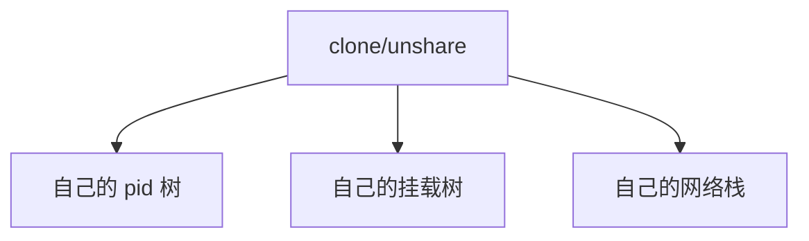

# namespaces

命名空间让一组进程看见自己的 pid、挂载树、网络栈、IPC、UTS 名和用户 id 映射，而不是全局那一份。

<footer>—— 据 Linux namespaces 文档；POSIX 未规定的 Linux 扩展，以内核文档为准</footer>

[上一课](/cs/init-userspace)的 pid 1 是全局的。[挂载](/cs/mount-super) 的树也是全局的。容器想「像一台机」又不跑第二次内核。缺口是 **namespaces**：隔离的是名字与视图，不是 CPU 时间配额（那是 cgroup）。本课合并六类常用空间，不当六篇词条。

## 问题

`chroot` 只改路径起点，pid 与网络仍全局。缺口：`clone`/`unshare` 带 `CLONE_NEWPID` 等标志，子进程成为该空间的 pid 1，看不见外面的进程表；`CLONE_NEWNS` 得到挂载副本；`CLONE_NEWNET` 有自己的网卡与回环；UTS 改 hostname；IPC 隔离 System V/POSIX 对象；user 命名空间映射容器内 uid 0 到外层非特权——机制课只讲映射存在，不讲如何打穿。

setns 加入已有空间。打开 `/proc/pid/ns/*` 可引用。本课不写逃逸步骤。

## 方法

创建容器：先 user（若需要），再 pid/mnt/net 等，在新 pid 空间 exec 一个 init。该 init 只 wait 自己空间的孩子。挂载空间里可以有独立的 `/proc`，否则 pid 视图与 proc 不一致。与 [文件表](/cs/file-table) 对照：fd 仍可在某些操作中指向外层对象，能力边界由实现规定，主干不展开利用。

## 机制

命名空间把「全局内核表格」变成每组进程一份视图，让 [VFS](/cs/vfs) 查找、`kill` 的 pid、`bind` 的端口号重新解释。内核仍是一份，特权环未变。这与虚拟机不同：没有第二套页表根给「客内核」。user ns 降低了「容器内 root」对外层的含义，安全课会再收。

## 边界

本课不引入 time 命名空间的全部细节。不保证所有资源都有命名空间（如某些设备号）。下一课：视图隔离不解 CPU/内存/IO 争用，需要分组记账与限制。

后课默认：名字可以按组切开。CPU 与内存配额，下一课 cgroups。

## 小结

- namespaces 隔离 pid、挂载、网络等视图，内核仍一份。
- 容器内 pid 1 只覆盖该空间。
- 资源限制是 cgroup 的缺口。
- 出处：Linux `namespaces(7)`；Love 之后的内核文档；Tanenbaum *MOS* 对容器的讨论。
