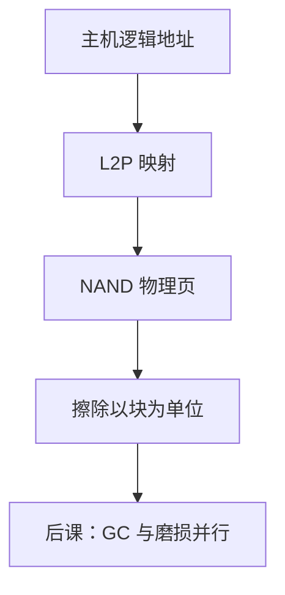

# NAND 闪存与 FTL

  
NAND 按页编程、按块擦除，不能原地改一个扇区；闪存转换层把逻辑块地址骗成「可覆盖的磁盘」，底下做重映射。

  <footer>—— 据 Harris and Harris, Digital Design and Computer Architecture；Patterson and Hennessy, Computer Organization and Design (RISC-V)；Open NAND Flash Interface 实践 整理</footer>

[上一课](/cs/nvm-persistent)的字节持久仍少见。[闪存对照](/cs/flash-memory)已区分 NOR/NAND 角色。缺口是 **FTL**（flash translation layer）：主机看见 512B/4KiB 逻辑块，NAND 看见页与擦除块，中间这层表如何维护。

## 问题

写页前若块内已有数据，通常不能覆盖：要写到新物理页，旧页标无效，逻辑地址改指新页。块满了再擦除，须先把有效页搬走。缺口不是再讲浮栅，而是这张 **L2P 映射**（页级、块级或混合）以及掉电时映射本身也要持久。

ONFI/Toggle 是颗粒接口；SSD 控制器跑 FTL，主机走 NVMe/SATA——协议在 PCIe 课后。本课钉介质+FTL。

### FTL 不是文件系统

文件系统也做日志与地址映射，但对象是文件与 inode。FTL 对主机呈现一块平板磁盘。两者叠床架屋（日志文件系统 + FTL）会放大写放大。把 FTL 当 ext4，内核块层职责会错。

Harris 与 Patterson/Hennessy 把闪存当存储层次底层。FTL 是 SSD 教材与厂商实践的核心。本课不抄某开源 FTL 源码结构当标准。

## 方法

读：查 L2P，向 NAND 发页读（可能多 plane）。写：分配空页、编程、更新 L2P、旧页无效。垃圾回收与磨损在下一课。映射表太大则分级，热页在 SRAM，冷页在 NAND——掉电用超级块日志恢复。

ECC：NAND 原始误码率高，页内强 ECC（BCH/LDPC），与 DRAM SECDED 强度不同，仍属[软错误](/cs/soft-error-ecc)家族的介质版。

## 机制

SSD 内部并行（多 die、plane）让 FTL 把用户写打到不同通道，类似 DRAM 通道但擦除约束不同。持久内存的字节语义在此不提供。磁盘几何课会对照：HDD 可原地覆盖扇区，无 FTL。

## 边界

本课不讲 3D NAND 字线工艺，不把 TLC/QLC 电压阈值当光刻课。不写加密盘的密钥槽细节（可点名存在）。

后课默认：NAND 不能原地覆盖；FTL 把 LBA 映到物理页并留下无效页给 GC。

## 小结

- NAND：页写块擦；FTL 提供可覆盖的逻辑磁盘。
- L2P 自身要可恢复；与文件系统叠层会写放大。
- 下一课并行、回收与磨损。
- 出处：Harris and Harris；Patterson and Hennessy, COD；ONFI 实践。
