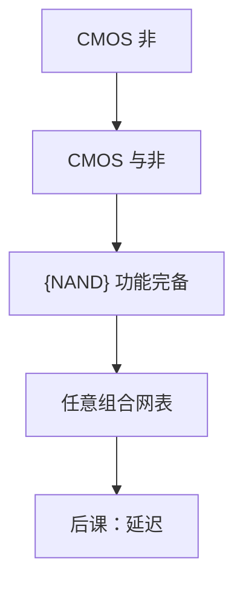
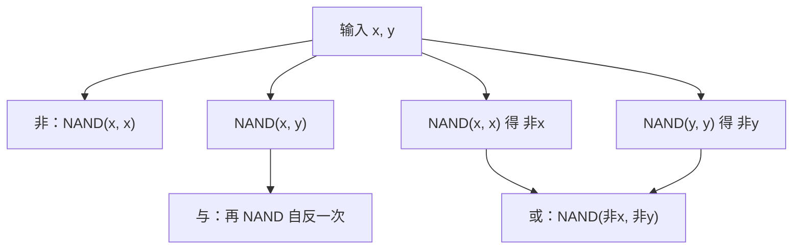

# 与或非与万能门

与非单独就能拼出与、或、非；因此一片只烧与非的阵列在功能上已经完备。

<footer>—— 据 Harris and Harris, Digital Design and Computer Architecture；Shannon, 1938 整理</footer>

上一课[CMOS 反相器](/cs/cmos-inverter)钉死了非的硅实现。本课不重画转移曲线，也不从布尔公理再证一遍交换律。[布尔代数](/cs/boolean-algebra)已有与或非；缺口是：**哪些门集合能实现全部布尔函数**，以及 CMOS 上与非为何是自然的万能门。

## 问题

反相器只有一输入。任意 $n$ 元函数需要能表达与、或、非中的全体——布尔课已证三者完备。缺口是实现：CMOS 把串联 nMOS、并联 pMOS 做成与非，对偶做成或非，比「与再加非」少一级。NAND（或 NOR）单独完备：$\bar x = x\,\mathrm{NAND}\,x$，与、或由此拼出。

术语翻译：「功能完备」就是一套门能拼出全部布尔函数，不多不少。全用 NAND 拼三种基本门的口诀只有三句——非：两端接同一个输入；与：先 NAND 一次再自反一次；或：把两个输入各自先取反，再做 NAND（这正是 De Morgan 律搬到器件上）。

本课只钉功能完备与 CMOS 复合物。延迟、负载在后面的[组合逻辑时延](/cs/gate-delay)一课展开。AOI 复合门点到为止。

### 万能不是「延迟最短」

NAND 万能指功能，不指时序最优。全用 NAND 的网表往往更深。后课综合会混用。把「FPGA 基本单元」提前成 NAND 也不对：LUT 是另一层，本课不讲可编程结构。

Harris 给出 CMOS NAND/NOR 的管级串联并联。De Morgan 在器件上就是把气泡挪到另一边。本课不把晶体管尺寸比写成模拟作业。

## 方法

CMOS NAND2：两个 nMOS 串联接地，两个 pMOS 并联上拉。输出低仅当两输入都高。NOR 对偶。用 NAND 构造 NOT、AND、OR 的等式按布尔课改写，不再列公理。

```mermaid
flowchart TD
  INV["CMOS 非"] --> NAND["CMOS 与非"]
  NAND --> UNIV["{NAND} 功能完备"]
  UNIV --> NET["任意组合网表"]
  NET --> LATER["后课：延迟"]
```

## 机制

有了万能门，任意规范 SOP 都能映射成门网：与项用 NAND-NAND 或 AND-OR。PLA、标准单元库以 NAND/NOR/AOI 为砖。纠错码的异或是与或非的组合，本课不把门级 XOR 展开成晶体管数竞赛。

数字实例：用与非拼二输入与门要 2 个门、6 只晶体管（NAND 4 管 + 反相器 2 管），比直接做与门还多——那为什么工厂偏爱 NAND？因为它的 CMOS 结构最自然（nMOS 串联、pMOS 并联），且单一门种就能实现一切电路，单元库与流水线都更简单。

扇入增大则串联堆叠变慢、噪声容限变差，这是延迟课的入口；本课只承认堆叠合法。

常见误区：初学者把「万能」理解成「最快」或「最省」。全 NAND 的网表逻辑级数往往更深、延迟更大，实际综合器会混用门；「功能完备」也不等于「图灵完备」——这里没有状态、没有存储，只谈组合函数能不能拼出来。

```mermaid
flowchart TD
  XY["输入 x, y"] --> NOT["非：NAND(x, x)"]
  XY --> S1["NAND(x, y)"]
  S1 --> AND["与：再 NAND 自反一次"]
  XY --> IX["NAND(x, x) 得 非x"]
  XY --> IY["NAND(y, y) 得 非y"]
  IX --> OR["或：NAND(非x, 非y)"]
  IY --> OR
```

## 边界

本课不引入传输管逻辑、多米诺动态逻辑。不把功能完备与图灵完备混名：这里没有状态、没有无限带。时钟仍未出现。

后课默认：组合功能可全用 NAND 或全用 NOR 实现；CMOS 静态门是互补上拉下拉网络。

## 小结

- CMOS 与非/或非是互补串并联；NAND 或 NOR 单独万能。
- 万能是功能完备，不是延迟或面积最优。
- 任意布尔函数可落地为门网；代价由后课时延计量。
- 出处：Harris and Harris；Shannon, 1938。
