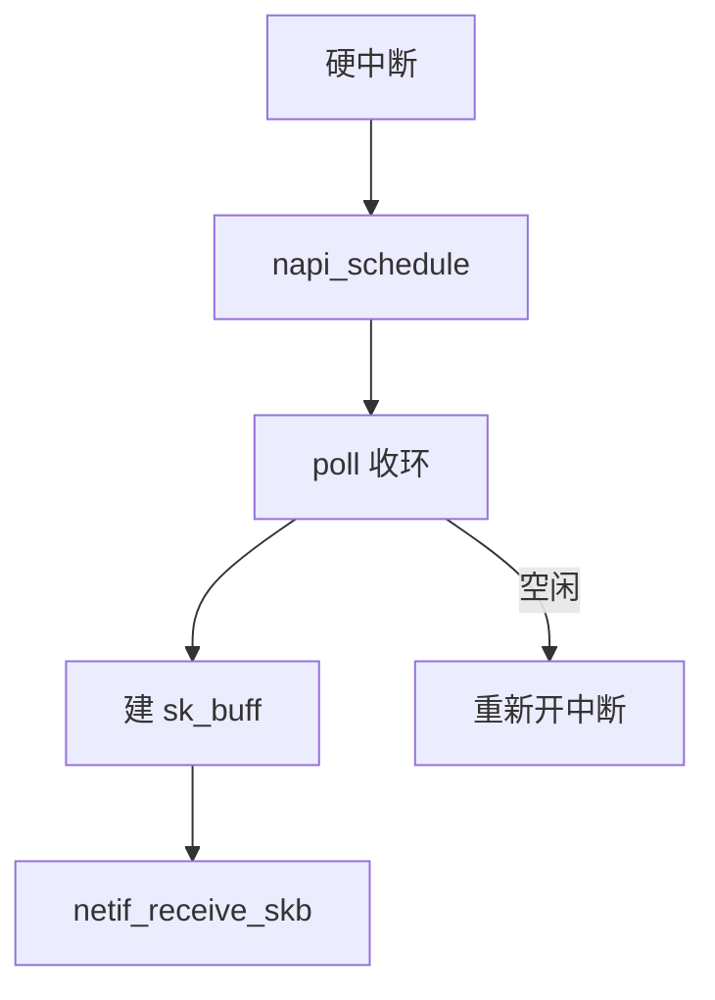

# 网卡驱动与 NAPI

NAPI 在第一包用中断叫醒，随后关中断、在软中断里轮询收包，直到配额用尽或队列空再开中断。

<footer>—— 据 Salim, Olsson, Kuznetsov, Beyond Softnet；Linux NAPI 文档</footer>

[上一课](/cs/skbuff)有了包对象。若每帧一个硬中断，万兆上会 livelock：[轮询 I/O](/cs/io-polling) 在存储侧已见过同一税。缺口是 **NAPI**：Linux 网卡的混合中断/轮询。本课不把 XDP 提前展开。

## 问题

livelock：CPU 全在 IRQ 里建 skb，协议层得不到时间。NAPI：驱动注册 `napi_struct`，IRQ 只 `napi_schedule`，`poll()` 从环形缓冲取描述符、填 skb、`netif_receive_skb`。配额（weight）防止一网卡饿死调度。缺口：多队列网卡每队列一个 NAPI；忙时类似存储 poll，闲时仍靠 IRQ 省电。

busy polling（`SO_BUSY_POLL`）让用户线程直接调 napi poll，与存储 IOPOLL 同构。本课先钉内核软中断路径。

## 方法

开中断 → 来包 → 关该队列 IRQ → 软中断 `net_rx_action` 调 poll → 上送协议栈 → 若工作仍多则再排 NAPI。对照 NVMe poll：一个是块 CQ，一个是 NIC ring。对照 [blkio](/cs/blkio-cgroup)：包的节流在 qdisc/cgroup net，不在 NAPI 配额里。

## 机制

NAPI 把「包到达」从逐帧 IRQ 换成批量，使协议栈与应用能跑。它是 Linux 网络性能的底座，后课 GRO 在 poll 里聚合。不要写成实时保证：软中断仍抢占用户，过重会 raise `ksoftirqd`。

与设备模型：网卡仍是 PCI 设备，本课只管收包引擎。

实现上：weight 用尽会让出 softirq，避免一网卡饿死调度。RPS 把包再丢到别的 CPU 的 backlog，等于软件 RSS。busy poll 让套接字在 recv 里直接 napi_poll。 读法上只引用[上一课](/cs/skbuff)的结论，不把对象换成训练推理或限价簿。

本课在操作系统进阶的「网络栈 / 收发路径」课序里，对象是 **网卡驱动与 NAPI**。

- 先修只引用，不重导：上一课的结论当公理，本课只补差。
- 五栏不吞并：不把本课写成大模型训练/推理，也不写成限价簿或权重量化。
- 文献用 OSTEP、McKusick、内核文档与具名会议论文；不发明 arXiv 编号。

## 边界

本课不引入所有 ethtool coalescing 参数。不保证无线驱动的 NAPI 形状相同。下一课在 poll 里把小包粘成大段：GRO，以及发送侧的 GSO。

版本字段会变，课序钉的是机制对象「网卡驱动与 NAPI」，不是某一主线内核的结构体名。
后课默认：收包走 NAPI 轮询配额。分段卸载与聚合，下一课 GRO/GSO。

## 小结

- NAPI：首包中断，随后轮询收环，用配额限时。
- 多队列对应多个 napi_struct。
- GRO/GSO 是下一课。
- 出处：Salim et al.；Linux NAPI；Benvenuti *ULNI*。
