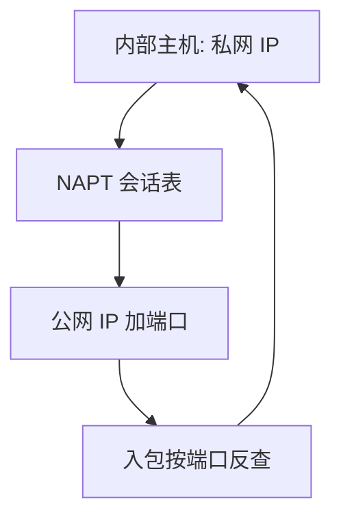

# NAPT 与端口

只改 IP 不够：多台主机共用一个公网地址时，必须用传输层端口把会话从地址对里拆开。

<footer>—— 据 RFC 3022 对传统 NAT；Kurose and Ross 对端口映射的整理</footer>

[上一课](/cs/dhcp-nat)同时给出租约与「私网复用公网地址」。本课不重做 DHCP 状态机。缺口是 NAT 的细档：一对一改地址（基本 NAT）扛不住多对一；必须做 **NAPT**：改写 IP 与端口，用表记住内部四元组与外部的对应。本课不把 IPv6 当已部署完。

## 问题

[DHCP 与 NAT](/cs/dhcp-nat) 留下「改写 IP 与端口」。若只换源 IP，两台主机连同一服务器同一服务时，回来的包无法区分。NAPT 把源端口也纳入键：外出建立映射，进入时按目的端口反查。无连接的 UDP 也要计时；ICMP 查询用 identifier。缺口是**会话表**，不是新的私网前缀。

传输层尚未开课，但端口字段已在 UDP/TCP 头里。本课只把端口当成 NAT 的解复用键；套接字语义后课再收。

## 方法

外出：若无映射则分配外部端口，改源 IP/端口，重算校验。进入：查表改回内部目的，无表则丢（默认不接受未请求的入连接）。超时回收。端口受限与对称 NAT 改变「对谁可见」的松紧，影响后课穿越，本课只承认分档存在。

## 机制

NAPT 把[端到端](/cs/layering-e2e)的地址透明性撕开：中间盒持有连接状态，与路由器「只转发」不同。IP 分片、ICMP 错误必须能关联到表项，否则映射断裂。对后课 TCP 握手：SYN 外出建表；对端看到的是公网四元组。安全上它不是防火墙规格，只是顺带丢未映射入包。

## 边界

本课不把全部 NAT 穿越协议写成教程，不引入运营商级 NAT 的日志法规。IPv6 对照下一课：地址够用时仍可能有防火墙状态，但不靠 NAPT 省地址。

后课默认：IPv4 边缘常见「多主机、一公网、靠端口表」。128 位地址如何改写邻居发现，下一课起对照。

## 小结

- NAPT 用端口把多台私网主机复用到少量公网 IP。
- 入方向默认只接受表上有的会话。
- IPv6 是另一条路，下一课对照。
- 出处：RFC 3022；Kurose and Ross。
