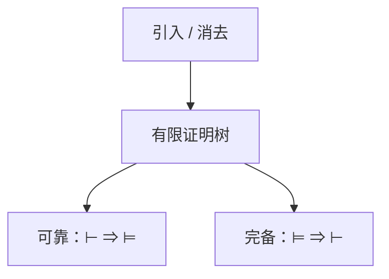

# 自然演绎、可靠与完备

引入与消去规则在假设下推出结论。可靠：可证则有效。完备：有效则可证。一阶的完备把「真」收成「有限证明」，停机仍不可判定。

<footer>—— 据 Gentzen, 1935；Gödel, 1930；Enderton 整理</footer>

上一课[谓词逻辑](/cs/predicate-logic) 有语义 $\models$，没有推导。缺口是**证明系统**：自然演绎（或 Hilbert、sequent）。可靠与完备。本课不把 Coq 当工具——证明助手是最后一课。

## 问题

规则例：$\to$ 引入（在假设 $\varphi$ 下证 $\psi$ 则得 $\varphi\to\psi$），$\to$ 消去（MP），$\forall$ 引入须对新鲜变元。证明是有限树。可靠：$\Gamma\vdash\varphi\Rightarrow\Gamma\models\varphi$。命题完备可用真值表或 Henkin；一阶 Gödel 完备：$\Gamma\models\varphi\Rightarrow\Gamma\vdash\varphi$（$\Gamma$ 可递归）。于是有效公式可枚举，但因不可判定，不能判定「停在不可证」。

一致性：推不出 $\bot$。完备性证明常用极大一致扩张 + 项模型，本课要陈述不写 Henkin 全文。

### 完备不是「什么都能证」

Gödel 不完备针对含算术的理论：真算术句子有不可证者。一阶逻辑的完备是纯逻辑有效性，对象不同。不要两句撞车。

Gentzen 自然演绎与 sequent。Gödel 1930 完备。Enderton 第 2 章。Curry–Howard 把证明当项，点名留给证明助手课。

## 方法

用命题小证明画一棵 $\to$ 引入树。陈述可靠（对规则归纳）与完备。指出：加进 Peano 公理后，系统仍半判定「是否从公理可证」，不判定算术真。

## 机制

有了 $\vdash$，程序正确性可以把「从公理与不变式推出后条件」写成证明义务。自动工具用另一套规则（归结、CDCL）仍要可靠。完备性保证不漏掉有效公式，不保证找证明的时间。

[组合子](/cs/combinators-fixed-point) 的 $Y$ 在类型系统里往往不可型，简单类型对应的是直觉主义命题，一阶算术需要更强。点名。

Sequent 演算把上下文写成 $\Gamma\Rightarrow\Delta$，切割消除给出证明规范化。Hilbert 系统少规则、多公理，手证不亲。直觉主义去掉排中律，$\neg\neg\varphi\to\varphi$ 不可证，对应类型里没有一般的 double-negation 翻译除非加经典。本课古典为主，助手课再分。

## 边界

本课不证 Henkin，不引入切割消除全文。不把古典 vs 直觉主义打完。后课默认：谈到证明，即某可靠系统里的有限推导。下一课把证明对准程序：Hoare。

可靠保证证出来的都有效；完备保证有效的都有有限证明。算术理论的 Gödel 不完备是另一句，不要与一阶逻辑完备相撞。Hoare 下一课把规则对准程序状态。

上一课留下的缺口在本课收口；「自然演绎、可靠与完备」进入后课词汇表后只引用。文献用来钉对象与边界，不把本课写成该主题的独立综述。

## 小结

- 自然演绎用引入/消去；证明有限。
- 可靠与（一阶逻辑）完备：真与可证对齐。
- 算术理论的不完备是另一句话。
- 出处：Gentzen, 1935；Gödel, 1930；Enderton。
