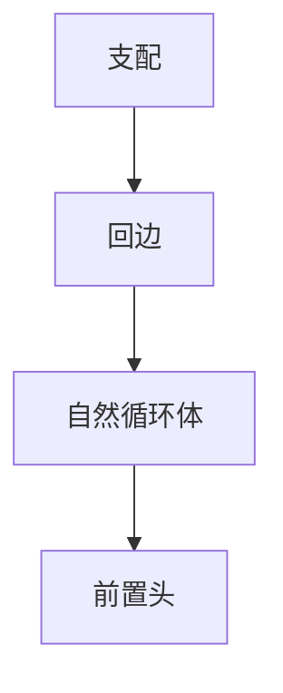

# 自然循环识别

回边的头支配尾。自然循环是头加上不经过头而能到达该回边尾的节点。嵌套由头的包含关系给出。

<footer>—— 据龙书 9.6；Muchnick；Tarjan 区间分析对照整理</footer>

上一课[SSA 析构](/cs/ssa-destruction)提醒优化宜在 SSA 上进行。LICM、IV、展开都要**循环对象**。主干 CFG 课有块与边。缺口是**自然循环**：从回边识别头与体。不可约 CFG 没有整齐的自然循环树，要先变换或放弃部分循环优化。本课钉定义，不写 PGO。

## 问题

回边：尾到头，且头支配尾。自然循环：体是所有「不经头能到尾」的节点加头。缺口是**嵌套森林**，不是 φ 放置。

前置头：造一个唯一外入块，方便 LICM。不可约：两个入口，无单一头，自然循环定义失败。

### 自然循环不是「源码的 for」

`goto` 可造不可约。识别结果可能与程序员写的 `for` 不同（多个 break）。优化认的是 CFG 循环，不是 AST 循环——除非前端保留元数据。

龙书循环。Havlak 不可约循环。LLVM LoopInfo。本课以可约为主。

## 方法

算支配。找回边。对每条回边扩体（反向 CFG 搜索）。按头支配关系建嵌套。插入 preheader。

与多面体：SCoP 检测也要循环树。与向量化：最内自然循环是候选。

## 机制

开关与多出口：循环仍自然，只是退出边多，LICM 安全条件更严。不要把 `do-while` 当没有 preheader 就不能优化——可以造。

深度：内层先处理是 LICM/IV 的标准序。

## 边界

本课不写全部不可约变换（节点分裂）。后课默认：可约 CFG 有循环树。下一课 PGO：用轮廓给循环行程与分支概率，驱动展开与内联。

也不把自然循环当链表上的「环检测」算法课。

## 小结

- 回边 + 支配 ⇒ 自然循环；嵌套成树。
- preheader 服务外提。
- 不可约要另处理。
- 出处：Aho et al. 龙书 9.6；Muchnick；对照 Tarjan 区间。
