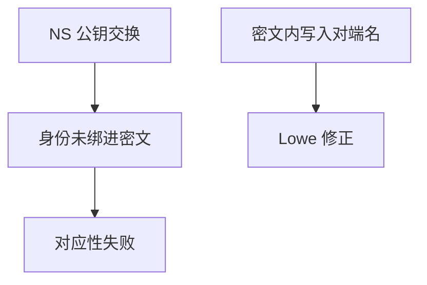

# Needham–Schroeder 与 Lowe

Needham–Schroeder 公钥协议看起来互相证明了新鲜 nonce；Lowe 指出缺少身份绑定，第三者可以把会话转包。修复是在消息里显式写上对端名字。

<footer>—— Needham and Schroeder, 1978；Lowe, Breaking and Fixing the Needham-Schroeder Public-Key Protocol, TACAS 1996</footer>

## 定位

上一课[ProVerif/Tamarin](/cs/protocol-verification)要一个经典标本。缺口就是 **NS 公钥协议与 Lowe 修正**：认证对应性失败的最小例子。软件安全下一单元从这里离开协议逻辑，进入内存。

后课默认已经读完本课钉下的合同，只补差，不从该领域第一性原理重开。

## 问题

A 与 B 交换加密 nonce。攻击者 I 让 A 以为在和 I 谈，同时让 B 以为在和 A 谈——只陈述身份错绑。Lowe：在加密载荷里加入对端身份。缺口是「认证要钉住是谁」，不是 nonce 算术作业。

### 符号攻击≠实现包

本课不给报文级利用。要的是：设计时把身份放进认证消息，再用工具查对应性。

Needham–Schroeder 1978 还有对称密钥版与服务器。Lowe 1996 针对公钥版。这是协议验证课的标准例。

## 方法

写三消息形状与 Lowe 的字段补丁。对照 TLS 的签名 Finished 与证书名：同一思想——名字绑进密钥交换。指出软件漏洞不在此模型里。

图中节点是本课的机制骨架；课程不把图展开成可运行的攻击步骤。

## 机制

身份单元封口：令牌、会话、联邦、因素、形式化，最后用 NSL 说明最小补丁。下一课程单元软件安全：栈上的比特如何破坏「进程按源码语义执行」这一假设。

前提写进合同之后，游戏外的误用只当失败模式点名，不在本课写成操作程序。

## 边界

本课不把 Kerberos 全部消息重写（Windows 课更后）。下一课栈溢出到 shellcode：空间安全的开口，只讲机制与防御，不给可运行载荷。

## 小结

- 工具课需要标本：NS 公钥协议的认证洞。
- Lowe：把对端身份写进认证密文。
- 对应性是「谁与谁完成了会话」。
- 下一单元：栈溢出与内存破坏（防御视角）。
- 出处：Needham and Schroeder, 1978；Lowe, 1996。
