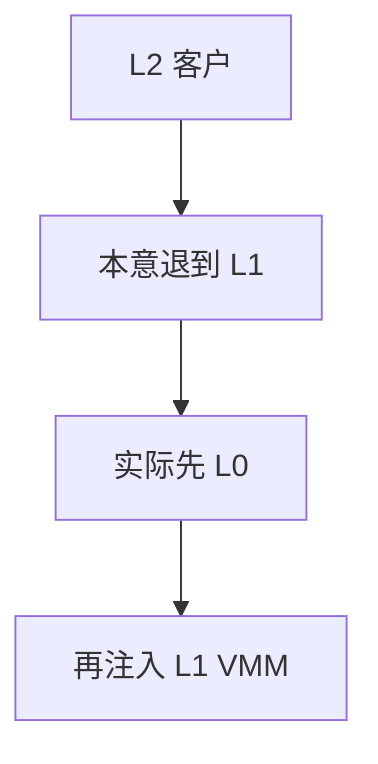

# 嵌套虚拟化

嵌套让 L1 客户自己当 hypervisor 跑 L2：L0 必须模拟或转发 VMX 操作，exit 可能翻倍。

<footer>—— 据 Linux KVM nested 文档；Intel 对 nested VMX 的说明；[VM-exit](/cs/vmx-vmexit) 为代价先修</footer>

[热迁移](/cs/live-migration) 已够复杂。云上还要在 VM 里再开 KVM。缺口是 **nested**：谁处理 L2 的 exit。

## 问题

L2 执行导致 L1 想 VM-exit 到 L1 内核，实际先到 L0。L0 或转发或模拟 VMCS。缺口：性能；安全（L1 逃到 L0）；与 [EPT](/cs/shadow-page-table) 多一层。本课不把所有硬件 nested 能力位列出。

用于测试 hypervisor、嵌套云。对象是两层 VMX，不是容器套容器。

## 方法

L0 KVM nested 模块维护两层 VMCS 影子。对照 [调度域](/cs/sched-domains)：都是分层，一个 CPU 拓扑一个特权。对照 [FUSE](/cs/fuse)：无关。对照 Firecracker 后课：通常禁止 nested 减攻击面。

## 机制

嵌套把虚拟化递归化，使「在 VM 里开发 hypervisor」成为可能，税是 exit 与复杂性。生产常关。不要写成套娃梗。与 [kABI](/cs/kabi-module-signing)：L1 内核模块仍要匹配 L1。

bug 类常是双重影子不同步。

实现上：L2 的 EPT 由 L1 管理，L0 再嵌一层，缺页路径变长。生产关 nested 是减攻击面。测试 hypervisor 是主要正当理由。 读法上只引用[上一课](/cs/live-migration)的结论，不把对象换成训练推理或限价簿。

本课在操作系统进阶的「虚拟化与隔离进阶 / Hypervisor」课序里，对象是 **嵌套虚拟化**。

- 先修只引用，不重导：上一课的结论当公理，本课只补差。
- 五栏不吞并：不把本课写成大模型训练/推理，也不写成限价簿或权重量化。
- 文献用 OSTEP、McKusick、内核文档与具名会议论文；不发明 arXiv 编号。

## 边界

本课不引入 AMD 与 Intel 的全部差异。不保证迁移嵌套 VM。Hypervisor 课序收口；下一课序容器运行时。

版本字段会变，课序钉的是机制对象「嵌套虚拟化」，不是某一主线内核的结构体名。
后课默认：可嵌套但贵且扩大攻击面。runc/containerd 如何用命名空间，下一课。

## 小结

- 嵌套：L0 转发/模拟 L1 的 VMX。
- exit 与攻击面增加；生产常关。
- 容器运行时是下一课序。
- 出处：KVM nested；Intel nested VMX。
