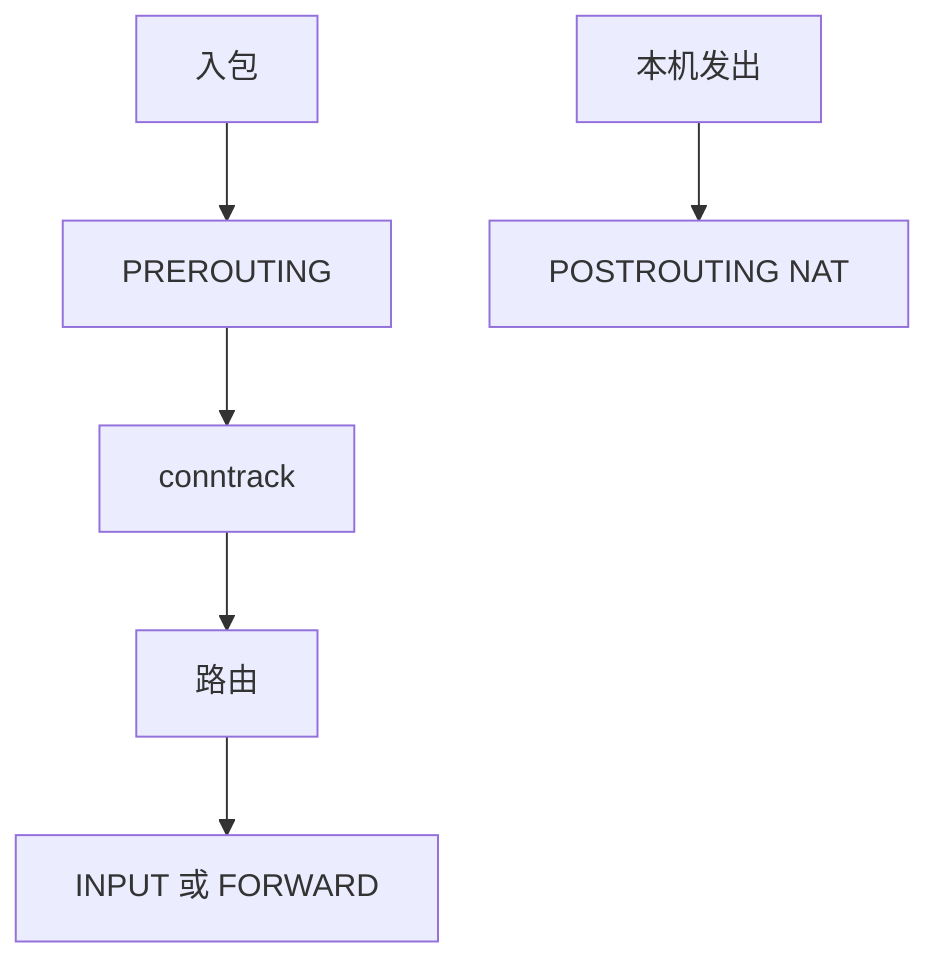

# netfilter 与 conntrack

netfilter 在包路径上设钩子；conntrack 把同一连接的各方向报文收成一项状态，NAT 与状态防火墙靠它。

<footer>—— 据 Russel, Linux netfilter Hacking HOWTO；Linux nf_conntrack 文档</footer>

[RX](/cs/rx-path)/[TX](/cs/tx-path-qdisc) 已经点名钩子。[TCP](/cs/kernel-tcp-impl) 有自己的状态，那是传输对端。防火墙需要 **另一份** 连接表。缺口是 netfilter 钩子位置与 conntrack 元组。

## 问题

PREROUTING、INPUT、FORWARD、OUTPUT、POSTROUTING 五类钩。iptables/nftables 在钩上匹配、丢、改、跳 NAT。无状态规则不能「只允许已建立」。conntrack：五元组 + 状态（NEW/ESTABLISHED/RELATED），ICMP 差错可 RELATED。缺口：表满则 drop（DoS）；NAT 改地址必须改校验与端口；与 [套接字](/cs/socket-buffers) 查找用的是改后或改前地址，取决于钩点。本课不把 nft 语法写成手册。

nf_conn 可被 helper 解析 FTP 等。关闭 conntrack 对转发性能有好处，但 NAT 不能关。

## 方法

入包：PREROUTING 做 DNAT，路由，再 INPUT 或 FORWARD。出包：OUTPUT、POSTROUTING SNAT。对照 TCP 状态机：conntrack 不重传，只跟踪看见过的方向。对照 [dm-crypt](/cs/dm-crypt)：一个改块，一个改包头。对照 LSM：netfilter 不是 inode 标签。

## 机制

netfilter 把「包策略」收成可编程钩，使 NAT 与防火墙成为 OS 功能而非旁路盒子。conntrack 是有状态的代价：内存与锁。不要写成安全产品对比文。与 [namespaces](/cs/namespaces)：每 netns 一份 conntrack，容器隔离靠后课 netns。

连接跟踪与应用层代理不同：它不终结 TCP，只改或放行。

实现上：表满时 NEW 包被丢，表现为随机连不上。helper 解析载荷会放大 CPU，也是攻击面。flowtable 把已确认转发路径短路到更早的交换，绕过多次钩子。 读法上只引用[上一课](/cs/kernel-tcp-impl)的结论，不把对象换成训练推理或限价簿。

本课在操作系统进阶的「网络栈 / 收发路径」课序里，对象是 **netfilter 与 conntrack**。

- 先修只引用，不重导：上一课的结论当公理，本课只补差。
- 五栏不吞并：不把本课写成大模型训练/推理，也不写成限价簿或权重量化。
- 文献用 OSTEP、McKusick、内核文档与具名会议论文；不发明 arXiv 编号。

## 边界

本课不引入 flowtable 硬件卸载的全部。不保证 conntrack 对所有隧道内层可见。下一课把整份栈复制一份：网络命名空间与 veth。

版本字段会变，课序钉的是机制对象「netfilter 与 conntrack」，不是某一主线内核的结构体名。
后课默认：钩子可过滤/NAT，conntrack 记连接。每容器一份协议栈如何用 veth 接起来，下一课。

## 小结

- netfilter 钩在收发与转发路径上。
- conntrack 用元组做有状态放行与 NAT。
- netns 与 veth 是下一课。
- 出处：netfilter HOWTO；Linux nf_conntrack；Benvenuti。
