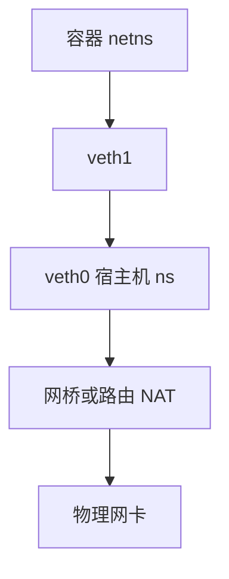

# 网络命名空间与 veth

每个 netns 有自己的设备列表、路由表、套接字与 conntrack；veth 是一对跨命名空间的虚拟网线，写一端从另一端 RX。

<footer>—— 据 Linux namespaces(7)；内核 veth 驱动说明；cgroup/ns 主干课的网络维</footer>

[上一课](/cs/netfilter-conntrack)的表是每命名空间一份。[namespaces](/cs/namespaces) 主干已有隔离直觉。缺口是 **网络维落地**：lo、地址、以及容器常用的 veth pair。

## 问题

无 netns：所有进程共享一张网卡与端口空间。容器要独立 `listen :80`。`clone(CLONE_NEWNET)` 得到空栈（几乎只有 lo 需 up）。veth：创建 pair，一端移入容器 ns，一端留在宿主机或网桥。缺口：路由谁做 NAT（往往宿主机 POSTROUTING）；移动设备用 `setns`；与 [设备节点](/cs/device-nodes) 不同——网卡不是 cdev 主次号那套，是 net_device。本课不把 CNI 插件写成 k8s 百科。

socket 属于创建它的 netns。fd 传出后仍绑原 ns，这是容器网络的细坑。

## 方法

宿主机：`ip link add veth0 type veth peer name veth1`，`ip link set veth1 netns pid`，两边配地址或桥。包：容器 TX veth1 → 宿主机 veth0 RX，再走 [qdisc](/cs/tx-path-qdisc)/转发。对照 [tmpfs](/cs/tmpfs)：一个隔离文件树，一个隔离协议栈。对照 SCSI：没有 LUN，只有 peer 指针。

## 机制

netns+veth 把「一台主机多份网络栈」收成原语，容器网络的其余都是桥、路由、策略的叠加。性能：每包多次协议栈与 skb 拷贝或转发。后课会有更快的旁路。不要写成 SDN 产品。与 [cgroup](/cs/cgroups)：netns 不管 CPU，只管看见哪些设备。

iptables 要在正确的 ns 里下规则，否则「容器里关不掉宿主机端口」。

实现上：把物理网卡移进 ns 后，宿主默认路由可能断。veth 的 peer 指针跨 ns，拆 ns 要先把设备移回。socket 随创建 ns，SCM_RIGHTS 传出后仍绑旧栈。 读法上只引用[上一课](/cs/netfilter-conntrack)的结论，不把对象换成训练推理或限价簿。

本课在操作系统进阶的「网络栈 / 收发路径」课序里，对象是 **网络命名空间与 veth**。

- 先修只引用，不重导：上一课的结论当公理，本课只补差。
- 五栏不吞并：不把本课写成大模型训练/推理，也不写成限价簿或权重量化。
- 文献用 OSTEP、McKusick、内核文档与具名会议论文；不发明 arXiv 编号。

## 边界

本课不引入 ipvlan/macvlan 的全部替代拓扑。不保证无线设备移 ns 的驱动支持。下一课把多端点收成二层：网桥与 tun/tap。

版本字段会变，课序钉的是机制对象「网络命名空间与 veth」，不是某一主线内核的结构体名。
后课默认：容器用 veth 接宿主机栈。软件网桥与用户态隧道设备，下一课。

## 小结

- netns 复制设备、路由、套接字空间。
- veth 是跨 ns 的成对虚线。
- 网桥与 tun/tap 是下一课。
- 出处：Linux `namespaces(7)`；veth；内核 netns 文档。
