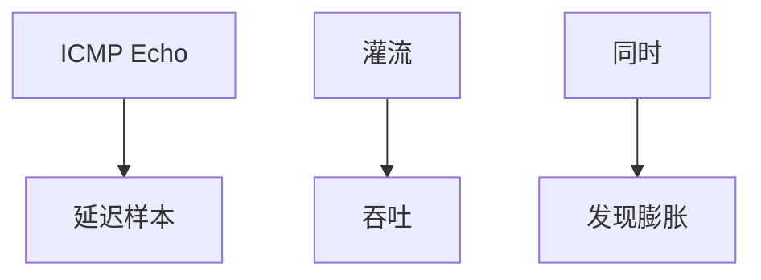

# ping / iperf

ping 用 ICMP 回显读可达与 RTT；iperf 用灌流读吞吐。一个测延迟样本，一个填满 $C$，两者一起才对得上 BDP 与膨胀。

<footer>—— 据 RFC 792 ICMP Echo；iperf 工具通识；Kurose 测量节整理</footer>

[traceroute](/cs/ttl-traceroute) 画路径。[BDP](/cs/bandwidth-delay-product) 与 [缓冲膨胀](/cs/bufferbloat) 要数。[上一课](/cs/service-discovery) 结束分发。缺口是**主动测量入门**：Echo 与灌流。本课不把抓包写完。

## 问题

口 up 不等于应用好。ping：RTT、丢、是否过滤。不能代表 TCP 吞吐。iperf：开窗口灌满，看 Gb/s，会制造膨胀与扰民。要同时看 ping 在灌流时是否炸——膨胀诊断。ECMP 下每次测量可能不同路。卫星：ping 已是数百毫秒下限。

不要把公网 iperf 当攻击。

ICMP 常被滤，TCP ping 变体存在。iperf3 是实现。本课钉方法。

### 两把尺子

ping 看 RTT，iperf 看吞吐，合起来看队列。ICMP 可能被降级。单次结果受 ECMP 污染。要分布不要单点。

## 方法

对照：控制面 traceroute / 数据面 ping / 灌流 iperf。画：空闲 RTT vs 负载 RTT。与 ABR 估计同类，一层工具。

方法止于选定对象与对照；机制才说它如何嵌入已有分层与主干课。

## 机制

QoS 可能把 ICMP 降级，ping 差而 TCP 好。RoCE 要用专门诊断。Maglev 后测量打到不同后端。DoH 不改 ping。权限：ping 要 raw socket 在某系统。

统计：一次 ping 无意义，要分布。

## 边界

本课不引入 OWAMP 的全部。抓包与 Wireshark 是下一课。后课默认：ping 看 RTT/可达；iperf 看吞吐；合起来看队列。

只报「带宽 1G」不报 RTT 是半张图。

上一课留下的缺口在本课收口；「ping / iperf」进入后课词汇表后只引用。文献用来钉对象与边界，不把本课写成该主题的独立综述。下一课[抓包与 Wireshark](/cs/packet-capture)。

## 小结

- Echo 测延迟；灌流测吞吐。
- 负载下 ping 暴露膨胀。
- 过滤与 ECMP 使单次结果不可绝对化。
- 后课只引用本课钉死的对象，不从该领域总问题重开。
- 出处：RFC 792；测量实践。
