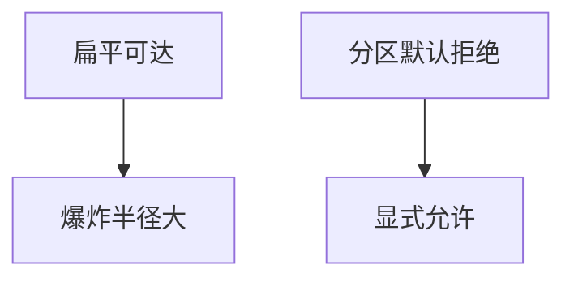

# 网络分段

扁平二层让一次失陷走遍。分段把主体与客体放进不同可达性域：管理网、生产、用户、访客。零信任不取消分段，分段降低爆炸半径。

<footer>—— 据 Saltzer 最小特权；NIST SP 800-207 与分段的关系；对照[VPN 对零信任](/cs/vpn-zero-trust)</footer>

## 定位

上一课[扫描](/cs/port-scanning)列出开着的口。缺口是**即使口开着也不该从该区连到**。本课讲 VLAN、防火墙域、微分段，不写打通隔离的步骤。

后课默认已经读完本课钉下的合同，只补差，不从该领域第一性原理重开。

## 问题

ARP 课已说明同 L2 危险。生产数据库不应与访客 Wi-Fi 同域。缺口是策略：默认拒绝跨段，显式允许。

### 东西向

数据中心内部流量常被忘。微分段把策略落到工作负载。

Anderson 对扁平网络。禁止逃逸分段教程。默认配置下一课是主机层。

## 方法

画区：用户、应用、数据、管理。对照零信任：分段是网络实现最小特权的一种。下一课默认配置加固。

图中节点是本课的机制骨架；课程不把图展开成可运行的攻击步骤。

## 机制

可达性是授权的物理近似。仍要应用 BOLA。默认口令下一课常让分段形同虚设。

前提写进合同之后，游戏外的误用只当失败模式点名，不在本课写成操作程序。

## 边界

不写跨 VLAN 攻击。扁平二层仍会把 ARP 课的映射问题放大。默认配置加固下一课。

## 小结

- 扫描揭示端口；分段限制谁能连。
- 默认拒绝跨段；管理面单独。
- 与零信任叠加，不互相取消。
- 下一课默认配置。
- 出处：Saltzer and Schroeder；NIST SP 800-207；Anderson。

