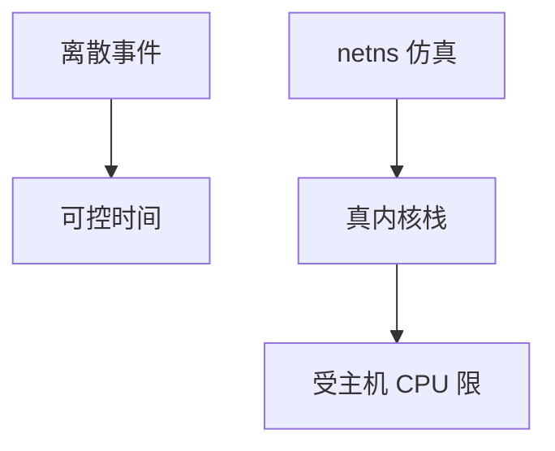

# ns-3 与 mininet

ns-3 是离散事件仿真，时间与丢包完全可控；Mininet 用网络命名空间搭真实内核栈的迷你拓扑，保真协议、难保线速。

<footer>—— 据 ns-3 手册；Lantz et al., Mininet, 2010 整理</footer>

[抓包](/cs/packet-capture) 在真网上贵。[上一课](/cs/packet-capture) 留下「如何复现」。缺口是**仿真 vs 仿真式仿真（emulation）**。本课不把 Reactor 写完。

## 问题

incast、AQM、BGP 收敛在生产上难复现。ns-3：事件队列推进虚拟时间，可插传播延迟与错误模型，协议是模型或真实栈移植。Mininet：Linux netns + veth + OVS，跑真 TCP，用 tc 限速，CPU 共享则时间戳假。卫星 RTT 在 ns-3 里设数即可。P4 有 BMv2 仿真点名。

不要把仿真曲线当 SLA。

Mininet 2010。ns-3 是科研常用。本课不教安装。

### 保真哪一层要先选

ns-3 控时间；Mininet 保真内核栈不保真线速。曲线不是 SLA。随机种子要记。

## 方法

对照：数学分析 / ns-3 / Mininet / 试验床。画：问题选工具。与 Clos 拓扑：Mininet 能搭，但脊线速假。

方法止于选定对象与对照；机制才说它如何嵌入已有分层与主干课。

## 机制

抓包在 Mininet 里方便。iperf 在仿真里量的是模型 $C$。SDN 控制器可接 Mininet。DNS TTL 可加速测试。不要用仿真证明互联网政策。

随机种子要记，否则不可复现。

## 边界

本课不引入 OMNeT++ 的全部。Reactor/Proactor 是下一课。后课默认：仿真控变量；Mininet 保真栈不保真速率。

把 1000 台主机仿真在笔记本上会自己成为瓶颈。

上一课留下的缺口在本课收口；「ns-3 与 mininet」进入后课词汇表后只引用。文献用来钉对象与边界，不把本课写成该主题的独立综述。下一课[Reactor / Proactor](/cs/reactor-proactor)。

## 小结

- ns-3：虚拟时间，模型清晰。
- Mininet：真协议栈，资源共享。
- 选工具看要保真哪一层。
- 后课只引用本课钉死的对象，不从该领域总问题重开。
- 出处：ns-3；Lantz et al., 2010。
