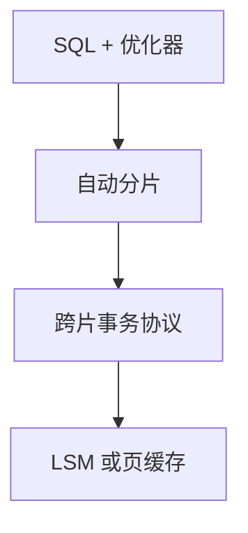

# NewSQL

NewSQL 标签：关系 SQL、跨分片事务、水平扩展。实现仍在 2PC、Calvin、Spanner 路线里选，不是第三种代数。

<footer>—— 据 Pavlo and Aslett NewSQL 综述；Stonebraker；本课前面的协议拼图</footer>

[上一课](/cs/htap)给了双引擎。本课给产品族名字：NoSQL 放弃 SQL 与多行事务换扩展；NewSQL 想把 SQL 事务拿回来仍分片。分布式数据库序列封口。缺口是分类，避免把商标当新理论。数据模型族从 RocksDB 再开节点内引擎。

## 问题

定义松：Google Spanner、Cockroach、TiDB、VoltDB 等被归入。共同承诺：SQL、ACID（或外部一致）、自动分片。分歧：时钟 vs 定序 vs 单分区无跨片。缺口是**用已学协议读白皮书**：有无 TrueTime、是否确定性、存储 LSM 还是缓冲池 B+、是否存算分离。

不是「比 Postgres 快」的同义词。单机 Postgres 仍可更快；NewSQL 买的是故障域与扩展。

Pavlo and Aslett 对 NewSQL 的整理。Stonebraker 对 NoSQL 的批评（「One Size Fits None」脉络）。本课不排名。

## 方法

读一家系统：① 分片键与再平衡；② 跨片协议（2PC/Calvin/时钟）；③ 日志粒度与 CDC；④ 隔离实际是 SI 还是 SSI；⑤ 存储引擎。对照本课程树。

基准用 TPC-C 跨分片比例，后课。Jepsen 测声称的一致。

## 机制

优化器：必须分片裁剪与 broadcast/shuffle。没有则 SQL 是一层慢的 scatter。ORM 阻抗在分布式下 N+1 变成 N×分片。连接池对着网关。

HTAP 功能常当附件（列副本），不是 NewSQL 定义的一部分。

## 边界

本课不讲 RocksDB 内部 compaction——下一课。也不把 NewSQL 当图数据库。文档库宽列各开课。

后课默认：见到 NewSQL 用协议清单拆解。RocksDB：嵌入式 LSM，常当 NewSQL 的本地引擎。

标签不增加定理。协议已经在前面课里。

## 小结

- NewSQL = SQL + 分片 + 分布式事务，实现路线已知。
- 用分片、协议、存储、隔离四问读系统。
- 下一序列 RocksDB：节点内 LSM 引擎。
- 出处：Pavlo and Aslett；Stonebraker；Spanner/Calvin 对照。
