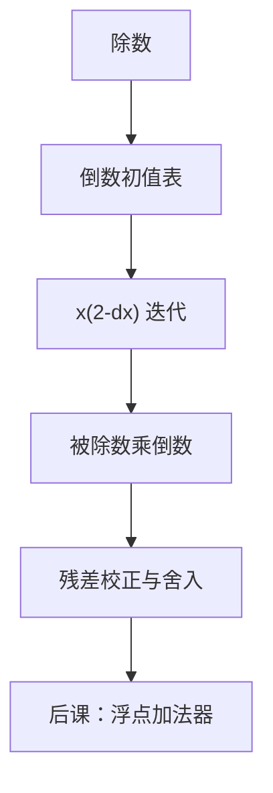

# 牛顿迭代除法与倒数

  
除法可以改成乘法：先迭代出倒数，再乘被除数；二次收敛让几次乘加就够用，前提是已有快速乘法器。

  <footer>—— 据 Ercegovac and Lang, Digital Arithmetic；IEEE Std 754-2008；Goldberg, What Every Computer Scientist Should Know about Floating-Point Arithmetic, 1991 整理</footer>

[上一课](/cs/srt-division)用冗余数字把移位–减加快，仍是每步依赖余数的迭代加减。[华莱士树](/cs/wallace-carry-save)已经把乘法变成浅组合（或浅流水）单元。缺口是：当乘法很便宜时，能否**用乘来做除**——牛顿求倒数，再乘。

## 问题

求 $1/d$。牛顿迭代解 $f(x)=1/x-d=0$，迭代 $x_{n+1}=x_n(2-d x_n)$，二次收敛：有效位数大约每步翻倍。初值来自查表（指数段 + 尾数高位）。缺口不是再写 SRT 表，而是另一条数据通路：几次乘加（或 FMA）换一次除。Goldschmidt（级数/连乘）是同一家族的变体，本课以牛顿钉方程，点名 Goldschmidt 为硬件上常见的并行乘实现。

浮点除还要对阶、舍入、异常；本课先钉倒数迭代的算术核，754 加法器在两课之后。

### 二次收敛不是「两次就精确」

从 $k$ 位近似到 $2k$ 位，再 $4k$，直到超过目标格式精度，再按[舍入模式](/cs/rounding-modes)收一次。中间乘必须用额外保护位，否则舍入误差会阻止最后 1 ulp 正确。把「牛顿除法」理解成软件里调两次 `mul` 就完，754 的正确舍入合同不成立。

754-2008 要求除法正确舍入到目标格式。硬件常用迭代乘 + 残差校正一步。Goldberg 1991 强调运算是格式上的函数，不是「多迭代几次随便截断」。

## 方法

1. 查表得 $x_0\approx 1/d$（尾数）。2. 重复 FMA：$x\leftarrow x(2-dx)$，精度加倍。3. $q=n\cdot x$，再算余数 $n-qd$ 做一步校正，保证正确舍入。整数除也可先规格化除数再迭代，最后右移还原；许多 CPU 仍用 SRT 做整数，牛顿留给浮点。

与 SRT 对照：SRT 的关键硬件是 CSA 与小表；牛顿的关键硬件是已有乘法器与稍大的初值 ROM。面积预算决定选哪条。

## 机制

后课浮点乘法/FMA 正是这条通路的引擎；本课预先承认：除法单元可以「几乎是乘法器加控制」。平方根有类似牛顿/Goldschmidt 迭代，本课不展开，以免把算术单元写成函数库。

## 边界

本课不证明二次收敛的区间，不给初值表的具体比特。不把软件 `libm` 的 Newton 当 CPU 除法器。也不进入「训练里的近似倒数指令」（GPU `__frcp`）——那是精度更低的特化，不是 754 除。

后课默认：倒数可由牛顿/Goldschmidt 迭代得到；精确除还要残差校正；浮点加减是下一条缺口。

## 小结

- SRT 走移位减；牛顿走乘：先 $1/d$ 再乘。
- 二次收敛，初值查表，最后校正才能正确舍入。
- 依赖快速乘法器，与华莱士树配套。
- 出处：Ercegovac and Lang；IEEE 754-2008；Goldberg, 1991。
