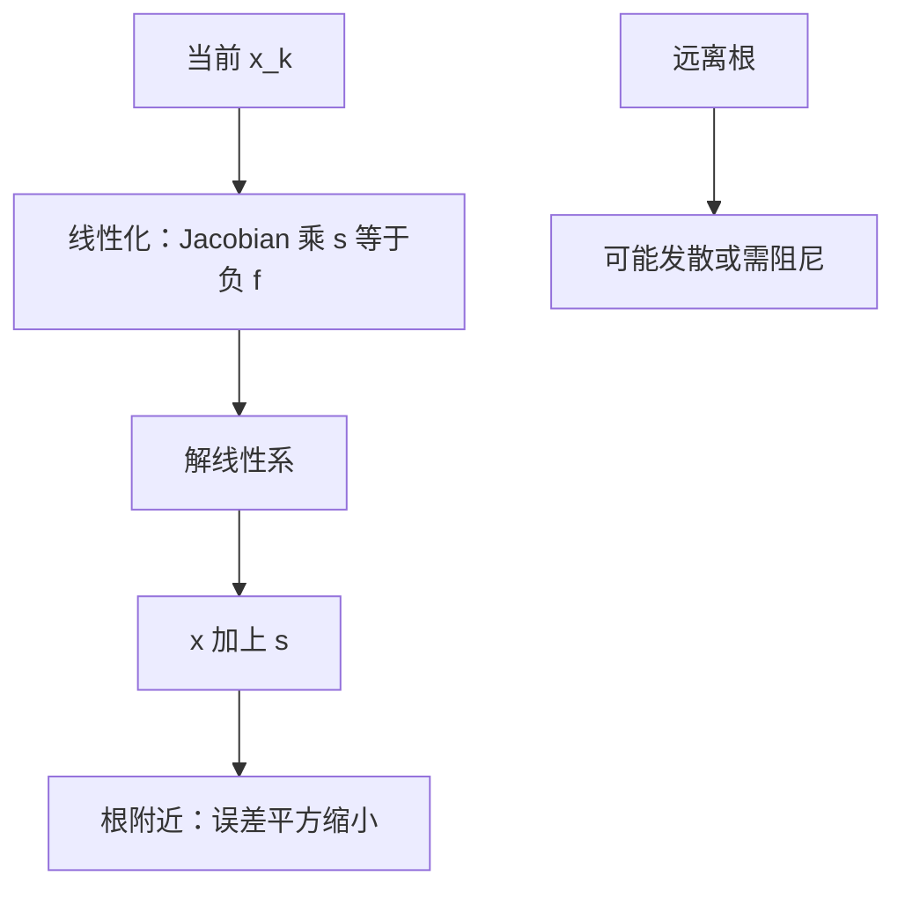

# 非线性方程与牛顿

牛顿法用当前点的切线代替 $f$，每步解一个线性方程；局部二阶收敛以导数不奇异且初值够近为前提。

<footer>—— 据 Trefethen and Bau, Numerical Linear Algebra；Higham, Accuracy and Stability of Numerical Algorithms 整理</footer>

上一课[迭代法何时收敛](/cs/iterative-solver-converge)钉死了线性定常迭代的谱半径条件。本课不重讲 Jacobi，也不从优化教材的全局化另起。缺口是：$Ax=b$ 已经会解，**$f(x)=0$ 没有固定的 $G$，每步线性化得到的方程在变**。牛顿把非线性收回到上一课与消元课已经会的线性求解。

## 问题

标量：$x_{k+1}=x_k-f(x_k)/f'(x_k)$。向量：解 $f'(x_k)s=-f(x_k)$，再 $x_{k+1}=x_k+s$。缺口因此不是「再画一条切线」，而是**每步的线性系带着 $f'(x_k)$ 的条件数，以及 $f$ 本身在根附近的条件**。根的条件大致随 $1/\|f'(x_*)\|$ 变差；重根让牛顿掉到线性收敛，甚至失去局部保证。

线性迭代的 $G$ 固定；牛顿的收缩在根附近变成平方：误差大致平方地变小，直到碰到舍入。舍入地板由 $f$ 的求值误差与 $f'$ 的条件决定——传播课与抵消课在此会合：差分近似 $f'$ 可能已经抵消。

### 牛顿不是「总能全局收敛」

局部二阶需要 $x_0$ 在吸引盆里且 $f'$ 可逆。远离根时切线可以送到更远的地方，或在近水平处迈出巨大一步。把牛顿当成无条件求解器，会在初值或病态 Jacobian 上发散，却误怪线性求解器。阻尼、线搜索是全球化补丁，本课只承认需要它们，不把优化理论展开。

Trefethen and Bau 把牛顿作为非线性与线性的接口。Higham 提醒函数求值的舍入如何限制最终残量。本课不把自动微分当必须，只要求 $f'$ 的来源被当成误差源。

## 方法

每步：求值 $f$ 与 $f'$（或 Jacobian），解线性系（消元或迭代），更新。停准则看 $\|f\|$ 与步长 $\|s\|$，并记住病态根上 $\|f\|$ 小不等于 $x$ 准。有限差分 Jacobian 把步长选在截断与舍入之间，过小即抵消。

重根：收敛阶下降。换问题（因式、换未知量）往往比硬做牛顿更有效——又是条件数属于问题。

标量情形用图看：切线与轴的交点是下一步。若 $f$ 在根处平坦，切线近乎水平，步长爆炸，这是根的条件差，不是线性求解器单独的错。多项式求根还可能先把问题换成特征值，那是把 $f$ 换成条件更好的兄弟问题。本课只要求：每步线性系沿用已有的主元与范数语言；停在舍入地板时不要再指望残量继续降。后课插值提供另一种局部模型，节点选择会变成那个模型的 $\kappa$。

## 机制

切线模型在二阶可微时，误差的二次项主导，故局部平方收敛。浮点里，$f(x_k)$ 一旦落到舍入噪声，步长 $s$ 不再有信息，迭代在机器精度附近徘徊。这不是谱半径 $>1$，是函数求值的后向误差。线性求解器必须后向稳定，否则每步的 $s$ 已经偏了，平方收敛看不见。

Jacobian 可以用解析、自动微分或差分。差分步长太小则抵消，太大则截断，这是传播课与消去课在导数上的实例。每步线性系若病态，牛顿步指向错误方向，平方收敛不会出现。把线性求解换成迭代时，内层停得太早等于每步用了不精确的牛顿，可能失去阶。阻尼（步长乘 $0<\lambda<1$）牺牲局部阶来换全局不散，是另一套算法，合格线仍是：最终在根附近应当能看到二次收缩，直到舍入地板。插值下一课会提供另一种「用模型代替 $f$」的路径，节点一差，模型可以比牛顿更病态。

## 边界

本课不讲拟牛顿公式族，不把区间牛顿请来。下一课[插值与龙格现象](/cs/interpolation-runge)问：用多项式穿过数据时，$f$ 可以有多病态。后课默认：牛顿每步是一个线性系；局部平方收敛有前提；最终精度受 $f$ 求值与根的条件限制。

## 小结

- 牛顿每步解 $f'(x_k)s=-f(x_k)$，把非线性交给已有的线性求解。
- 局部二阶收敛需要近根且 Jacobian 可逆；全局无保证。
- 根的条件与 $f$ 求值误差决定地板，与线性 $\kappa$ 叠加。
- 下一课看多项式插值作为映射何时病态。
- 出处：Trefethen and Bau；Higham。
