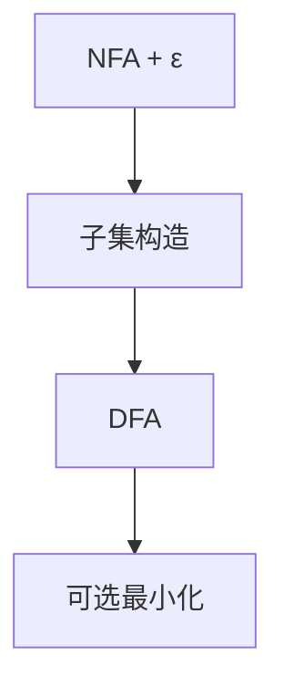

# NFA 与 DFA

非确定机用状态集合响应一个字符；子集构造给出等价的确定机，正则语言不因非确定而变大。

<footer>—— 据 Rabin and Scott, Finite Automata and Their Decision Problems, 1959；Hopcroft and Ullman, Introduction to Automata Theory 整理</footer>

上一课[正则与词法](/cs/regex-lexer)已经用 DFA 最长匹配切记号，并写过「正则 → NFA → DFA」。本课不重做种别与关键字表。缺口是自动机本身：NFA 允许多转移与 $\varepsilon$，DFA 每个字符至多一个后继；二者认同一类语言。后课 Thompson 才把正则表达式具体编成 NFA。本课只钉等价与子集构造的形状。

## 问题

词法要的是「读完一个字符，下一状态唯一」，否则最长匹配的回退没有确定位置。书写正则时，并与星号自然对应分支与回路，直接画 DFA 很挤。NFA：$ \delta(q,a)$ 是集合，$\varepsilon$ 不读字符。接受：存在一条路读完 $w$ 停在接受态。DFA 是 NFA 的特例。缺口是**确定化**：DFA 的一个状态 = NFA 状态的一个子集，$\delta'(S,a)=\varepsilon\text{-closure}(\bigcup_{q\in S}\delta(q,a))$。

指数爆炸：子集最多 $2^{|Q|}$。词法器生成器接受这份编译期代价；运行期仍对源长线性。不等价的错觉来自「NFA 好像更强」——语言类相同。

### $\varepsilon$ 不是空记号

$\varepsilon$ 转移在字符之间，不消耗输入。词法的空lexeme 是另一约定（不要为每种别匹配空串）。本课 $\varepsilon$ 只服务自动机。

Rabin–Scott 1959 子集构造。Hopcroft–Ullman 标准教材。龙书第 3 章用同一构造接词法。最小化（Hopcroft）本课点名：确定化之后可再压状态，不证 $O(n\log n)$。

## 方法

从 NFA 算每个子集的 $\varepsilon$-闭包，对字母表每个符号画转移，起点是 $\varepsilon\text{-closure}(\{q_0\})$，含原接受态的子集为接受。模拟 NFA 也可在运行期维护集合，等价于懒确定化。

[组成课 FSM](/cs/fsm-control) 是硬件控制；这里的状态是词法位置。对象同类，输入是源字符。

## 机制

DFA 无 $\varepsilon$、转移全。最长匹配：跑到死再回最后接受，依赖确定性。NFA 直接模拟要克隆光标，词法器通常不在运行期这么做。补、交对 DFA 容易（乘积），对 NFA 也可，本课不写积自动机全文。

不要把 CFG 的分析栈当成 NFA 的非确定：嵌套不是有限状态。

## 边界

本课不把正则式写成自动机（下一课 Thompson）。不证 Myhill–Nerode。后课默认：词法 DFA 与 NFA 认同一语言；正则到 NFA 的结构归纳是下一缺口。

## 小结

- NFA 与 DFA 认同一类正则语言；子集构造确定化。
- 状态数最坏指数，发生在生成期。
- 运行期词法用 DFA；正则的构造下一课。
- 出处：Rabin and Scott, 1959；Hopcroft and Ullman；龙书第 3 章。
