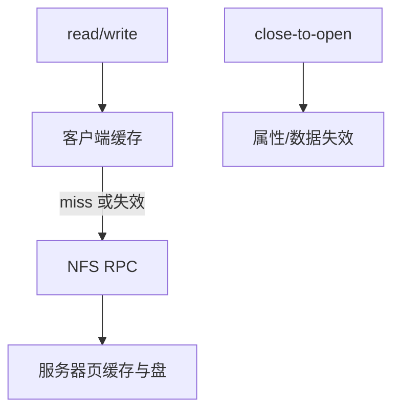

# NFS 语义

NFS 把远程过程当成文件操作：客户端缓存使打开的文件不必每读一回服务器，于是 POSIX 单机语义被削弱成「关闭-打开」一类约定。

<footer>—— 据 Sandberg et al., Design and Implementation of the Sun Network Filesystem；RFC 1813 / RFC 7530 对 NFSv3/v4 的整理</footer>

[上一课](/cs/fuse)让操作出核。[VFS](/cs/vfs) 底下也可以是网络。缺口不是套接字 API——主干已有——而是 **NFS 相对本地 FS 少保证什么**：缓存、删除仍打开的文件、锁、会话。

## 问题

本地 Unix：`write` 对其他进程立刻可见（同一页缓存）。NFS 客户端若缓存数据与属性，另一客户的写可能延迟可见。经典约定：close 后 open 看见最新（close-to-open）。NFSv4 用租约与委派加强，仍不是单机共享内存。缺口：文件句柄代替路径（服务器 inode 世代）；无状态 v3 vs 有状态 v4；`unlink` 仍打开时服务器 rename 到 `.nfs*` 隐藏名。本课不把 RPC 的 XDR 写成网络课。

属性缓存超时使 `stat` 便宜但不准。写缓存未刷时服务器崩溃，数据丢——应用仍要 fsync 语义的远程对应物。

## 方法

lookup 向服务器要文件句柄。read：缓存命中则不发 RPC；失效则 GETATTR/READ。write：可异步，commit 才稳定。与 [fsync](/cs/fsync)：客户端必须把脏页推到服务器并 COMMIT。对照 FUSE：两边都是「不是本地盘」，但 NFS 有共享多客户与网络分区。对照 overlay：层在本地；NFS 的 lower 若是远程，缓存叠缓存。

## 机制

NFS 用「弱缓存一致性」换吞吐。这不是 bug，是课序要默认的前提：分布式文件不是本地 inode 的透明延伸。NFSv4 的 stateful 打开、委派（delegation）让服务器把缓存权交给某一客户，冲突时收回——更接近本地，仍有收回窗口。不要把本课写成限价簿的远程同步。

与 [ACL](/cs/xattr-acl)：v4 ACL 可在线上走，与 POSIX 模式位映射有损。

实现上：NFSv4 委托让客户端缓存接近本地，但服务器收回时要收回冲突写。无状态 v3 把恢复推给客户端重试，打开文件在服务器崩溃后可能换文件句柄世代。 读法上只引用[上一课](/cs/fuse)的结论，不把对象换成训练推理或限价簿。

本课在操作系统进阶的「文件系统实现 / 接口进阶」课序里，对象是 **NFS 语义**。

- 先修只引用，不重导：上一课的结论当公理，本课只补差。
- 五栏不吞并：不把本课写成大模型训练/推理，也不写成限价簿或权重量化。
- 文献用 OSTEP、McKusick、内核文档与具名会议论文；不发明 arXiv 编号。

## 边界

本课不引入 pNFS 布局、RDMA NFS 的全部注册。不保证每个 NAS 设备实现委派。下一课在本地与远程都会出现的互斥：文件锁。

版本字段会变，课序钉的是机制对象「NFS 语义」，不是某一主线内核的结构体名。
后课默认：远程文件有缓存与 close-to-open 一类语义。字节范围锁与建议锁，下一课。

## 小结

- NFS 用句柄与客户端缓存；默认不是单机瞬时可见。
- close-to-open 与 v4 委派是不同强度的补丁。
- 文件锁是下一课。
- 出处：Sandberg et al.；RFC 1813；RFC 7530；*OSTEP* 对 NFS 的讨论。
