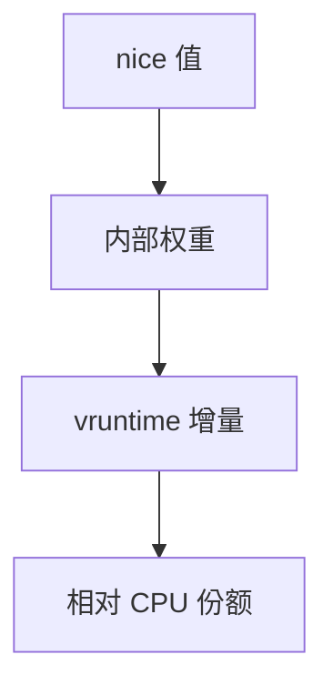
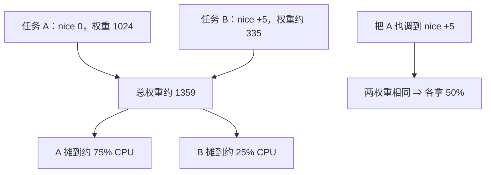

# nice 与权重

nice 是用户能拧的相对权重旋钮：数越大越「客气」，折算后同一墙钟里分到的 CPU 更少。

<footer>—— 据 Silberschatz et al., Operating System Concepts；Love, LKD 对 nice 的整理</footer>

[上一课](/cs/cfs-vruntime)让调度器比较折算后的虚拟时间。缺口是权重 $w_i$ 从哪来。Unix 把用户接口做成 **nice**：默认 0，范围通常 -20 到 19，映射到内部权重表，再进入 vruntime 增量。本课只钉这层映射与「相对份额」，不把多核负载数写完。

## 问题

CFS 的目标是份额 $w_i/\sum w$，不是固定优先级抢占。用户不能也不该直接写内核权重整数；nice 提供粗档。同一 nice 的任务彼此仍按 vruntime 公平。缺口不是记账公式，而是：**改 nice 只改增量快慢，不把别人从 CPU 上绝对踢走**（除非实时策略另说）。

nice +19 不是停止运行；可运行集合里若只有它，它仍得全部 CPU。权重是相对的。

数字实例：Linux 权重表里 nice 0 对应 1024，每差一档权重乘约 1.25——nice 0 对 nice +5 的权重比约 $1024:335$，即同一段时间里前者摊到约 75%、后者约 25% 的 CPU。

## 方法

查表：nice 越低（更负）权重越大，同样 $\Delta t$ 里 vruntime 涨得越慢，越容易保持「最小」。权限：降低 nice（更贪）通常要特权，升高（更客气）谁都可以——防止普通人把自己调成实时杀手。本课不把具体表项数字当定律，只要求单调。

直觉类比：nice 档位像合伙出资的股份，不是指挥棒——人人都有份上桌，只是切蛋糕时按股比分。这解释了为什么 +19 也不是「禁跑」：可运行队列里只剩它时，它拿 100%。

```mermaid
flowchart TD
  NICE["nice 值"] --> W["内部权重"]
  W --> VR["vruntime 增量"]
  VR --> SHARE["相对 CPU 份额"]
```

与[MLFQ](/cs/mlfq) 对照：nice 是显式用户意图；MLFQ 档位是内核猜的行为。两者可同时存在于不同系统，本课对象是权重。

## 机制

权重让后台编译 `nice +10` 而不必用实时优先级去「压」它：前台仍按更高权重摊时间。指标上，这是公平尺子的加权版，不是周转最优。I/O 型即使 nice 较高，也常因 vruntime 停住而保持响应——与上一课一致。

组调度（按 tty 或 cgroup 再摊一层）是后话；本课默认权重在任务一级。

```mermaid
flowchart TD
  T1["任务 A：nice 0，权重 1024"] --> SUM["总权重约 1359"]
  T2["任务 B：nice +5，权重约 335"] --> SUM
  SUM --> SA["A 摊到约 75% CPU"]
  SUM --> SB["B 摊到约 25% CPU"]
  CH["把 A 也调到 nice +5"] --> EQ["两权重相同 ⇒ 各拿 50%"]
```

这张图回答：nice 差距怎么折算成份额。CPU 不看 nice 数值本身，而是把各任务权重占总权重的比例当份额——调一个 nice 改变的是比例，不是让谁出局。

常见误区：初学者容易把 nice 当绝对优先级，以为低 nice 会「饿死」别的任务。CFS 里每个可运行任务都分得到时间，nice 只改 vruntime 涨速；能完全抢占的是实时调度类，那是另一套机制。

## 边界

本课不把 `SCHED_IDLE`、`SCHED_BATCH` 的全部语义写完，不讨论容器 CPU 限额与 nice 谁说了算的政策冲突。实时优先级不是 nice 的延伸：那是另一套调度类，对照课已经分开。

后课默认：单核上权重决定份额。多核上每 CPU 一条队列，份额会被队列长度扭曲，除非迁移，下一课讲负载均衡。

## 小结

- nice 映射到权重；份额相对，不是绝对禁跑。
- 更负的 nice 让 vruntime 走得更慢。
- 跨 CPU 搬任务是下一课。
- 出处：Silberschatz et al., *OSC*；Love, *LKD*。
