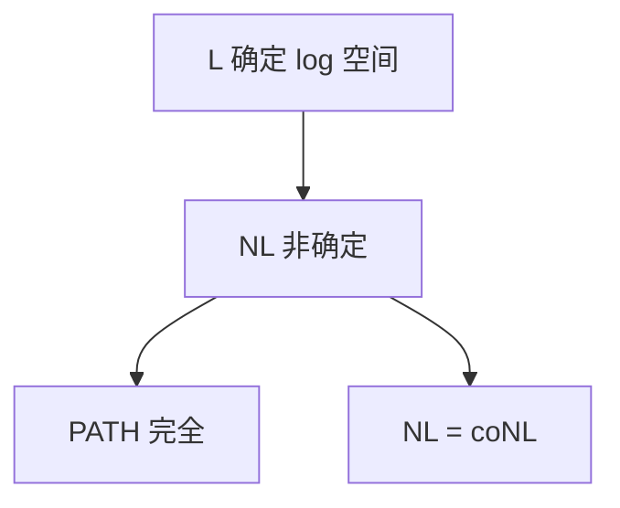

# L 与 NL

对数工作空间：输入只读。L 是确定对数空间，NL 是非确定；可达性 NL 完全，Immerman–Szelepcsényi 让 NL 对补封闭。

<footer>—— 据 Savitch；Immerman, 1988；Szelepcsényi, 1988；Sipser 整理</footer>

上一课[PSPACE 与 Savitch](/cs/pspace-savitch) 的平方在 $s=\log n$ 时把 NL 送进 $\mathrm{DSPACE}(\log^2 n)$，不是 L。缺口是对数空间这一层：L、NL、NL 完全问题 PATH，以及 NL $=$ coNL。

## 问题

工作带 $O(\log n)$：只能放下指针、计数器，不能复制整份输入。输入带只读。L：确定。NL：非确定猜测（或等价地，有向图 $s$–$t$ 可达 PATH）。PATH 在 NL：猜测后继顶点，写下当前顶点编号。NL 困难：对数空间归约把一般 NL 机的配置图交给 PATH。Savitch 只给 $\mathrm{NL}\subseteq\mathrm{DSPACE}(\log^2 n)$。$L\stackrel{?}{=}NL$ 开放。

Immerman–Szelepcsényi：非确定对数空间可数「不可达」——归纳计数可达顶点个数，对补封闭，$\mathrm{NL}=\mathrm{coNL}$。这与 NP 对 coNP 的开放形成对照。

### 对数空间归约更严

多项式时间归约会用太多空间。NL 完全用 $O(\log n)$ 工作空间的多一归约。不要用 Karp 归约直接当 NL 归约。

Immerman 与 Szelepcsényi 1988 独立证明 NL=coNL。Sipser 有配置图与归纳计数的课堂版。Reingold 后来证明无向可达在 L，本课点名不证。

## 方法

写 PATH 的 NL 算法。说明配置图顶点可 $O(\log n)$ 写下。点名无向连通（Reingold）在 L，有向仍是 NL 的旗帜。不要把 BFS 原样搬进 L：队列太大。

主干图算法的 BFS 在 P；本课问的是工作空间，不是时间。

## 机制

空间小迫使算法流式、可重读输入。组合问题里「指针追逐」自然落在 NL。对补封闭意味着「不可达」同样有短非确定证明（证书形状与可达不同，靠计数）。NP 没有已知的对应定理。

$L\subseteq NL\subseteq P$，是否相等都开放。

输入只读迫使算法把输入当随机访问磁带，工作带只记指针。无向 $s$–$t$ 可达在 L（Reingold），技巧是展开图上的 USTCON，本课不证。有向 PATH 仍是 NL 完全旗帜。$NL\subseteq P$ 因为配置图多项式大，可显式 BFS——时间与空间在这里分家。

## 边界

本课不证 Reingold，不写 IS 定理的全部归纳。不引入 #L。后课默认：对数空间以 PATH 为完全问题；NL 对补封闭。下一课回到 NP：Cook–Levin，补上主干未写的 SAT 完全证明形状。

对数空间归约比 Karp 归约严：工作带不够抄整份输入。PATH 的完全性在这套归约下成立。对补封闭让「不可达」与「可达」同一类，这是 NP 没有的奢侈。

## 小结

- L / NL：只读输入 + 对数工作带。
- PATH NL 完全；$L=NL$ 开放。
- Immerman–Szelepcsényi：$\mathrm{NL}=\mathrm{coNL}$。
- 出处：Savitch；Immerman, 1988；Szelepcsényi, 1988。
