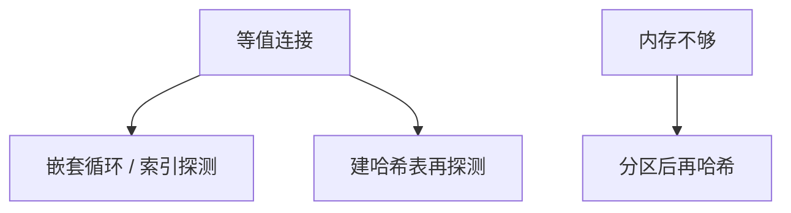

# 嵌套循环与哈希连接

嵌套循环对每一外层元组探测内层；哈希连接把较小一侧建成桶，另一侧探测——代价形状完全不同。

<footer>—— 据 Blasgen and Eswaran；Ramakrishnan and Gehrke 对 NLJ 与哈希连接的整理</footer>

[上一课](/cs/join-algorithms)声明逻辑连接只有一种含义、物理有三种形状。本课不重写 ⋈ 的定义。缺口是前两种算子：块嵌套循环如何用缓冲池，哈希连接如何在内存不够时分区。排序归并下一课。NULL 不当成匹配键，[上一课三值](/cs/sql-null) 已钉。

## 问题

连接算法总览留下名字。嵌套循环：简单，有索引时可变成「外层扫描 + 内层索引探测」。无索引则内层反复全表，I/O 灾难。哈希：等值连接上把 build 输入散到桶，probe 输入只扫一次；内存不够则 Grace 式分区再递归。缺口是**何时选哪一种**的机制，数字在代价课。

非等值连接（θ 不是等）哈希帮不上忙，循环或排序更合适。构建侧应是较小的那张（估计后）。

## 方法

块 NLJ：一次读外层 B 页，内层扫一遍，摊薄内层 I/O。索引 NLJ：内层条件是键，走 B+。哈希：选哈希函数，处理溢出桶；混合哈希把一部分常驻内存。本课不写具体 DBMS 的算子名。

## 机制

两种算子实现同一代数，但打破对称：哪一侧在外/build 改变页数。缓冲池偷页与脏页规则仍是 [WAL](/cs/wal) 之前的那一套文件 I/O。选择率估错会选错 build 侧，后课直方图补统计。

## 边界

本课不把并行 hash join 的全部网络 shuffle 写入主干。两边已按连接键有序时，归并可以一次扫描，下一课。

后课默认：等值连接常用循环或哈希。有序输入另有归并。

## 小结

- NLJ 简单，索引时变成探测。
- 哈希适合等值且能放下或能分区。
- 排序归并下一课。
- 出处：Blasgen and Eswaran；Ramakrishnan and Gehrke。
