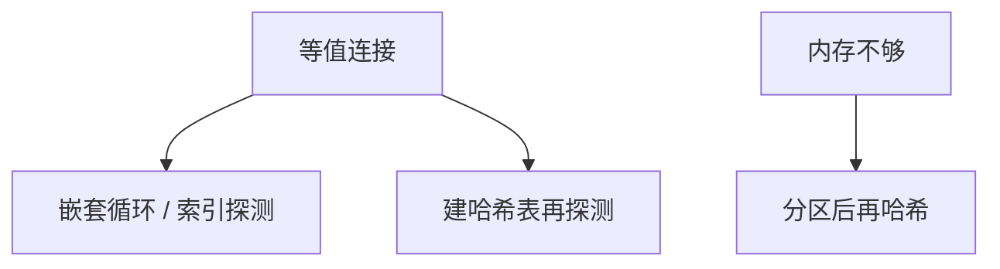
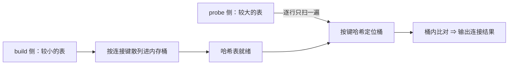

# 嵌套循环与哈希连接

嵌套循环对每一外层元组探测内层；哈希连接把较小一侧建成桶，另一侧探测——代价形状完全不同。

<footer>—— 据 Blasgen and Eswaran；Ramakrishnan and Gehrke 对 NLJ 与哈希连接的整理</footer>

[上一课](/cs/join-algorithms)声明逻辑连接只有一种含义、物理有三种形状。本课不重写 ⋈ 的定义。缺口是前两种算子：块嵌套循环如何用缓冲池，哈希连接如何在内存不够时分区。排序归并下一课。NULL 不当成匹配键，[空值与三值逻辑](/cs/sql-null) 已钉。

## 问题

连接算法总览留下名字。嵌套循环：简单，有索引时可变成「外层扫描 + 内层索引探测」。无索引则内层反复全表，I/O 灾难。哈希：等值连接上把 build 输入散到桶，probe 输入只扫一次；内存不够则 Grace 式分区再递归。缺口是**何时选哪一种**的机制，数字在代价课。

非等值连接（θ 不是等）哈希帮不上忙，循环或排序更合适。构建侧应是较小的那张（估计后）。

数字实例：外层 1000 页、内层 100 页的块 NLJ，每批读 10 页外层，代价约 $(1000/10)\times100=10000$ 次 I/O；若内层连接键有索引，每次探测只要几次 I/O——选算法前先看表大小与索引。

## 方法

块 NLJ：一次读外层 B 页，内层扫一遍，摊薄内层 I/O。索引 NLJ：内层条件是键，走 B+。哈希：选哈希函数，处理溢出桶；混合哈希把一部分常驻内存。本课不写具体 DBMS 的算子名。

直觉类比：哈希连接像聚会前先把客人按姓氏首字母分进房间，后来的客人报出姓直接去对应房间找人——先「分房」（build）再「对号」（probe），不用每个新客人和全场逐一握手（嵌套循环）。

```mermaid
flowchart TD
  EQ["等值连接"] --> NLJ["嵌套循环 / 索引探测"]
  EQ --> HJ["建哈希表再探测"]
  MEM["内存不够"] --> PART["分区后再哈希"]
```

## 机制

两种算子实现同一代数，但打破对称：哪一侧在外/build 改变页数。缓冲池偷页与脏页规则仍是 [WAL](/cs/wal) 之前的那一套文件 I/O。选择率估错会选错 build 侧，后课直方图补统计。

```mermaid
flowchart LR
  B["build 侧：较小的表"] --> H["按连接键散列进内存桶"]
  H --> HT["哈希表就绪"]
  P["probe 侧：较大的表"] -->|"逐行只扫一遍"| LK["按键哈希定位桶"]
  HT --> LK
  LK --> M["桶内比对 ⇒ 输出连接结果"]
```

这张图回答：哈希连接内部的两阶段怎么协作。build 阶段一次性把小表按键分桶，probe 阶段大表每行只探一次桶——代价从「两边相乘」变成「两边相加」，这正是它与嵌套循环的本质差别。

常见误区：初学者容易以为哈希连接永远更快。它要整表过一遍哈希、对内存敏感，非等值条件（如 $\lt$）根本用不上桶；小表外层加索引探测的嵌套循环常常反而赢——优化器靠统计估计来选，估计错就选错。

## 边界

本课不把并行 hash join 的全部网络 shuffle 写入主干。两边已按连接键有序时，归并可以一次扫描，下一课。

后课默认：等值连接常用循环或哈希。有序输入另有归并。

## 小结

- NLJ 简单，索引时变成探测。
- 哈希适合等值且能放下或能分区。
- 排序归并下一课。
- 出处：Blasgen and Eswaran；Ramakrishnan and Gehrke。
