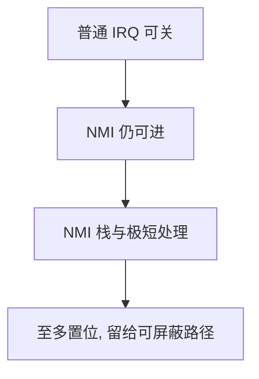

# NMI

不可屏蔽中断在普通 IRQ 已关闭时仍能进入；它几乎不能拿常规锁，也不能走可推迟的下半部。

<footer>—— 据 Bovet and Cesati, Understanding the Linux Kernel；Intel/AMD 与 RISC-V 特权手册对 NMI 的整理</footer>

[上一课](/cs/irq-affinity)让可屏蔽设备 IRQ 可以绑核、可以推迟。[异常与中断入口](/cs/exception-interrupt-entry)里的普通中断能被状态位关掉。缺口是：看门狗、机器检查、某些调试事件必须在「已经关中断」的路径上仍能打断 CPU——**NMI**。本课只钉它与普通 IRQ 的差别，不写处理器勘误表。

## 问题

内核关本地中断是为了保护与 ISR 共享的数据。若死循环发生在关中断区间，普通时钟 IRQ 进不来，调度器救不了。NMI 绕过屏蔽，进入另一套入口：不重入或极窄重入、栈往往是专用 NMI 栈，避免在已损坏的内核栈上再压帧。缺口不是新的亲和掩码，而是承认存在**不能推迟、不能睡、几乎不能拿自旋锁**的上下文——因为锁的持有者可能正是被 NMI 打断的那条路径。

NMI 处理程序里打印、分配、拿 `spinlock` 都可能死锁。实践是：碰 per-CPU 无锁状态、触发崩溃转储、或只置位留给稍后的可屏蔽路径。

## 方法

硬件投递 NMI 向量。入口：切到 NMI 栈，保存最小状态，跑处理函数，退出时恢复屏蔽语义。看门狗：NMI 里检查「该核是否还在打卡」；若普通时钟长期未跑，判定锁死。本课不把 kdump 的全部协议写完。

与[中断下半部](/cs/interrupt-bottom-half)的纪律相反：NMI 没有标准下半部。想推迟，只能置标志，等下一次可屏蔽中断或调度点。

## 机制

NMI 把「关中断 = 原子」这句话限制成「对可屏蔽 IRQ 原子」。写内核的人必须假设 NMI 可以嵌在任何关中断区间。因此 per-CPU 统计若要在 NMI 里更新，要用 NMI 安全的原子或专用缓冲。这为后课内核抢占与 per-CPU 数据预告约束，本课不展开抢占计数。

不可用 NMI 来做普通设备完成通知：丢失与嵌套语义都太凶。

## 边界

本课不把 SMM、机器检查异常的全部严重度分级写完，不讨论如何用 NMI 做隐蔽通道。也不把用户态「假 NMI」当对象：用户不能发真 NMI。

后课默认：存在不能屏蔽的入口。内核执行路径何时能被**另一条内核线程**抢走 CPU，下一课讲内核抢占。

## 小结

- NMI 绕过普通关中断；无标准下半部，几乎不能拿常规锁。
- 看门狗一类诊断依赖它；设备完成不要走它。
- 内核路径上的抢占是下一课。
- 出处：Bovet and Cesati；Love, *LKD*。
