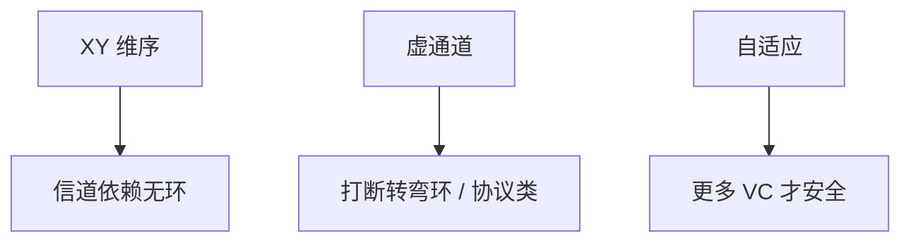

# NoC 路由与死锁避免

包在网格里转弯会形成环形等待：每个路由器握着一个 flit 等下一个缓冲。维序路由禁止某些转弯，把依赖图变成无环。

<footer>—— 据 Dally and Seitz, Deadlock-Free Message Routing in Multiprocessor Interconnection Networks, IEEE TC 1987 整理</footer>

[上一课](/cs/interconnect-topologies) 选了图。最短路径若任意转弯，wormhole 路由下缓冲依赖可以成环，整网冻死。本课不重画 fat-tree。缺口是 **路由：维序（XY）、虚通道、以及一致性消息为何特别怕死锁。**

## 问题

wormhole：包拆 flit，头 flit 占路由，身子跟进，中间路由器只缓冲少许。若 A 等 B 的缓冲、B 等 A，死锁。[目录](/cs/directory-scalability) 的请求-转发-ack 本身构成协议依赖，再叠网络依赖更危险。缺口不是加大缓冲到 store-and-forward 整包（面积炸），而是**限制转弯或用虚通道打断环。**

Dally–Seitz：信道依赖图无环则死锁自由。XY 路由：先走 X 再走 Y，禁止 Y→X 转弯。虚通道：同一物理链路多队列，协议类或转弯类分通道。

## 方法

确定性维序：简单、易证明、路径不自适应，热点绕不开。自适应路由：绕拥塞，但要额外虚通道保证无死锁。一致性：请求与应答分虚网络，避免「等 ack 的节点发不出请求」的协议死锁。

## 机制

这与 OS [死锁预防](/cs/deadlock-prevent) 同构：都是破环。NoC 不能超时重试当常规手段，因为一致性 ack 超时会破坏 [MESI](/cs/mesi-protocol) 不变式。活锁：自适应一直绕，要限跳或最终确定性。

wormhole 的低缓冲是面积选择：每个虚通道几个 flit 槽。槽太少则依赖边更密、死锁窗口更大；槽太多则路由器面积回到「小交叉开关」。证明死锁自由是设计验收项，不是事后打补丁。

## 边界

本课不把所有 turn model（west-first 等）列全。多 socket 的物理层与缓存代理下一课，可能仍用类似虚通道思想，介质换成板级或封装级。

后课默认：片上路由必须死锁自由；一致性分虚网络。出芯片的互连有另一套拓扑与协议封装。

## 小结

- wormhole + 任意转弯会死锁；维序或虚通道破环。
- 一致性请求/应答要分虚网络。
- 多路 socket 互连是下一课出片。
- 出处：Dally and Seitz, *IEEE TC*, 1987。
