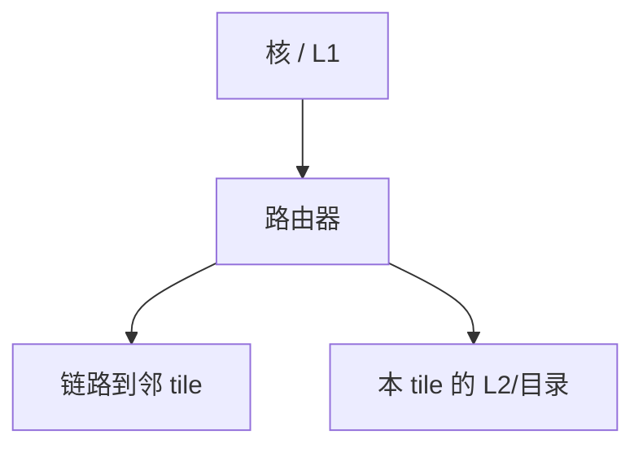

# 片上网络 NoC

核、cache slice 与内存控制器不再共享一条广播总线；包在路由器之间跳，带宽随链路数涨，延迟变成跳数与拥塞。

<footer>—— 据 Dally and Towles, Principles and Practices of Interconnection Networks 整理</footer>

[上一课](/cs/heterogeneous-soc) 把多种核放在同一硅上。[目录](/cs/directory-scalability) 已经要求点对点。十几个以上节点时，总线与交叉开关的线长、仲裁都不可接受。本课不重讲 big.LITTLE 迁移。缺口是 **NoC：片上包交换网络作为一致性事务的载体。**

## 问题

广播窥探假设人人听见。交叉开关面积 $O(n^2)$。缺口不是再加一个 Forward 态，而是**用路由器 + 链路连接 tile：每 tile 有核、L1、L2 slice、路由器。一致性消息、DMA、I/O 都变成 flit。**

Dally–Towles：互连是一等公民。片上与片间原理相同，只是延迟与缓冲预算不同。拓扑下一课才选 mesh 或 fat-tree。

## 方法

每个 tile 一个路由器：输入缓冲、路由计算、虚通道、开关分配、链路口。消息：读请求、转发、作废、ack、数据。 homing：地址哈希到 slice，即目录 home。QoS：不同虚通道给延迟敏感的一致性 ack 与批量 DMA。

## 机制

[MLP](/cs/mlp-memory-parallelism) 的 miss 现在排队在 NoC 里；热点 slice 造成热树。与 [fence](/cs/fence-cost)：fence 等待的「可见」包括包到达 home 并完成 inv ack，跳数进入临界区代价。功耗：连线与路由器缓冲是多核能耗大头之一。

包优先级：作废 ack 比批量 DMA 更延迟敏感，否则锁的临界区被大块拷贝堵住。这就是虚通道与 QoS 在片上出现的原因，具体拓扑下一课才选。

## 边界

本课不选定 mesh 或 torus，下一课拓扑。死锁与维序路由再下一课。多 socket 用另一套物理层。

后课默认：片上一致性走包交换。链路怎么铺、直径多少，由拓扑决定。

## 小结

- NoC 用路由器连接 tile，一致性变成包。
- 带宽随链路扩展，延迟变跳数与拥塞。
- mesh / torus / fat-tree 是下一课。
- 出处：Dally and Towles。
