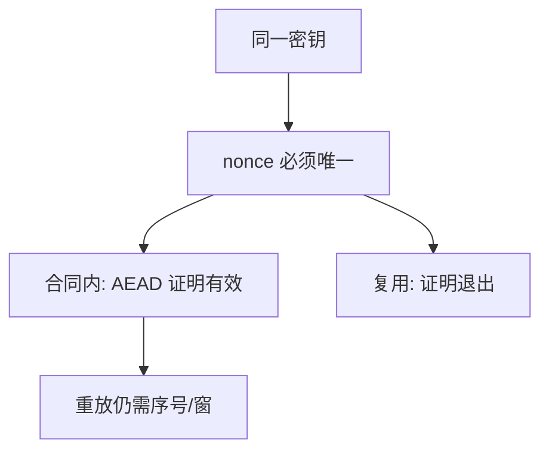
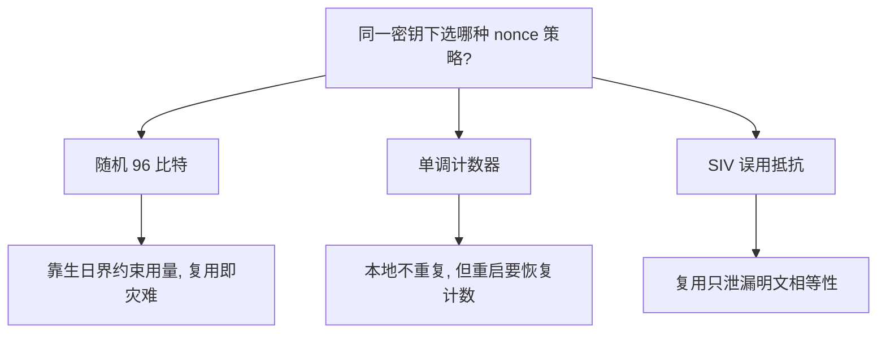

# Nonce 误用与重放

Nonce 不是密钥，却必须在同一密钥下唯一。复用一次，CTR/GCM 的证明就退出；重放则是把合法密文再播一次，完整标签拦不住「旧消息再来」。

<footer>—— 据 NIST SP 800-38D 对 IV 合同；Rogaway 对 nonce-based 加密；Katz and Lindell 整理</footer>

上一课[GCM 内部](/cs/aead-gcm-internals)把保密与标签收成一次调用。缺口是**状态**：nonce 谁发、如何不重复、重放是否算攻击。主干对称课已警告复用是灾难；本课把它从旁注升为主题。

后课默认已经读完本课钉下的合同，只补差，不从该领域第一性原理重开。

## 问题

GCM 在 nonce 复用下会泄漏密钥流并伤及 GHASH 密钥——本课陈述性质，不给恢复步骤。随机 96 比特 nonce 碰撞遵循生日界，消息量大时要换计数器或密钥。重放：敌手重发旧的合法 AEAD 对，标签仍对；要会话层新鲜性（序号、时间窗、[认证协议](/cs/auth-protocol)里的 nonce）。

### 误用抵抗不是默认

SIV 等误用抵抗模式改变合同：重复 nonce 泄漏相等性而非密钥。不要假设库「已经防呆」。

术语翻译：SIV（合成 IV）就是把 nonce 不再交给发送方自由选择、而是从明文和密钥派生出来的手段，来做「即使复用也不泄漏密钥」的事；代价是复用时会泄漏「两条明文完全相同」这一事实。

Rogaway 的 nonce-based 对称加密把唯一性写进游戏。TLS 记录序号、SSH 序号都是协议层计数器。本课不提供复用下的代数求解。

常见误区：「标签验证通过」等于「消息是新的」。实际上标签只证明这段密文出自持有密钥的某次加密，不证明它此刻是第一次到达——后者叫新鲜性，要靠序号或时间窗单独建立。

直觉类比：重放就像拿昨天的有效门票今天再进一次场。票本身是真的（标签能验证通过），检票员要拒收，靠的不是验票，而是核对「这个场次号还没被用过」——会话序号干的就是这件事。

## 方法

分两条失败：生成端复用；网络重放。对策：计数器 nonce、密钥分级、每连接新密钥、应用层幂等与序号。AEAD 不替代这些。

```mermaid
flowchart TD
  KEY["同一密钥"] --> NQ["nonce 必须唯一"]
  NQ --> OK["合同内: AEAD 证明有效"]
  NQ --> BAD["复用: 证明退出"]
  OK --> RP["重放仍需序号/窗"]
```

## 机制

计算安全的证明都有前提。Nonce 是前提里的状态变量。重放是完整性标签范围外的会话语义：标签说「这是某次合法封装」，不说「这是此刻该接受的第一次」。

数字实例：96 比特随机 nonce 的碰撞概率约为 $q^2/2^{97}$（$q$ 为加密次数）。代入 $q=2^{32}$（约 43 亿条），概率约 $2^{-33}$，看似很小，但 NIST 干脆规定每个密钥的 GCM 调用不超过 $2^{32}$ 次，把风险钉死在界内——这就是「消息量大时要换密钥」的出处。

```mermaid
flowchart TD
  Q["同一密钥下选哪种 nonce 策略?"] --> R["随机 96 比特"]
  Q --> C["单调计数器"]
  Q --> S["SIV 误用抵抗"]
  R --> R1["靠生日界约束用量, 复用即灾难"]
  C --> C1["本地不重复, 但重启要恢复计数"]
  S --> S1["复用只泄漏明文相等性"]
```

## 边界

本课不把随机数硬件写成 CSPRNG 课（更后）。填充预言是另一条主动敌手：下一课说明为何「解密失败如何返回」会变成明文泄漏通道。

## 小结

- GCM 合同的核心是 nonce 唯一。
- 复用破坏保密与认证密钥；重放要序号。
- 误用抵抗模式是另一合同，不是静默修复。
- 下一课：填充与错误信息造成的预言机。
- 出处：NIST SP 800-38D；Rogaway；Katz and Lindell；对照 RFC 8446 记录序号。
