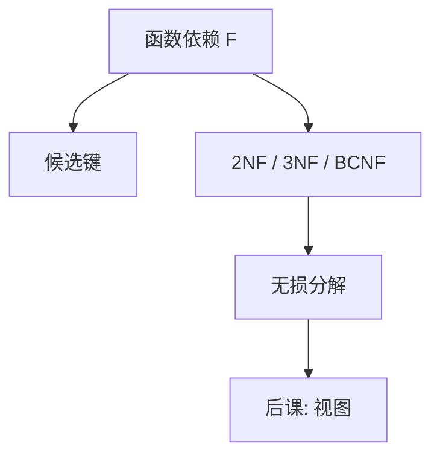

# 范式与分解

异常来自把不同事实塞进同一关系；分解按函数依赖切开，连接再拼回。

<footer>—— 据 Codd 对 3NF；Codd, Further Normalization, 1972；Bernstein 对合成算法的整理</footer>

[上一课](/cs/predicate-pushdown)在查询树上做等价变换。本课不改某一条 SQL。缺口是：模式本身若把多个独立事实捆在一行，更新会出现插入、删除、修改异常。范式用函数依赖判断「这张表是否太宽」；分解给出更窄的关系，用连接恢复。

## 问题

[键](/cs/keys-integrity)已经能识别元组。若非主属性依赖键的真子集（部分依赖），或依赖其他非主属性（传递依赖），同一事实会重复出现，删一行可能丢掉无关事实。缺口不是新的查询语言，而是模式设计：1NF 禁止表中表；2NF 去掉部分依赖；3NF / BCNF 处理传递与键侧的依赖。

本课不把「永远 BCNF」写成教条。有的依赖集无法既保依赖又保无损连接又落在 BCNF；3NF 合成是常用折中。

无损连接：分解后的自然连接能恢复原关系。依赖保持：原有函数依赖仍能在单个分解后的关系上检查，而不必先连接。

## 方法

给定属性集 $U$ 与函数依赖集 $F$。用闭包判断候选键。若违反目标范式，分解成投影，使每一投影满足范式，且分解无损。3NF 合成按 $F$ 的正则覆盖建表；BCNF 分解沿违反依赖切开。本课不把多值依赖与 4NF 写进主干，只点名它们存在。

## 机制

分解之后，更新局部化：改一处事实只碰一张表。查询则可能要多做连接——这正是前几课计划和代价要付的账。所以规范化是逻辑设计，不是「查询一定更快」。反规范化是故意保留冗余换少连接，完整性改由应用或触发器补；主干把这标成权衡，不标成另一套模型。

[关系代数](/cs/relational-algebra)的连接这时从「查询写法」变成「模式恢复」：分解的正确性条件就是那次连接无损。

## 边界

本课不讲 ER 图作图法，不把范式当成文件分片。也不处理时态、XML、文档模型的「嵌套是否 1NF」。NULL 与弱实例理论不展开。后课视图可以让用户仍看见「宽表」，底下是分解后的关系。

依赖必须声明或从数据里发现；本课假定 $F$ 已给定。后课默认：谈到基表，依赖已尽量收进 3NF/BCNF 权衡；宽行若出现，是显式反规范，不是没学过依赖。

分解后的模式仍是关系模型里的关系，只是更窄。查询变多连接，正是前几课计划要付的账，不是范式失败。

## 小结

- 改写动查询树；本课按函数依赖分解模式。
- 无损与保依赖是分解的正确性条件，不是审美。
- 视图如何挡住分解后的碎片，是后课缺口。
- 出处：Codd, 1972；Date；Ramakrishnan and Gehrke。
