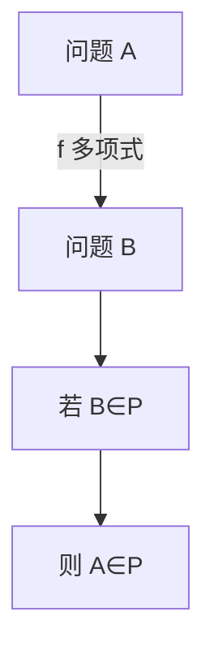
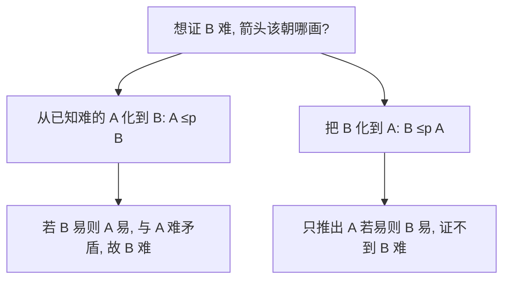

# 多项式归约

若 $A$ 可多项式变成 $B$ 的实例，则 $B$ 的多项式算法会带走 $A$；难度沿箭头向上游传。

<footer>—— 据 Karp, Reducibility Among Combinatorial Problems, 1972；Garey and Johnson, 1979 整理</footer>

上一课[P 与 NP](/cs/p-vs-np)钉了两类判定。本课不重定义证书。缺口是：如何在问题之间**传递**「若这个易则那个易」。多项式时间多一归约（Karp）：$f$ 多项式可计算，$x\in A\iff f(x)\in B$。本课只钉这条箭头的方向与用法。

## 问题

独立地证明每个问题都难，没有公共杠杆。归约说：解 $B$ 的黑盒足够解 $A$。因此若 $A$ 被认为难而 $A\le_p B$，则 $B$ 至少一样难。方向容易画反：把 $B$ 化成 $A$ 证明的是 $A$ 更难。缺口是把箭头画对，不是再讲 NP 是什么。

直觉类比：归约像翻译。若任何中文问卷都能快速译成法文问卷，而你发现有人能秒答法文问卷，那中文问卷也能被秒答——「法文问卷」$B$ 的解题器，套上一层廉价的翻译器 $f$，就是「中文问卷」$A$ 的解题器。$B$ 易则 $A$ 易。

Cook 归约允许对 $B$ 的多次自适应询问；本课主干用 Karp 多一映射，足够后课 NPC。不回到图灵机带子。

### 归约不是「特例」

独立集不是团的别名；但互补图把一个实例多项式变成另一个。那是归约，不是同一问题。背包化成子集和是「限制参数」，也要写成显式 $f$。

Karp 1972 的 21 个问题靠一串 $\le_p$。Garey/Johnson 强调：证明 $B$ 难，从已知难的 $A$ 化到 $B$。本课后课 SAT 出发，这里只练方向。

## 方法

给定 $A,B$，构造 $f$：写清输入如何改写、为何多项式、为何是当且仅当。验证器不出现在 $f$ 里；$f$ 是实例到实例。传递性：$A\le_p B\le_p C$ 则 $A\le_p C$。

```mermaid
flowchart TD
  A["问题 A"] -->|"f 多项式"| B["问题 B"]
  B --> ALG["若 B∈P"]
  ALG --> AP["则 A∈P"]
```

若 $B\in P$ 且 $A\le_p B$ 则 $A\in P$。若 $A$ 不在 P（相对假设）且 $A\le_p B$ 则 $B$ 不在 P。NPC 定义下一课才用「NP 中且万物化到它」。

常见误区：想证明新问题 $B$ 难，初学者常把 $B$ 化到自己熟悉的简单问题 $A$ 上——这只说明「$A$ 易则 $B$ 易」，什么都证不了。正确动作是把箭头反过来：从已知难的 $A$ 归约到 $B$，难度才沿箭头上游传给 $B$。

## 机制

P 在 Karp 归约下关闭：归约加算法仍多项式。NP 同样关闭。这保证完全问题若在 P 则 $P=NP$。本课把这句话留给下一课的定义落地。

不要用指数时间的 $f$：那不保持多项式类。也不要把近似比的归约（L-reduction）提前引进。

术语翻译：Cook 归约允许把 $B$ 当子程序、自适应地反复调用；Karp 多一归约只许把实例一次性翻译过去、拿一个答案回来。后者更「瘦」，所以用它证出的「$B$ 难」结论更硬——本课主干选 Karp 就是这个原因。另外 $f$ 的开销要落在多项式内：输入规模 $n$ 时花 $O(n^3)$ 可以，花 $2^n$ 就把整条传递链拖垮了。

```mermaid
flowchart TD
  Q["想证 B 难, 箭头该朝哪画?"] --> OK["从已知难的 A 化到 B: A ≤p B"]
  OK --> R1["若 B 易则 A 易, 与 A 难矛盾, 故 B 难"]
  Q --> BAD["把 B 化到 A: B ≤p A"]
  BAD --> R2["只推出 A 若易则 B 易, 证不到 B 难"]
```

## 边界

本课不证 SAT 完全，不列出 21 题。不处理空间归约、计数归约。后课默认：证明「至少一样难」用 $A\le_p B$，$A$ 已知难，$B$ 是新问题。典型 NPC 清单是下一课。

## 小结

- $A\le_p B$：$A$ 的实例多项式变成 $B$ 的实例，是当且仅当。
- 难度沿箭头向上游；$B$ 易则 $A$ 易。
- 画反箭头就证错对象。
- 出处：Karp, 1972；Garey and Johnson, 1979。
