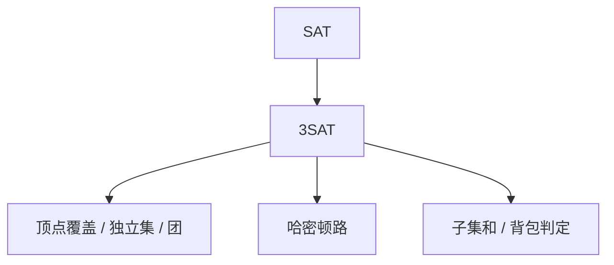

# NPC 典型问题

NP 完全是 NP 里的最难一层：所有 NP 问题都多项式归约到它。SAT 是第一块，其余由归约接上。

<footer>—— 据 Cook, 1971；Karp, 1972；Garey and Johnson, Computers and Intractability, 1979 整理</footer>

上一课[多项式归约](/cs/np-reduction)钉了 $\le_p$ 的方向。本课不重画箭头。缺口是：**NP 完全**的定义，以及主干上要认得的几块——SAT/3SAT、顶点覆盖/独立集/团、哈密顿路/回路、子集和/背包判定——证明细节只点一条链，不把 Garey/Johnson 抄成词条。

## 问题

$B$ 是 NPC： $B\in NP$，且每个 $A\in NP$ 有 $A\le_p B$。等价地：某个已是 NPC 的 $A$ 满足 $A\le_p B$ 且 $B\in NP$。Cook–Levin：SAT 是 NPC。此后只需归约，不必再对任意 NP 语言写验证器编码。

缺口是这份杠杆，不是再解释证书。算法课里的图问题：最短路在 P，哈密顿路 NPC——同是「路」，约束从权和变成过每个点恰好一次。

### 不要每个都从图灵机再证一遍

有了 SAT，3SAT 限制每子句三文字仍 NPC（加垫文字）。图问题从 3SAT 构造顶点与边。子集和从 3SAT 或从精确覆盖来。本课认脸谱与「从哪化来」，不写完每个 gadget。

Garey/Johnson 的附录清单是标准索引。本课只取课程序列后头会对照的：覆盖、团、哈密顿、子集和。旅行商判定同样 NPC，点名即可。

## 方法

证 $B$ 为 NPC：先给多项式验证器，再给从 3SAT（或清单上已知题）到 $B$ 的 $f$。若只要 NP-难，可省「在 NP 内」（优化版搜索常如此）。$P=NP$ 当且仅当任一 NPC 在 P。

[背包](/cs/knapsack)判定在伪多项式算法下仍可 NPC：NPC 相对的是二进制输入长度。两句话必须同时记住。

## 机制

认题是为了后课：编译与系统仍在 P 里做词法、语法、寄存器着色的启发式；着色判定一般图上 NPC，那是[寄存器分配](/cs/regalloc-color)会碰到的墙，本课先把「完全」这词备好。不要把启发式说成多项式最优算法。

补：3SAT 仍在 NP。P 里的 2SAT 是另一算法（蕴含图），本课点名对照，不写。

## 边界

本课不证 Cook–Levin 的表格构造。不引入 PCP、近似硬度。不把密码学单向函数写进来。算法栏到此结束：下一课起，对象从「问题难不难」换成「源文本如何变成可跑的程序」——源文本还不是图。

后课默认：NPC = NP 中且所有 NP 归约到它；SAT 为根，其余靠 Karp 归约。编译器通行证接的缺口是源程序作为字符串。

## 小结

- NPC：在 NP 中，且所有 NP 问题 $\le_p$ 到它；SAT 第一。
- 认 3SAT、覆盖/团、哈密顿、子集和；细节 gadget 不逐题写完。
- 背包 DP 与 NPC 不矛盾：伪多项式对数值，完全性对位数。
- 出处：Cook, 1971；Karp, 1972；Garey and Johnson, 1979。
