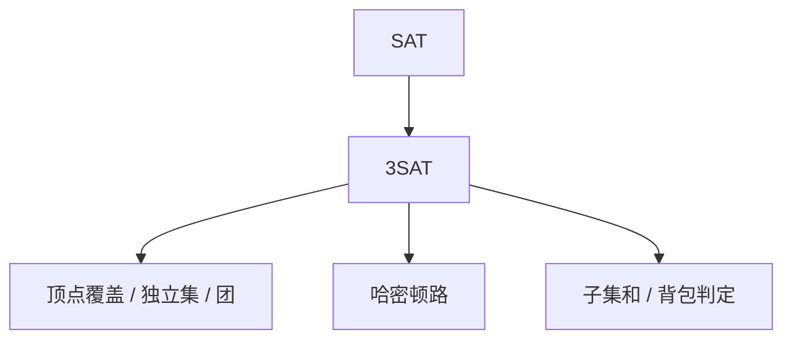
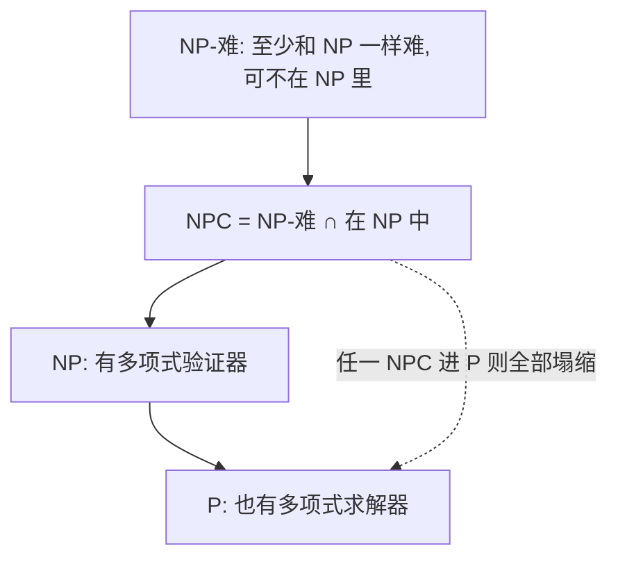

# NPC 典型问题

NP 完全是 NP 里的最难一层：所有 NP 问题都多项式归约到它。SAT 是第一块，其余由归约接上。

<footer>—— 据 Cook, 1971；Karp, 1972；Garey and Johnson, Computers and Intractability, 1979 整理</footer>

上一课[多项式归约](/cs/np-reduction)钉了 $\le_p$ 的方向。本课不重画箭头。缺口是：**NP 完全**的定义，以及主干上要认得的几块——SAT/3SAT、顶点覆盖/独立集/团、哈密顿路/回路、子集和/背包判定——证明细节只点一条链，不把 Garey/Johnson 抄成词条。

## 问题

$B$ 是 NPC： $B\in NP$，且每个 $A\in NP$ 有 $A\le_p B$。等价地：某个已是 NPC 的 $A$ 满足 $A\le_p B$ 且 $B\in NP$。Cook–Levin：SAT 是 NPC。此后只需归约，不必再对任意 NP 语言写验证器编码。

缺口是这份杠杆，不是再解释证书。算法课里的图问题：最短路在 P，哈密顿路 NPC——同是「路」，约束从权和变成过每个点恰好一次。

数字实例：同样 $n=20$ 个点，最短路用 Dijkstra 大约算 $20^2$ 量级的操作，瞬间出结果；哈密顿路暴力枚举是 $20! \approx 2.4\times 10^{18}$ 条排列，就算每秒查 10 亿条也要 70 多年。「多一句『每个点恰好一次』」就把问题从 P 推进了 NPC 的邻居。

### 不要每个都从图灵机再证一遍

有了 SAT，3SAT 限制每子句三文字仍 NPC（加垫文字）。图问题从 3SAT 构造顶点与边。子集和从 3SAT 或从精确覆盖来。本课认脸谱与「从哪化来」，不写完每个 gadget。

Garey/Johnson 的附录清单是标准索引。本课只取课程序列后头会对照的：覆盖、团、哈密顿、子集和。旅行商判定同样 NPC，点名即可。

## 方法

证 $B$ 为 NPC：先给多项式验证器，再给从 3SAT（或清单上已知题）到 $B$ 的 $f$。若只要 NP-难，可省「在 NP 内」（优化版搜索常如此）。$P=NP$ 当且仅当任一 NPC 在 P。

```mermaid
flowchart TD
  SAT["SAT"] --> T3["3SAT"]
  T3 --> VC["顶点覆盖 / 独立集 / 团"]
  T3 --> HAM["哈密顿路"]
  T3 --> SS["子集和 / 背包判定"]
```

[背包](/cs/knapsack)判定在伪多项式算法下仍可 NPC：NPC 相对的是二进制输入长度。两句话必须同时记住。

常见误区：「背包有 DP，所以它不难」。实际上那张 DP 表按容量 $W$ 建格子，而输入里 $W$ 是用 $\log_2 W$ 个比特写的——$W$ 从 1000 涨到 10 亿，输入只多 10 个字符，表却多 6 个数量级的格子。按「输入长度」计时它仍是指数的，NPC 地位安然无恙。

## 机制

认题是为了后课：编译与系统仍在 P 里做词法、语法、寄存器着色的启发式；着色判定一般图上 NPC，那是[寄存器分配](/cs/regalloc-color)会碰到的墙，本课先把「完全」这词备好。不要把启发式说成多项式最优算法。

补：3SAT 仍在 NP。P 里的 2SAT 是另一算法（蕴含图），本课点名对照，不写。

直觉类比：把 NPC 想成 NP 班里「最难的那批同学」：全班任何人的卷子都能快速「翻译」成他们的卷子。若有一天有人给出任何一个 NPC 问题的多项式算法，等于宣布翻译目标可解——于是全班（整个 NP）一起塌进 P。这就是「$P=NP$ 当且仅当任一 NPC 在 P」的直觉。

```mermaid
flowchart TD
  NH["NP-难: 至少和 NP 一样难, 可不在 NP 里"] --> NC["NPC = NP-难 ∩ 在 NP 中"]
  NC --> NPL["NP: 有多项式验证器"]
  NPL --> P["P: 也有多项式求解器"]
  NC -.->|"任一 NPC 进 P 则全部塌缩"| P
```

## 边界

本课不证 Cook–Levin 的表格构造。不引入 PCP、近似硬度。不把密码学单向函数写进来。算法栏没有到此结束：下一课把 SAT 与 3-SAT 单独展开成公式对象，近似比与随机化也还排在本栏后头。

后课默认：NPC = NP 中且所有 NP 归约到它；SAT 为根，其余靠 Karp 归约。下一课接的缺口是把布尔公式写成显式对象。

## 小结

- NPC：在 NP 中，且所有 NP 问题 $\le_p$ 到它；SAT 第一。
- 认 3SAT、覆盖/团、哈密顿、子集和；细节 gadget 不逐题写完。
- 背包 DP 与 NPC 不矛盾：伪多项式对数值，完全性对位数。
- 出处：Cook, 1971；Karp, 1972；Garey and Johnson, 1979。
