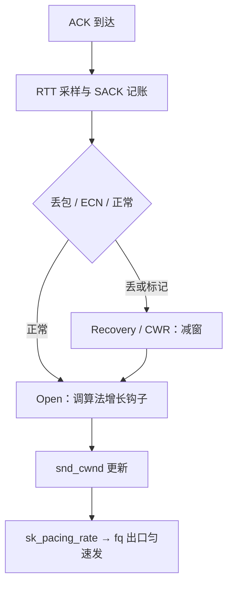

# 拥塞控制的实现

算法论文画的是窗口随时间的曲线；协议栈里它是一次函数调用加几个整型字段——每个 ACK 到达时改几个数，其余时间窗口只是一份无人触碰的账。

<footer>—— 据 RFC 5681、RFC 6928；Linux tcp_congestion_ops 接口与 net/ipv4/tcp_input.c 口径整理</footer>

[上一课](/cs/npk-tcp-state-machine)把 ESTABLISHED 的 sock 落在四元组哈希表里；拥塞变量 `snd_cwnd`、`ssthresh` 就栖在这个对象上，随状态生灭。主干课已拆过 AIMD 的动机（[拥塞控制](/cs/tcp-congestion)）、Reno 与 Cubic 的曲线（[Reno 与 Cubic](/cs/reno-cubic)）与 [BBR](/cs/bbr) 的另起炉灶；[AIMD 动力学](/cs/aimd-dynamics)给了收敛证明。本课不重推任何一条曲线，只写它们共同的实现落点：算法怎么插拔、窗口何时被改、记分板怎么记、发包节奏由谁执行。

## 问题

三个实现问题决定了算法能不能按论文工作：算法必须可在不重编内核的情况下按连接更换；丢包判定只能发生在 ACK 到达的那条路径上，发送线程自己无从知道对端收没收到；重传队列必须能按序号快速定位「哪些段已确认、哪些成洞」。不这么做会错在哪：把窗口更新挂在定时器或应用调用上，曲线就不再跟着 ACK 走，多流公平性与反应性全部落空；把记分板做成顺序扫描，大窗口（十万段量级）下每个 ACK 扫一遍队列，CPU 先于网络饱和；忽略 pacing，窗口允许的突发会在微秒级全数压进瓶颈队列，自己制造丢包再把自己减窗。

## 方法

三件事各有一个落点。插拔：每个算法定义一张 `tcp_congestion_ops` 函数表——钩住窗口增长、拥塞事件、慢启动阈值；`setsockopt(TCP_CONGESTION)` 按连接换表，`tcp_congestion_control` 定全机默认。Cubic 与 BBR 的差别就是两张函数表的差别。更新时机：每个 ACK 进入 `tcp_ack`——RTT 采样、累计确认推进、SACK 块记账，然后按丢包判定结果驱动一个拥塞子状态机（Open、Disorder、CWR、Recovery、Loss 五态）：正常则调用算法的窗口增长钩子，判定丢包（三个重复 ACK 或 RACK 按时间断定）则迁入恢复态并减窗，ECN 的 CE 标记走 CWR 态减一次。记账：重传队列是一棵按序号索引的红黑树，SACK 块在树上标「已到、未确认」，恢复结束时树上仍留的区间就是重传对象。节奏：窗口只答「最多飞多少」，何时刻满由 `sk_pacing_rate` 回答，通常交给 [fq qdisc](/cs/tx-path-qdisc) 在出口执行——把突发摊成匀速。

## 机制

落点的结构性理由：ACK 处理是全栈唯一同时看得见「对端视角」与「本端队列」的位置，窗口逻辑放这里才闭环。函数表把算法从状态机里解耦——恢复、记分板、RTO 是公共底座，Cubic 与 BBR 只换增长与减窗钩子，这就是「同一套丢包信号下的窗口几何」能并存的原因。红黑树让按序号的操作（查洞、清已确认）都是对数阶，记分板从「位图标记」进化为「树上区间」，万段窗口也不怕。pacing 把拥塞控制的两个自由度分开：`cwnd` 管量，`pacing_rate` 管速，前者由 ACK 驱动、后者按 BDP 折算——只认窗口不认节奏的实现，会在窗口恢复的瞬间把整窗突发打出去，等于自己给自己喂丢包信号。

两个易错点的数字：初始窗口自 RFC 6928 起是 10 个 MSS，不是教科书旧图里的 1；`snd_cwnd` 以段为单位，不足一段的零头由 `snd_cwnd_cnt` 攒——把窗口当字节数直接加减，微 MSS 与对齐的细节立刻算错。`ss -ti` 的 cwnd 字段读的就是它，单位是段。

## 边界

本课不重推 AIMD 的收敛（[aimd-dynamics](/cs/aimd-dynamics)）、Cubic 的时间立方（[reno-cubic](/cs/reno-cubic)）、BBR 的带宽建模（[bbr-v2-v3](/cs/bbr-v2-v3)）与 DCTCP 的标记比例（[dctcp](/cs/dctcp)）；RTO 定时器的估计与退避归 [RTO 与 Karn](/cs/tcp-rto)。无线链路上的假丢包问题也不在此展开。后课默认：拥塞变量已挂上 sock、随 ACK 更新、发包有节奏；下一课转向应用与内核的交界——这些对象如何被套接字层包装成交付给进程的 fd。

## 小结

- 拥塞控制的实现三落点：算法函数表可插拔、更新只在 ACK 路径、记分板是序号红黑树。
- ESTABLISHED 内部还有五态拥塞子状态机，由丢包判定与 ECN 驱动迁移。
- pacing 把「发多少」与「多快发」分开，突发窗不摊开就是自造丢包。
- 初始窗口 10 MSS、窗口按段记账——数字与单位错了，曲线就对不上论文。
- 出处：RFC 5681、RFC 6928；Ha, Rhee and Xu（CUBIC）；Cardwell 等（BBR）；Linux tcp_congestion_ops 口径整理。
