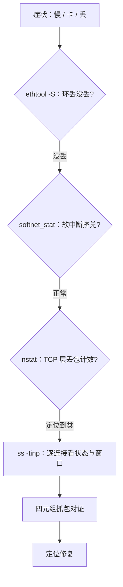
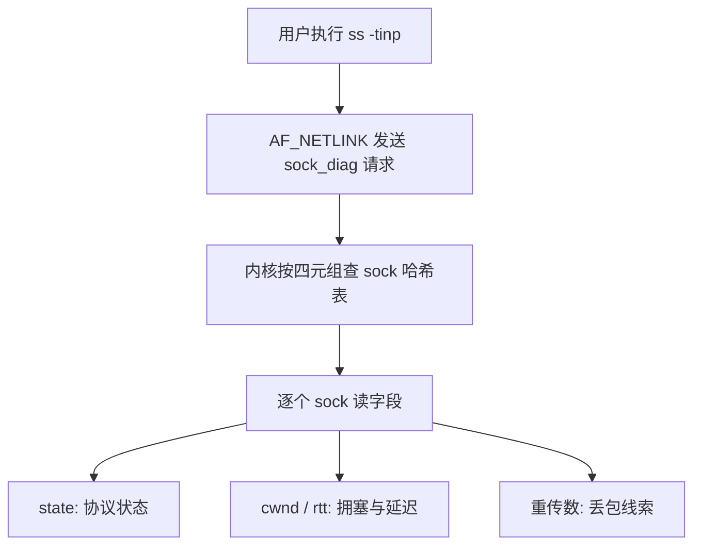

# 协议栈的调试工具

排障的纪律是先问「丢在哪一层」，再问「为什么丢」；工具不是按名字挑的，是按你要看的那节管道挑的。

<footer>—— 据 Linux ss/nstat/ethtool 手册；内核 per-cpu 计数器与 sock_diag 文档整理</footer>

[上一课](/cs/npk-socket-layer)把 fd 与 sock 的映射钉死，也留了一句伏笔：`ss` 这类工具靠 `AF_NETLINK` 直接读内核的 sock 对象。前三课还埋了更重要的东西——一整条路径上**每层的计数器**：网卡的环、软中断的预算、backlog、socket 队列、TCP 子状态。[抓包与 Wireshark](/cs/packet-capture) 教过线上的对证，[内核调试的方法](/cs/osk-kernel-debugging)教过 ftrace 与 kprobe 的分工。本课把工具按「症状在哪层」重排：从吞吐异常或连接卡死出发，走到具体哪一节管道出了问题。

## 问题

协议栈排障的缺口不是缺工具，而是计数器太多、彼此独立，按名字扫一遍什么也读不出来。必须先有一个从症状到层的判定序。不这么做会错在哪：只看 `ifconfig` 的总错包数——收包环、协议栈、应用层不读的丢包都混在 error 计数里，读不出丢在哪层；一上来就 `tcpdump` 抓全量——生产机上 CPU 与磁盘先饱和，且抓到的只是协议叙事，回答不了「包根本没到」；对 `netstat -s` 的绝对值惊慌——这些计数器从开机累加，不看增量与对照等于没看。

常见误区：看到 `netstat -s` 里「X 万个包被丢弃」就断定正在丢包。这些计数器从开机一路累加——一台跑了半年的机器，历史累计可能早就数以万计，而此刻的丢弃速率是零。正确读法是隔几秒取两次快照做差：差值为正且与症状同步增长，才算证据。

## 方法

按层走一遍判定序。第一层，包到没到网卡：`ethtool -S` 看驱动的 `rx_missed_errors`、`rx_no_buffer`——环或缓冲耗尽，包死在 DMA 之后、内核之前。第二层，进没进协议栈：`/proc/net/softnet_stat` 每行头三列是已处理数、软中断内丢弃数、`time_squeeze`（预算用尽次数，十六进制）；第四列起是 backlog 溢出与 CPU 忙不过来的挤兑记录。第三层，TCP 在哪丢：`nstat` 读 TcpExt——`ListenOverflows`/`ListenDrops` 对应 [accept 队列满](/cs/npk-tcp-state-machine)，`TCPBacklogDrop` 对应 [软中断与进程上下文的交接](/cs/npk-rx-path)，`PruneCalled` 是 socket 内存会计在修剪队列。第四层，看单个连接：`ss -tinp` 经 sock_diag 直接读内核 sock——state、cwnd、rtt、重传数，把[拥塞子状态机](/cs/npk-congestion-implementation)的变量按连接打印出来。最后才抓包，且只抓四元组过滤后的流量，按[捕获点纪律](/cs/packet-capture)注意 GRO 与卸载对边界的变形。静态计数器答不了的时序问题，用 [BPF 观测](/cs/ebpf-observability)在事件处聚合，或按 [ftrace 的分工](/cs/osk-kernel-debugging)用 tracepoint 取稳定字段。

术语翻译：四元组就是（源 IP，源端口，目的 IP，目的端口）这四个数——一台机器上百万条连接全靠它区分。`time_squeeze` 直译「时间被挤掉」：软中断一次预算（比如 8 个包或一小段时间）用完了还没处理完，被迫收工的次数——它涨，说明 CPU 忙不过来，不是网卡丢。

## 机制

这些工具能工作，靠的是前几课埋下的结构：每层入口都有计数器，是实现的副产品；`ss` 能逐连接读 sock，是因为[套接字层](/cs/npk-socket-layer)把 sock 做成了可寻址对象，netlink sock_diag 只是给它们开了查询口；softnet_stat 的三列对应[软中断预算](/cs/npk-rx-path)的三个结果——处理完、丢掉、被挤兑。读懂机制还给了推断力：`time_squeeze` 持续增长而网卡干净，说明 CPU 是瓶颈，调大预算只是把拥塞从软中断挪到硬中断；`ListenDrops` 增长而应用 idle，说明 accept 循环跟不上，病在应用线程不在内核。

softnet_stat 头三列是 processed、dropped、time_squeeze，十六进制——把它当十进制读，结论会差一个数量级。`nstat -az` 加 `a` 才显示零值计数器；对比两次快照看增量，是这套计数器唯一的正确读法。

直觉类比：`ss` 查连接像去医院调病历——不是把病人搬出来，而是凭挂号号（四元组）到档案室（内核 sock 表）调阅化验单（state、cwnd、rtt、重传数）。netlink sock_diag 就是那扇「调阅窗口」：数据始终在内核里，用户态拿到的只是副本。

## 边界

本课不重教过滤器语法与 Wireshark 用法（[抓包与 Wireshark](/cs/packet-capture)），不重写 ftrace/kprobe 本体与 kdump（[内核调试的方法](/cs/osk-kernel-debugging)），火焰图与硬件计数器归观测课，ns-3 一类仿真归[网络仿真](/cs/network-simulation)。丢包原因编号（内核 5.17 起随 kfree_skb 事件给出 reason）按内核版本而定，判定序本身不随版本变。下一课收束全课程。

## 小结

- 排障按层走判定序：网卡环 → 软中断预算 → TCP 层计数 → 逐连接 sock → 抓包对证。
- 计数器从开机累加，只有增量与分层对照能当证据。
- `ss -tinp` 经 netlink 直接读内核 sock，是前三课对象账的查询口。
- 时序问题交给 BPF/tracepoint，捕获点与变形纪律照旧。
- 出处：Linux ss/nstat/ethtool 手册；内核 softnet_stat、TcpExt 与 sock_diag 文档口径整理。
