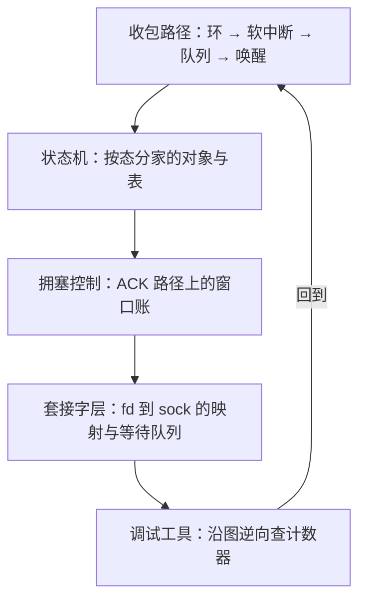

# 协议栈实践收束

读协议栈读到最后一课，拿走的不是函数名清单，而是四条不变的骨架：状态有地址、转移有动作、排队有预算、拒绝有计数。

<footer>—— 据 Benvenuti, <em>Understanding Linux Network Internals</em>；Stevens, <em>TCP/IP Illustrated</em>；RFC 9293 对照整理</footer>

[上一课](/cs/npk-debugging-tools)给了从症状到层的判定序。本课程到此收束：本课把五课拼回一张图——一个包从网卡到进程、再从进程回到网卡的完整旅程——并把这一层实践沉淀出的共同原理收在四条骨架上，给主干课的「为什么这样设计」补上「落进代码是什么样」。

## 问题

收束要回答的是：读完五课，换成另一套协议栈（另一内核版本、用户态栈、甚至 QUIC 的用户态实现）时，哪些知识跟着版本走、哪些不跟。不这么做会错在哪：把函数名与 sysctl 名当知识带走，版本一换全部作废；把主干课的协议语义与本课程的对象账混成一层，就分不清「TIME_WAIT 该不该有」（协议问题）与「tw 桶满了谁被淘汰」（实现问题）——两者都真实，但答案属于不同的书。

## 方法

拼图按一个包的旅程走。[收包路径](/cs/npk-rx-path)：DMA 进环、中断只通知、软中断按预算轮询、GRO 合并、四元组查出 sock、计入 rmem、`sk_data_ready` 唤醒。[TCP 状态机](/cs/npk-tcp-state-machine)：同一逻辑连接按态分家——LISTEN 两队列、ESTABLISHED 哈希表、TIME_WAIT 小对象、close 之后的孤儿。[拥塞控制](/cs/npk-congestion-implementation)：窗口只在 ACK 路径上被改，算法可插拔，节奏由 pacing 与 qdisc 分管。[套接字层](/cs/npk-socket-layer)：fd、BSD 套接字、协议 sock 三层映射，等待队列把软中断的生产与进程的消费会合。[调试工具](/cs/npk-debugging-tools)：沿同一张图逆向查计数器，从网卡环一路查到 socket 队列。正向读是理解，逆向查是排障，同一张图两个方向。

## 机制

四条骨架在五课里各出现至少一次。状态有地址：状态存哪张表、哪个字段，决定查找成本、生命周期与它出现在哪个计数器里——找不到地址的状态无法观测也无法回收。转移有动作：状态机的边携带发段、起定时器、清记账，图是抽象，边才是程序。排队有预算：软中断预算、SYN 队列、accept 队列、rmem/wmem——栈里没有无限的东西，满了各有各的拒绝方式。拒绝有计数：每个拒绝点都留一个名字，这是排障判定序能成立的全部前提。这四条也是检验新栈的尺子：用户态协议栈把内核的函数换成自己的，但只要状态仍可寻址、队列仍有预算、拒绝仍留计数，[上一课](/cs/npk-debugging-tools)的判定序就换汤不换药；反之，[内核旁路](/cs/hpc-kernel-bypass)卖掉内核服务时，卖掉的正是这四条的实现者——状态、计数、预算全要自建，那份代价清单旁路课已经列过。往更深走，[高性能网络](/cs/hpc-map)的路径下移与本课程的路径解剖互为里外：一个从瓶颈往下换栈，一个从线缆往上读栈。

一个自查口径：读完本课程后，遇到「连接慢」，应能不查资料说出至少四个候选丢包点与各自的计数器名——网卡环 miss、softnet_stat 挤兑、ListenDrops、RcvPruned。说不全，说明读到的还是工具清单而不是结构。

## 边界

本课程不写特定版本内核的源码导读，函数名随版本漂；不写 eBPF 数据面编程与 [网络虚拟化](/cs/virt-network-virtualization)的数据面；QUIC 的用户态实现只在对照里点名，不在本课程展开。主干课继续答协议设计，本课程到此收束。

## 小结

- 五课拼成一张双向图：正向是包的旅程，逆向是排障的判定序。
- 四条骨架跨版本成立：状态有地址、转移有动作、排队有预算、拒绝有计数。
- 协议语义（该不该有）与实现对象（在哪、满没满）分层作答，不混为一谈。
- 内核旁路卖掉的正是这四条的内核实现者，自建代价是选型的一等输入。
- 出处：Benvenuti, *Understanding Linux Network Internals*；Stevens, *TCP/IP Illustrated*；RFC 9293；据本课程五课的对象与计数器口径整理。
