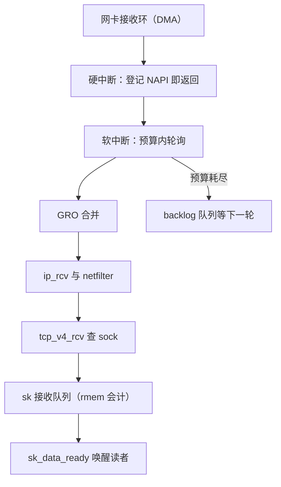

# 收包路径的解剖

应用看见的「可读」是一个事件；把它生产出来的是一条由中断、预算、队列与内存会计串成的流水线，每一节都有容量，每一节都会丢。

<footer>—— 据 Benvenuti, <em>Understanding Linux Network Internals</em>；Linux 内核对 NAPI 与 softirq 预算的文档整理</footer>

[上一课](/cs/osk-map)给「操作系统内核实践」收束：执行流、地址、数据、同步入口、异步入口、失效面六课一条装配主线，四条不变量各堵一个已知的装配失效——主干给零件图，本课程给总装图。网络协议栈照同一个读法拆：主干课的[阻塞与非阻塞套接字](/cs/socket-nonblock)把应用侧的合同钉在「就绪」上——阻塞读睡着等，非阻塞读立即返回 EAGAIN，再靠多路复用回来；[三次握手](/cs/tcp-handshake)、[序号与重传](/cs/tcp-seq-rexmit)、[流控窗口](/cs/tcp-window)被当协议拆过；操作系统课也用[接收路径](/cs/rx-path)把函数链串过一遍。本课程「网络协议栈实践」开始把每一段拆开当程序读。第一课解剖收包路径：一帧从网卡内存到进程被唤醒，经过几段队列、几次上下文切换、哪些检查点会丢包。后课默认你已读过这条路径。

## 问题

应用层的观感是「有数据了」；实现层要回答的是预算问题：软中断一次最多干多少活、socket 队列最多装多少字节、装不下时谁被丢。不这么做会错在哪：把丢包一律归咎网卡或对端，会漏掉最常见的第三类——网卡计数器干净、线上也干净，包丢在软中断预算耗尽之后的 backlog 队列或 socket 内存会计上；这三类丢包各有各的计数器，混在一起就查不下去。

## 方法

逐段解剖。入口：网卡 DMA 把帧写进接收环，硬中断只做一件事——登记 NAPI 并调度软中断，然后把中断关掉，否则每个包都打断一次 CPU。轮询：软中断 `net_rx_action` 在预算内循环调驱动 poll，一次预算默认三百个包、八毫秒上限，单设备单轮权重六十四；预算花完，剩余帧留在 backlog 队列等下一轮，`time_squeeze` 计数器加一。合并：GRO 把同流的小帧并成最大六十四 KB 的逻辑包再交协议栈，协议栈每字节只跑一次。分发：`eth_type_trans` 认出 IPv4 后，`ip_rcv` 过 netfilter 钩子，本机交付走 `tcp_v4_rcv`，用四元组哈希在 established 表里一次查出 sock——early demux 在此之前先把查到的 sock 缓存下来，省掉一次路由查找。入队：skb 计入该 sock 的 rmem 会计，超限则修剪队列甚至丢包，成功则挂进接收队列并执行 `sk_data_ready` 唤醒读者——这正是主干课[阻塞与非阻塞套接字](/cs/socket-nonblock)「就绪」合同的生产端。

## 机制

这套组织的理由是摊销与记账。中断只付一次「有包」的通知成本，批量轮询把固定成本摊到整批，代价是预算内的包要等轮询结束——这是延迟与 CPU 的交换。每层剥头不复制，六十四字节的以太网头到 TCP 头一路是同一块 skb 换偏移。内存会计把「谁吃光内核内存」钉到每个 sock：慢读者不会拖垮全机，只会压低自己的通告窗口——这是[套接字缓冲与背压](/cs/socket-buffers)的机制在收包路径上的执行点。多核下 RSS 先按流哈希选队列，RFS 再把协议栈处理搬到应用所在的核，付一次跨核通知换缓存亲和（[RSS 与多队列](/cs/rss-multiqueue)）。丢包点各有名字：backlog 溢出记 `TCPBacklogDrop`，socket 队列修剪记 `PruneCalled`，软中断丢帧记 softnet_stat 第二列。

预算的默认值值得背下来：`net.core.netdev_budget` 300、`netdev_budget_usecs` 8000 微秒、单轮权重 64。10 GbE 线速小包约 14.88 Mpps，每个软中断循环只处理 300 包——预算跟不上线速时，包根本没到协议栈就积压在驱动环里，`rx_missed` 类网卡计数器先涨。

## 边界

本课不重讲 [GRO 与 GSO](/cs/gro-gso) 的合并规则，不展开 [netfilter](/cs/netfilter-conntrack) 的表与链，转发路径（本机不是终点）与 XDP 的驱动层分流也不在此——那是[内核旁路](/cs/hpc-kernel-bypass)的世界，本课程只承认它在更早的检查点上就能把包拿走。虚拟化里的 veth 与网桥变形不在本课。后课默认：包到 TCP 时已在 sk 接收队列里，唤醒路径成立；下一课把 TCP 拿到包之后怎么记账——状态机——拆开。

## 小结

- 收包路径是一条预算链：中断只通知，软中断按预算轮询，超支的包排队或被丢。
- early demux 与四元组哈希让「找 sock」一次命中；rmem 会计把丢包责任钉到单个连接。
- 三类丢包（网卡环、backlog、socket 队列）各有独立计数器，排障必须分层对号。
- 「可读」事件由 `sk_data_ready` 生产，是阻塞与非阻塞合同在内核里的落点。
- 出处：Benvenuti, *Understanding Linux Network Internals*；Linux 内核 NAPI/softirq 文档；Stevens, *UNIX Network Programming*。
