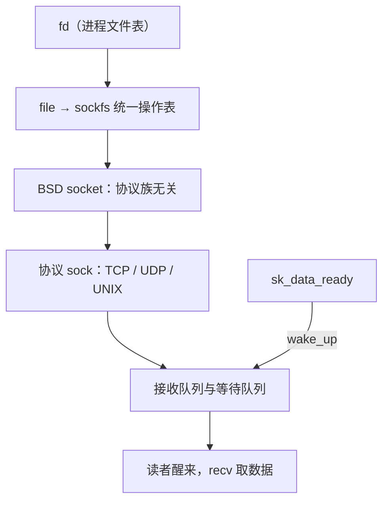

# 套接字层的实现

进程手里捏着的只是文件描述符表里的一项；把它变成一条 TCP 连接的，是 fd、BSD 套接字、协议 sock 三层对象之间一张固定的映射表。

<footer>—— 据 Leffler 等, <em>The Design and Implementation of the 4.3BSD UNIX Operating System</em>；Stevens, <em>UNIX Network Programming</em> 整理</footer>

[上一课](/cs/npk-congestion-implementation)结束时，TCP 的全部收发状态——状态机、拥塞变量、重传队列——都挂在协议层的 sock 对象上；但应用从来碰不到 sock，它手里只有 `socket()` 返回的一个整数。主干课用[套接字 API](/cs/socket-api) 钉过调用形状，用[缓冲与背压](/cs/socket-buffers)钉过内存会计，[套接字选项](/cs/socket-options)列过旋钮，[hpc-epoll 深化](/cs/hpc-epoll-deep)拆过事件循环。本课补最后一层实现：fd 到 sock 的三层映射怎么查、`read` 与 `poll` 怎么落到同一条等待队列、连接的身份与生命周期归谁管。

## 问题

三层对象不是故弄玄虚，每层各答一个问题：fd 答进程局部性（同一 sock 可以被多个 fd、多个进程指着）；BSD 套接字（`struct socket`）答协议族无关（`AF_INET` 与 `AF_UNIX` 在这一层调用形状相同）；协议 sock（`struct sock`）答协议状态。不这么做会错在哪：把 fd 当连接本身，就会在 `fork` 或 `dup` 之后误判——两个 fd 指同一个 sock，只 close 其中一个，连接照活，TIME_WAIT 与发送照常进行；以为 `accept()` 那一刻连接才建立，会在 accept 队列堆积时误把「完成握手但没被领走」的连接当不存在——它们早就占着内核资源；在非阻塞监听 fd 上不处理 accept 的 EAGAIN，事件循环会被假唤醒打转。

## 方法

顺着一次 `read()` 走。fd 经进程文件表找到 file，file 的操作表指向 sockfs 的统一入口 `sock_read_iter`，它调 BSD 层的 `inet_recvmsg`，再按协议派给 `tcp_recvmsg` 或 `udp_recvmsg`——三层各转发一次，协议语义只在最底层分岔。等待与唤醒：阻塞读把当前进程挂到 sock 的等待队列上睡；[收包路径](/cs/npk-rx-path)末端那个 `sk_data_ready` 执行的正是 `wake_up` 这条队列——第一课的流水线在套接字层会合。`poll/epoll` 注册的也是同一条队列，就绪语义天然一致。accept：从监听 sock 的 accept 队列取出已握手的子 sock，为它新造 BSD 套接字与 fd；注意 Linux 上 accept 出来的 fd 不继承监听 fd 的非阻塞标志，`accept4` 才能一并设定。协议族分岔：`AF_UNIX`（[Unix 域套接字](/cs/unix-socket)）不经网络栈，数据是内核内 skb 拷贝，还能借 SCM_RIGHTS 传 fd；`AF_NETLINK` 连接内核与用户态的消息口——下一课的 `ss` 就靠它读内核 sock。

## 机制

分层的机制含义是所有权清晰：fd 是引用，sock 是本体，生命周期跟着最后一个引用走而不是跟第一个 close 走——引用计数到零才触发真正的关闭路径，进入[上一课](/cs/npk-tcp-state-machine)的挥手或孤儿状态。等待队列把「生产者在软中断、消费者在进程上下文」的跨上下文会合收成一个原语：任何协议、任何 fd 类型（管道、终端、设备）共享同一套睡眠唤醒合同，这就是为什么 `select` 能同时等磁盘与网卡。共享同一 sock 的并发读写没有天然隔离，数据竞争要应用自己兜底——套接字层提供原语，不提供策略。

容量数字：单进程 fd 上限是软限制 `RLIMIT_NOFILE`（常见默认 1024，服务要显式调高），进程级硬顶 `fs.nr_open` 默认 1048576，全机总量看 `fs.file-max`。压测报 EMFILE 时先查这三个数，别先怀疑协议栈。

## 边界

本课不重列 Berkeley 调用（[套接字 API](/cs/socket-api) 已钉形状），不重讲缓冲会计与非阻塞语义（[套接字缓冲与背压](/cs/socket-buffers)、[阻塞与非阻塞套接字](/cs/socket-nonblock)），epoll 的惊群与分片在 [epoll 的深化](/cs/hpc-epoll-deep)，io_uring 的提交模型不在本课。原始套接字与抓包 socket 留给下一课的工具视角。后课默认：fd 到 sock 的映射与唤醒路径已钉死，内核里的 sock 是可寻址、可查询的对象——下一课的调试工具直接查它们。

## 小结

- fd、BSD 套接字、协议 sock 三层各有分工：进程引用、协议族无关、协议状态。
- 阻塞读、poll、epoll 共用 sock 的同一条等待队列，`sk_data_ready` 是所有就绪事件的生产端。
- 生命周期跟 sock 的引用计数走：dup/fork 共享本体，close 只退引用。
- accept 出的 fd 不继承非阻塞标志；`AF_UNIX` 走内核拷贝还能传 fd，`AF_NETLINK` 是工具读内核的口。
- 出处：Leffler 等, *The Design and Implementation of 4.3BSD*；Stevens, *UNIX Network Programming*；Linux sockfs 与 accept(2) 手册口径。
