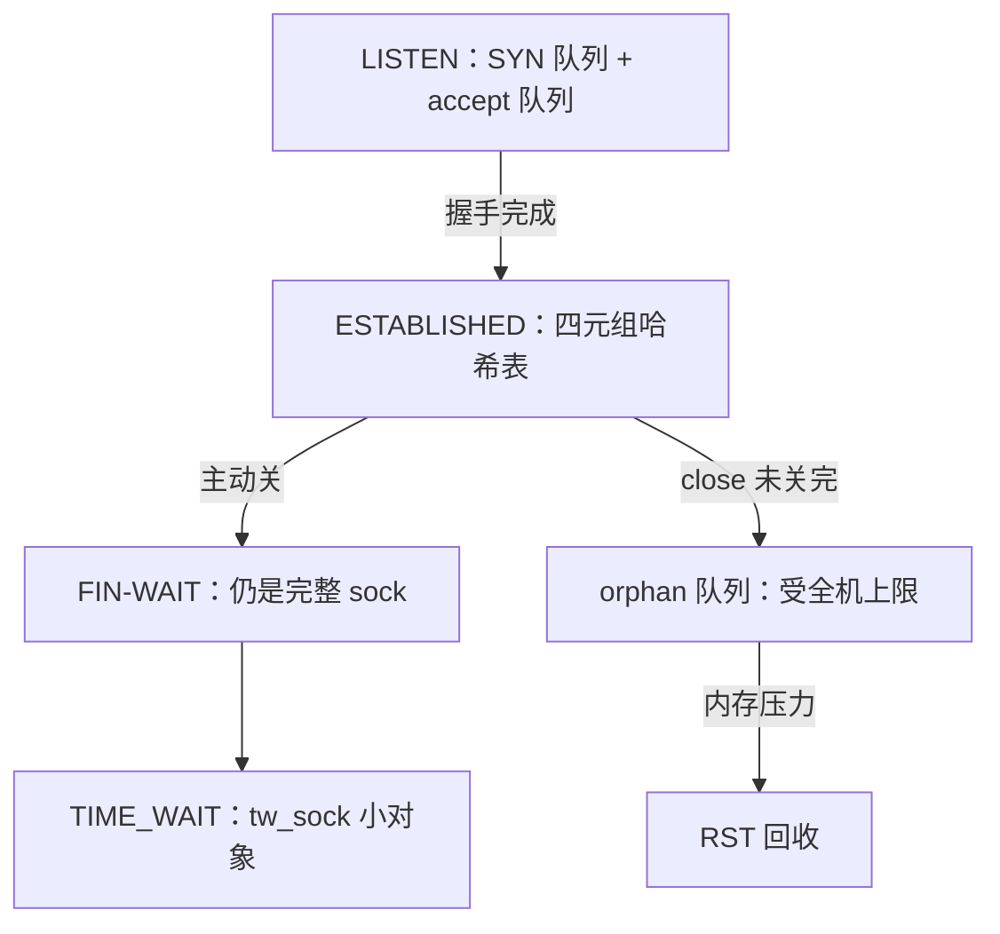

# TCP 状态机的实现

协议文档把状态画成一张图；实现里它是一个整型字段加上散落在各处理函数里的迁移代码——真正要读懂的是每条迁移边上谁改了它、谁在等它。

<footer>—— 据 RFC 9293；Stevens, <em>TCP/IP Illustrated Vol. 2</em>；Linux net/ipv4 源码口径整理</footer>

[上一课](/cs/npk-rx-path)把帧送进 sk 接收队列并唤醒读者，`tcp_v4_rcv` 在 established 表里按四元组找 sock——但只找了「已建立」的连接。主干课已用[TCP 状态机](/cs/tcp-state-machine)钉死十一态的主路径与 [TIME_WAIT](/cs/tcp-time-wait) 的理由，[内核 TCP 实现要点](/cs/kernel-tcp-impl)点过队列与定时器的名。本课补实现这一层：状态存放在哪、迁移由谁执行、每一态的 sock 住在哪张表里。后课的拥塞变量、套接字层都建立在这份账上。

## 问题

状态机不难画，难的是它的实现形态决定资源账：LISTEN 的半开连接放哪个队列、满了谁被丢；TIME_WAIT 为什么不是 sock 而是另一个对象；close 返回之后连接归谁。不这么做会错在哪：把 TIME_WAIT 当泄漏全局关掉，旧段的序号会串进新连接——主干课的警告，其机制就是这里的状态对象生命周期；把 accept 队列满当成「客户端慢」，会去调对端超时，而病根在本机 `listen(fd, backlog)` 与 `somaxconn` 的配置；以为 `close()` 即刻回收，会在高连接周转时撞上孤儿连接的内存上限——内核可能替你提前发 RST。

## 方法

按状态对象读。LISTEN 态：监听 sock 挂两个队列——SYN 队列放半开连接（收到 SYN、回完 SYN-ACK、等第三次握手的 `request_sock`），accept 队列放三次握手完成、等 `accept()` 领走的子连接；accept 队列满则丢第三次握手 ACK（对端重传），`tcp_syncookies` 打开时改用无状态的 cookie 应答，把半开状态搬进序号里（[SYN cookies](/cs/syn-cookies)）。ESTABLISHED 态：完整 sock 挂四元组哈希表，[上一课](/cs/npk-rx-path)的查找命中就是这张表。TIME_WAIT 态：tw_sock 是缩小版对象，不占发送队列与拥塞状态，进独立的 timewait 表，受 `tcp_max_tw_buckets`（默认 262144）封顶，超限按最旧淘汰；`tcp_tw_reuse` 只对主动发起方生效。关闭路径：主动关走 FIN-WAIT 到 TIME_WAIT；close 时应用不再持有但连接未关完，sock 变成孤儿（orphan），计入全机 `tcp_max_orphans`，内存压力下内核直接 RST 回收。有未读数据的连接 close 会发 RST——数据还没给应用，可靠的语义已经不成立。

## 机制

实现形态解释了行为怪癖。同一逻辑连接在不同态住在不同的表里，查找方（上一课的收包路径）必须在每一态命中正确的表——这就是为什么 SYN-RECEIVED 的包要查两张表、TIME_WAIT 收到包可能回 ACK 也可能回 RST。迁移代码散在 ACK 与数据处理函数里而不是一张查找表，因为每条边还携带动作：发段、起定时器、清记账——图是抽象，边才是程序。定时器把「无包可等」的态挂上时钟：重传定时器、FIN-WAIT-2 的孤儿超时、保活定时器探半开连接，都是把状态机的停滞变成可回收事件。`SO_LINGER` 的 RST 档、带未读数据的 close，都是把优雅关换成中止态的出口。

accept 队列长度的真实上限是 `min(backlog, somaxconn)`，内核 5.4 起默认 4096，旧内核是 128——「改了应用 backlog 没用」先查它。`ss -lnt` 的 Recv-Q 在 LISTEN 态读出的正是当前 SYN 队列深度，是半开积压的直接观测。

## 边界

本课不重画[主干状态机](/cs/tcp-state-machine)的十一态全图，不展开同时打开与同时关闭的边角，TFO 与 [MPTCP](/cs/mptcp) 的多子流状态不在此。syncookies 只接主干结论：它换掉的是状态不是安全性。后课默认：cwnd 等拥塞变量栖在 ESTABLISHED 的 sock 上、随状态生灭；下一课把这些变量的更新时机拆开。

## 小结

- 状态机的实现 = 一个 state 字段、散装的迁移边、按态分家的数据结构。
- LISTEN 有两队列：SYN 队列放半开，accept 队列放成品；满与洪泛各有对策。
- TIME_WAIT 是 tw_sock 小对象，受全机桶数封顶；orphan 是无人认领的 sock，受内存上限。
- close 不等于 CLOSED：带未读数据发 RST，关不完变孤儿。
- 出处：RFC 9293；Stevens, *TCP/IP Illustrated Vol. 2*；Linux net/ipv4 源码口径整理。
