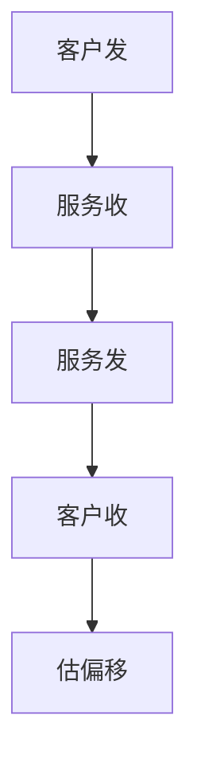

# NTP

NTP 用四时间戳估计往返与偏移，把主机时钟循向更上层的源；分层 stratum 防止环，精度到毫秒级常见。

<footer>—— 据 RFC 5905 NTPv4；Mills, Computer Network Time Synchronization 整理</footer>

[DNSSEC](/cs/dnssec) 与 [TLS](/cs/http-tls-entry) 要合理时钟。[上一课](/cs/ssh-protocol) 的证书也要。缺口是 **NTP**：偏移估计、层级、不是 GPS 微秒。本课不把 PTP 写完。

## 问题

主机晶振漂。NTP：客户发 t1，服务器收 t2 发 t3，客户收 t4，偏移 θ≈((t2−t1)+(t3−t4))/2，延迟 δ=(t4−t1)−(t3−t2)。选多层源滤波。Stratum 1 近原子钟，往下递增。认证可用对称钥或 NTS（点名）。被劫持的时间源能搞垮 DNSSEC 与票据。

不要把 `date` 命令当协议。

RFC 5905。闰秒处理是边界。本课不把钟控环 PID 写完。

### 毫秒级驯服

四时间戳假设路径对称。多源防单点。时间错会搞垮 DNSSEC 与 PAWS。公网单台 NTP 不够。

## 方法

画：四时间戳 → 偏移。对照 ping：都用 RTT，NTP 要对称假设。非对称路径（卫星、流量工程）使 θ 偏。

方法止于选定对象与对照；机制才说它如何嵌入已有分层与主干课。

## 机制

数据中心用本地 stratum，减公网 RTT 噪声。防火墙放 123/UDP。DoS 放大曾是 NTP 单播/monlist 问题，当代应关。与 BDP 无关直接，但时间错会导致 TCP 时间戳 PAWS 误杀。

VM 热迁移后时钟跳，要重新驯服，接 OS 补层。

## 边界

本课不引入 NTS 握手全文。PTP 是下一课。后课默认：NTP 毫秒级驯服；路径不对称是误差源。

只信一台公网 NTP 是单点。

上一课留下的缺口在本课收口；「NTP」进入后课词汇表后只引用。文献用来钉对象与边界，不把本课写成该主题的独立综述。下一课[PTP](/cs/ptp-precision-time)。

## 小结

- 四时间戳估偏移与延迟。
- Stratum 分层；要多源。
- 安全：认证，关放大。
- 后课只引用本课钉死的对象，不从该领域总问题重开。
- 出处：RFC 5905；Mills。
