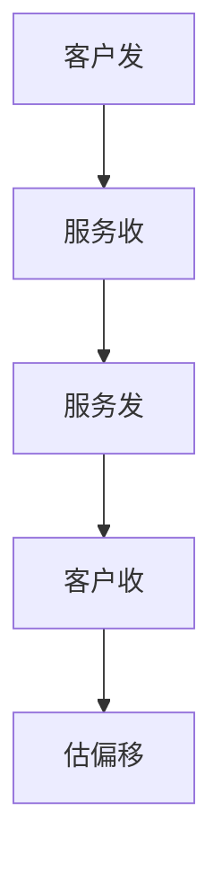
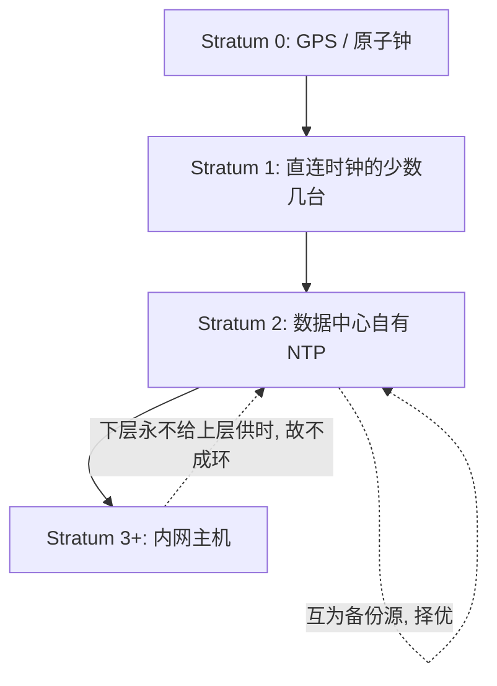

# NTP

NTP 用四时间戳估计往返与偏移，把主机时钟循向更上层的源；分层 stratum 防止环，精度到毫秒级常见。

<footer>—— 据 RFC 5905 NTPv4；Mills, Computer Network Time Synchronization 整理</footer>

[DNSSEC](/cs/dnssec) 的签名有效期、[TLS](/cs/http-tls-entry) 的证书期、[上一课](/cs/ssh-protocol)的证书校验，全都压在一个前提上：主机时钟合理。本课补这个前提——**NTP**：偏移估计与分层拓扑。不是 GPS 那类微秒级来源；PTP 留给下一课，本课不把它写完。

## 问题

晶振会漂，时钟必须周期校准。NTP 的核心是一次交换四个时间戳：客户发 $t_1$，服务器收 $t_2$、回 $t_3$，客户收 $t_4$；偏移 $\theta\approx((t_2-t_1)+(t_3-t_4))/2$，往返延迟 $\delta=(t_4-t_1)-(t_3-t_2)$。客户对多个源多次采样，滤波择优后缓慢驯服本地钟。拓扑分层：Stratum 1 直连原子钟或 GPS，往下逐层递增，分层既防环也逐层累积误差。协议可认证：对称密钥或 NTS（点名）。安全后果要记牢：被劫持的时间源能整体挪动 DNSSEC 的有效期窗口与票据期限，等效于攻破这些系统。

数字实例：设客户 $t_1=0$ 毫秒发出，服务端 $t_2=10$ 收到、$t_3=12$ 回，客户 $t_4=20$ 收到。偏移 $\theta=(10+(12-20))/2=1$ 毫秒——你的表慢 1 毫秒；往返 $\delta=20-(12-10)=18$ 毫秒。分子再大也只要小学加减法，难的是假设「去和回一样快」。

`date` 只是读钟，不含估计与驯服，不是协议。

RFC 5905。闰秒处理是边界。本课不把钟控环 PID 写完。

### 毫秒级驯服

四时间戳公式假设上下行路径对称，非对称路径直接变成 $\theta$ 的偏差，精度因此停在毫秒级而非微秒级。多源采样防单点：公网单台 NTP 服务器不能当唯一源。时间错的连带伤害不止 DNSSEC，还有 TCP PAWS——时间戳倒退的段会被当旧段丢弃。

## 方法

方法是读一次交换怎么变成估计：四时间戳给出偏移与延迟两个量。与 ping 对照：两者都测 RTT，但 ping 只要总和，NTP 要把 RTT 拆成偏移，于是多了对称假设；卫星链路与流量工程造成的非对称路径就落在这里变成误差。

```mermaid
flowchart TD
  T1["客户发"] --> T2["服务收"]
  T2 --> T3["服务发"]
  T3 --> T4["客户收"]
  T4 --> OFF["估偏移"]
```

直觉类比：四时间戳像两人对表。你说「我 0 点整发的话」，对方回「我 0 点 10 收到、0 点 12 回信」，你在 0 点 20 读到——去回各按 10、8 毫秒算，折中出「你的表慢约 1 毫秒」。`ping` 只报总账 20，NTP 要把总账拆成「钟差」与「路程」，才多出对称假设这条软肋。

## 机制

机制上，数据中心自建本地 stratum，只让少数几台从公网同步，下游用内网源减掉公网 RTT 噪声；防火墙要放行 123/UDP。安全历史上，`monlist` 查询曾被用作 DoS 放大器，当代实现应默认关闭。与 BDP 没有直接关系，但时间错会让 TCP 时间戳触发 PAWS 误杀，间接伤吞吐。VM 热迁移后时钟会跳，要重新驯服，接在 OS 的时钟校正层。

术语翻译：`monlist` 就是「把我认识的所有对端名单发给你」的调试查询——请求几十字节、响应可达几 KB，「放大攻击」就是用这种小请求骗大响应去淹没别人；所以当代 NTP 实现默认关掉它。

```mermaid
flowchart TD
  S0["Stratum 0: GPS / 原子钟"] --> S1["Stratum 1: 直连时钟的少数几台"]
  S1 --> S2["Stratum 2: 数据中心自有 NTP"]
  S2 --> S3["Stratum 3+: 内网主机"]
  S2 -.->|"互为备份源, 择优"| S2
  S3 -.->|"下层永不给上层供时, 故不成环"| S2
```

## 边界

本课不引入 NTS 握手全文，点名即可。PTP 是下一课。后课默认：NTP 做毫秒级驯服，路径不对称是主要误差源；只信一台公网 NTP 是单点。

下一课[PTP](/cs/ptp-precision-time)。

## 小结

- 四时间戳估计偏移与往返延迟。
- Stratum 分层防环，多源采样防单点。
- 安全两头：认证时间源，关闭放大查询。
- 后课只引用本课钉死的对象，不从该领域总问题重开。
- 出处：RFC 5905；Mills。
