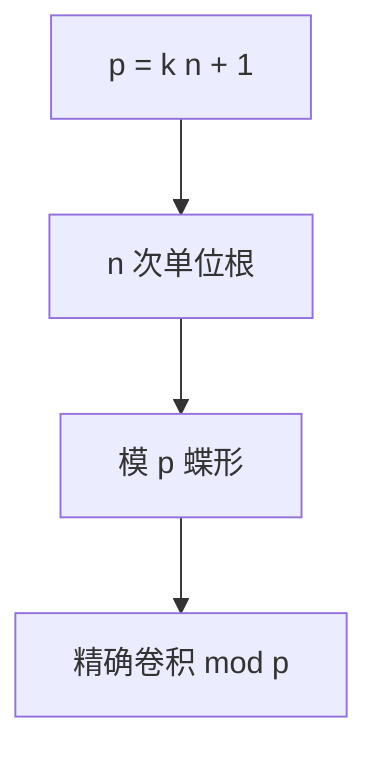
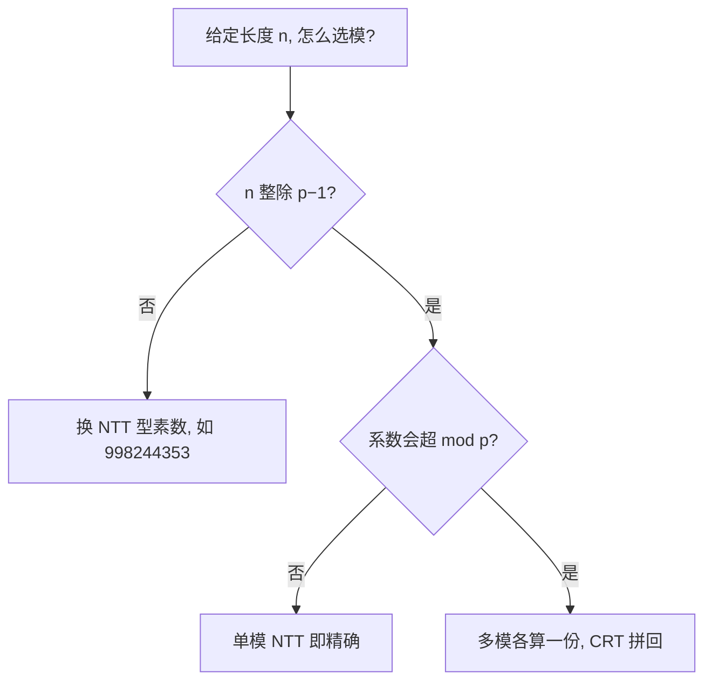

# NTT

模 $p$ 下若存在 $n$ 次单位根，DFT 的加减乘全部在整数进行：卷积精确，适合大整数与多项式取模。

<footer>—— 据 CLRS 第 30、31 章；数论变换见 Nussbaumer 与数论教材整理</footer>

上一课[FFT](/cs/fft)在复数上 $O(n\log n)$，浮点有误差。缺口是数论变换（NTT）：模素数 $p=k\cdot n+1$，原根 $g$，$n$ 次单位根 $\omega=g^k$。不重写蝶形结构。后课多项式求逆仍用 NTT 乘。接[有限域](/cs/finite-field-gf2n)的乘法直觉，不重写域公理。

## 问题

要 $\omega^n\equiv 1\pmod p$，且对真因子 $d\mid n$，$\omega^{n/d}\not\equiv 1$。则 Cooley–Tukey 原样，除 $n$ 改模逆。常用 $p=998244353=119\cdot 2^{23}+1$ 等。多模 + CRT 拼回大整数（Schönhage–Strassen 一类精确乘的实践版）。

缺口是模意义单位根存在条件，不是新蝶形。

### 不是任意模都能 NTT

$n$ 要整除 $p-1$。合数模没有域，不能随便当 NTT。长度不是 2 的幂可用 CRT 拼或其它原根阶。不要把 $10^9+7$ 当总能做长度为 $2^{20}$ 的 NTT——它不整除。

数字实例：为什么浮点 FFT 会失手？双精度浮点约 15-16 位有效数字；两个 $10^5$ 量级的系数相乘、再累加 $10^5$ 项，中间值可达 $10^{15}$，舍入误差已经和最低位同阶，「接近零」的系数判断会翻车。NTT 全程整数加减乘、对模 $p$ 取余，一个比特都不舍——这正是「精确卷积」三个字的分量。

NTT 是 DFT 在环 $\mathbb{Z}/p\mathbb{Z}$。CLRS 30.8 讨论数论。后课求逆：牛顿迭代 + NTT 乘。

## 方法

选 $p$、$n\mid p-1$、原根。预处理 $\omega$ 幂。蝶形全模 $p$。逆变换乘 $n^{-1}$。多素数再 CRT。

```mermaid
flowchart TD
  P["p = k n + 1"] --> W["n 次单位根"]
  W --> NTT["模 p 蝶形"]
  NTT --> CONV["精确卷积 mod p"]
```

卷积长度与 $p$ 同时约束。

术语翻译：原根 $g$ 就是模 $p$ 下的「万能生成器」——$g$ 的 1 到 $p-1$ 次幂恰好不重不漏跑遍所有非零余数。单位根 $\omega=g^k$ 是走了 $n$ 步就回到 1 的那档：它像复数里转圈的 $e^{2\pi i/n}$，只是圆周换成了模 $p$ 的余数圈。

## 机制

单位根的几何和在模 $p$ 同样正交，故 IDFT 还原。与 FFT 比：无舍入，有模范围。与 Karatsuba：NTT 对很长多项式渐近更好，阈值仍实验。快速幂算 $\omega$ 与 $n^{-1}$。

常见误区：「既然 NTT 精确，就永远用它」。实际上短多项式上朴素乘法或 Karatsuba 常数更小、更快；NTT 的优势要在长度大（如 $10^5$ 以上）才拉开。工业实践是按长度设阈值切换，不是二选一。

直觉类比：单个模 $p \approx 10^9$ 只能装下不超过 $p$ 的结果；两个大数相乘的结果远超它时，就用两三个不同的模各自算一份精确余数，再让 CRT 把它们「拼」回真值——像三把不同刻度的尺子量同一物，由三个读数唯一还原长度。

```mermaid
flowchart TD
  Q["给定长度 n, 怎么选模?"] --> C1{"n 整除 p−1?"}
  C1 -->|"否"| X1["换 NTT 型素数, 如 998244353"]
  C1 -->|"是"| C2{"系数会超 mod p?"}
  C2 -->|"否"| OK["单模 NTT 即精确"]
  C2 -->|"是"| CRT["多模各算一份, CRT 拼回"]
```

## 边界

本课不写全部常用模列表当作业。不写 p-adic、不写 Schönhage–Strassen 的完整复杂度陈述（可点名 $O(n\log n\log\log n)$ 级）。后课默认：精确多项式乘用 NTT。下一课多项式求逆与除法。

## 小结

- 存在单位根的模上，DFT 全精确。
- $n\mid p-1$；常用 Fermat 素数型模。
- 大整数：多模 CRT。
- 出处：CLRS 第 30 章；NTT 为 DFT 的模算术形式。
