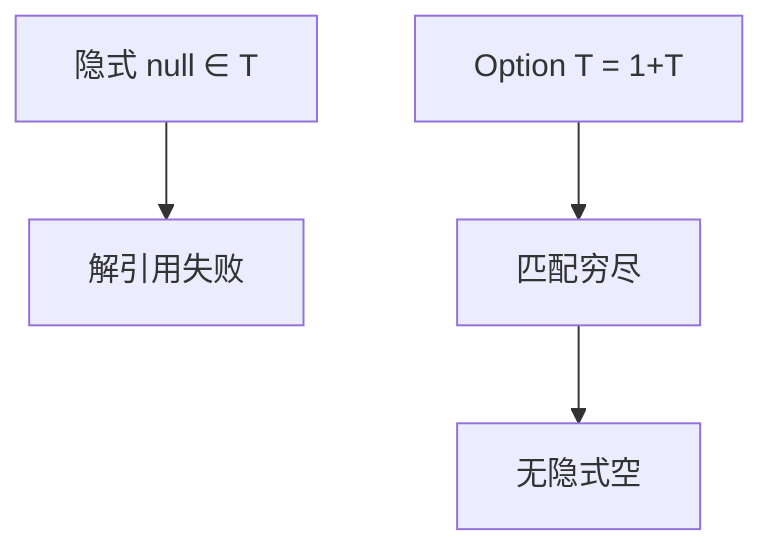

# 空与 Option

`null` 是每个引用类型上的隐式和。Option/Maybe 把空变成显式构造子，穷尽检查才能过关；分析器只能近似谁为空。

<footer>—— 据 Hoare 对空引用的反思；Pierce TAPL 的和类型；Maranget 穷尽性对照整理</footer>

上一课[抽象解释](/cs/abstract-interpretation)可把「可能空」当成抽象值。缺口是语言设计：**空该不该进每一个指针类型**。Hoare 称空引用是十亿元错误。本课用[ADT](/cs/adt-pattern-compile) 的 `None | Some t` 对照 C/`null`、Java 的 NPE、Option。类型单元在此收束，下一单元中端优化假定 IR 上的值已经没有隐式空，或空被显式测试。

## 问题

若 `T` 的值含 `null`，则每一解引用都可能卡住或抛例外。进展定理要把 NPE 当合法一步，于是「井型」不再表示「能读字段」。Option：类型是 $1+\tau$，匹配强迫处理。缺口是**把空从默认别名里拿出来**，不是再定义 Galois。

可空注解（`@Nullable`）是渐进/契约，运行时仍可能破。抽象解释找 NPE 是事后；Option 是事前。

### `undefined` 不是 `null`

JavaScript 的双底是另一设计事故。C 的未初始化是 UB，更不是 Option。不要三者混名。

Hoare, Null References: The Billion Dollar Mistake（演讲）。SML `option`、Haskell `Maybe`、Rust `Option`。Pierce 和类型。本课不把 SQL NULL 的三值逻辑写进 PL 规则。

## 方法

核心语言加和类型。表面：`?.` 是对 Option 的语法糖，应降成匹配，而不是再引入隐式空。与[穷尽性](/cs/exhaustiveness-check)：漏 `None` 即警告。与借用：`Option<&T>` 的寿命仍走区域。

互操作：FFI 从 C 进来的指针仍可能空，要在边界包成 Option——渐进课的强制在此落地。

## 机制

表示：`Option<&T>` 可用空指针位模式优化（Rust 的 nullable pointer optimization），这是表示 trick，类型仍是和。不要把优化当「其实还是 null」。

分析：即使有 Option，内部仍可用 AI 证明某 `unwrap` 安全以消除检查。类型不排斥分析。

## 边界

本课不写所有可选链的语义。后课默认：空应是显式和类型；中端见到的是测试与 φ。下一课常量传播：在 IR 上把已知值推过去，包括「已知是 Some」。

也不把空当线性资源；线性管次数，Option 管存在。

## 小结

- 隐式 null 削弱「井型即能解引用」。
- Option 是 $1+\tau$，穷尽检查补枝。
- 抽象解释可找 NPE；语言设计可取消隐式空。
- 出处：Hoare 演讲；Pierce 和类型；对照 Maranget；Cousot 分析。
