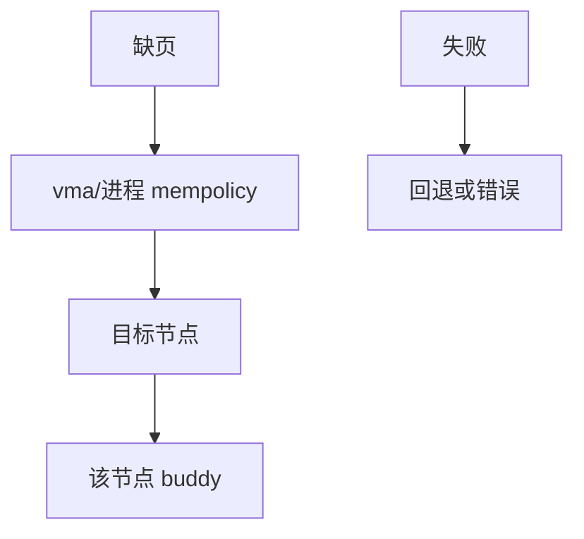

# NUMA 内存策略

mempolicy 决定缺页从哪个节点取框：本地、绑定、交错或首选，使带宽与延迟跟得上线程所在的 CPU。

<footer>—— 据 Linux numa(7)；Lameter 对 Linux NUMA 的论述；McKusick 对 UMA/NUMA 的背景</footer>

[上一课](/cs/zswap)留下的缺口接到本课。 [迁移](/cs/page-migration-compaction) 已能搬家。默认 first-touch 本地。多线程与文件页会打破「本地」。缺口是 **NUMA 策略**：`mbind`/`set_mempolicy`，不是主板拓扑百科。

## 问题

跨节点 load 延迟高、带宽走互联。策略：MPOL_BIND 失败则 OOM 或回退（MPOL_F_STRICT）；INTERLEAVE 打散带宽；PREFERRED 尽力。缺口：文件页共享——以谁的策略为准；自动 NUMA balancing 用缺页统计迁页迁任务；与 [THP](/cs/thp) 大页跨节点更贵。本课不把每代 AMD/Intel 互联名当课纲。

numactl 是用户接口。内核 per-vma policy 覆盖进程默认。设备 DMA 有自己的节点约束。

## 方法

缺页：查 vma policy → 选 nid → 在该 zone 分配，失败则回退列表。对照 [RSS](/cs/rss-multiqueue)：一个散包到 CPU，一个散页到节点。对照 [cgroup](/cs/cgroups)：cpuset 可限制节点集合，与 mempolicy 求交。

## 机制

策略把 NUMA 从「内核猜」变成应用可声明的放置。错误的 bind 会 OOM 而邻节点空闲。不要写成量化共址交易。与 [tmpfs](/cs/tmpfs)：shmem 页也走 policy。

自动平衡是启发式，可能与显式策略打架，生产上要选一边。

实现上：MPOL_BIND 在节点内存满时失败，任务可能 OOM 而邻节点空闲。自动 NUMA balancing 用探测缺页迁任务或页，和显式 mbind 冲突时要关一边。文件页的放置常跟第一次读的节点。 读法上只引用[上一课](/cs/zswap)的结论，不把对象换成训练推理或限价簿。

本课在操作系统进阶的「内存进阶 / 回收、迁移与加固」课序里，对象是 **NUMA 内存策略**。

- 先修只引用，不重导：上一课的结论当公理，本课只补差。
- 五栏不吞并：不把本课写成大模型训练/推理，也不写成限价簿或权重量化。
- 文献用 OSTEP、McKusick、内核文档与具名会议论文；不发明 arXiv 编号。

## 边界

本课不引入 CXL 内存分层的全部 demote。不保证实时优先级与 NUMA 回退的组合。下一课组级内存上限：memcg。

版本字段会变，课序钉的是机制对象「NUMA 内存策略」，不是某一主线内核的结构体名。
后课默认：缺页可按节点策略取框。cgroup 如何限制一组进程的内存，下一课 memcg。

## 小结

- mempolicy 选节点：绑定、交错、首选。
- 与 cpuset、自动平衡交互。
- memcg 是下一课。
- 出处：Linux `numa(7)`；Lameter；Gorman。
