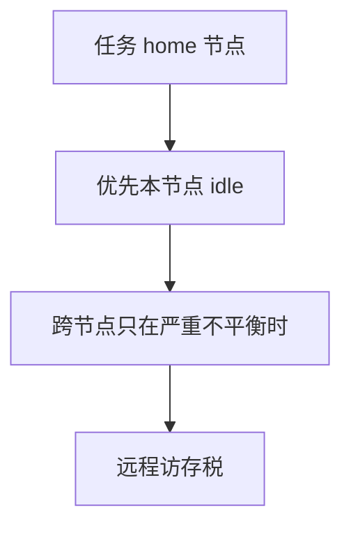

# NUMA 调度

任务跟着它的内存走往往比跟着闲核走更划算：远程访问的延迟可以吃掉一次「平衡」省下的排队时间。

<footer>—— 据 Hennessy and Patterson 对 NUMA 的讨论；Love, LKD 对调度域的整理</footer>

[上一课](/cs/cpu-affinity)给出 CPU 掩码。[互连与 NUMA](/cs/interconnect-numa) 已说明本地内存快、远程慢。[负载均衡](/cs/load-balance-migrate) 若只看队列长度，会把任务迁到「闲但内存全在另一节点」的核上。缺口是 **NUMA 感知调度**：负载分层（节点内先平衡），尽量在内存所在节点上跑。本课只钉这条启发，不写页迁移扫描器的全部。

## 问题

一次跨节点迁任务：TLB、cache 冷，而且之后每次缺页或命中都可能走互连。一次节点内迁核：税轻得多。调度域因此是树：SMT → 核 → 节点 → 机器。缺口不是再设一个亲和位，而是**平衡器比较负载时先看近层**，跨节点要更高的不平衡阈值。

首次分配内存的节点常由「当前 CPU 的节点」决定。任务若在 exec 后立刻被迁走，内存会落在错误节点——home node 策略试图避免这一点。

## 方法

记录任务的首选节点（home）。唤醒：优先同节点的 idle 核。周期性平衡：节点内积极，节点间保守。必要时迁页而非迁任务（或反过来），本课只承认两条路都存在，页迁移是虚存课。与 IRQ 亲和：网卡队列绑在节点上，处理线程也留在该节点。

实时任务：期限优先于 NUMA 启发；但 WCET 必须按远程情况给上界，否则 RM/EDF 纸面通过、板上失败。

## 机制

NUMA 调度把[调度指标](/cs/scheduling-metrics)里的「CPU 时间」说清楚：同样一毫秒，本地命中与远程命中做的有效工作不同。vruntime 仍按 CPU 时间记账，不按访存延迟折算——这是已知扭曲，完全公平并不等于等量工作。工程上用节点隔离来减小扭曲。

## 边界

本课不把 autoNUMA、平衡页扫描的参数当正文，不讨论 GPU 显存。也不把一致性协议再导一遍。同步课即将开始：多核上共享变量的交错，不能再假设单核关中断就够。

后课默认：跑哪颗核要看内存节点。多执行流同时改共享变量时何为正确，下一课讲[竞争与临界区](/cs/race-critical)。

## 小结

- NUMA 调度：节点内先平衡，任务尽量靠近其内存。
- 远程闲核不一定更优；vruntime 不反映访存税。
- 共享变量上的竞争是下一课。
- 出处：Hennessy and Patterson, *CA:AQA*；Love, *LKD*。
