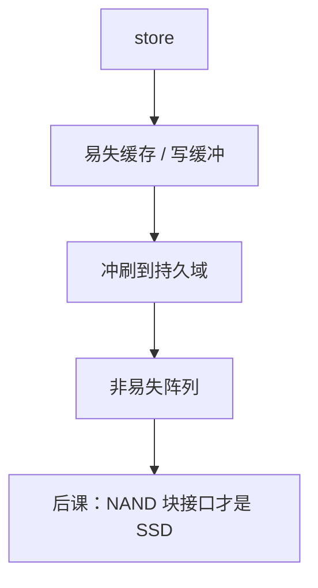

# 非易失内存与持久化

  
掉电仍在的介质可以挂在内存语义上，但写完成不等于持久：冲刷写队列、围栏与电源失效域，是另一套合同。

  <footer>—— 据 Hennessy and Patterson, CA:AQA；Intel/JEDEC 持久内存编程模型实践；Patterson and Hennessy, Computer Organization and Design 整理</footer>

[上一课](/cs/hbm-3d-stack)仍是易失 DRAM。[闪存对照](/cs/flash-memory)已说非易失不能当随机主存乱写。缺口是中间地带：**字节可寻址持久内存**（PCM、MRAM、3D XPoint 一类实践）挂在内存控制器上时，软件看见 load/store，崩溃一致性却要额外的冲刷。

## 问题

DRAM 掉电即忘，文件系统靠磁盘/闪存的块接口和 `fsync`。把非易失 DIMM 映射进物理地址，CPU 缓存与内存控制器写缓冲仍可能在易失侧。缺口不是再讲行缓冲，而是：**持久性域**从哪条围栏/冲刷指令开始算「已到非易失介质」。ADR/eADR 一类平台承诺不同，本课钉问题，不背某代 Intel 指令助记符表。

写延迟往往高于读，调度器不能照搬纯 FR-FCFS 读优先而不考虑写队列爆。

### 持久内存不是「更快的 SSD」

SSD 走块与 FTL（下两课）。字节地址持久内存走 load/store，但没有 DRAM 的对称延迟，也没有磁盘的块接口自动保证。把 `clflush` 当 `fsync` 而不理解失效域，数据库恢复会错。本栏不把这写成量化交易日志课。

CA:AQA 讨论存储级内存。SNIA NVM 编程模型区分持久堆与文件。本课用系统课语言：缓存、写缓冲、围栏。不发明 arXiv 号。

## 方法

软件：对持久对象更新、围栏、冲刷缓存行、再围栏。硬件：写结合缓冲要排空到持久域。掉电：电容把域内缓冲刷完（平台依赖）。ECC 与磨损：PCM 类有写磨损，控制器可能重映射，对软件可透明或暴露。

与 DRAM 通道可并存：易失主存 + 持久区，地址映射多分一段。

## 机制

下一课 NAND+FTL 是块设备主流实现，不提供 CPU 缓存行语义。本课防止把「非易失」三字在 HBM、闪存、持久 DIMM 之间划等号。fence 指令课在 ISA 对照会再遇到内存序，持久围栏是其超集需求。

## 边界

本课不保证某商用产品仍在市场，不写材料科学。不把文件系统日志算法写完。不进入光刻相变材料。

后课默认：字节持久内存要显式冲刷才能过崩溃；SSD 是另一条块接口路径。

## 小结

- 非易失阵列 ≠ 自动持久的 load/store。
- 缓存与写队列在易失域；围栏+冲刷定义持久点。
- 写慢、磨损、与 DRAM 异构共存。
- 出处：Hennessy and Patterson, CA:AQA；SNIA NVM 编程模型实践。
