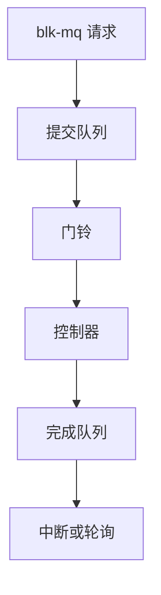

# NVMe 队列与驱动

NVMe 给每个核一对提交队列与完成队列：驱动把命令写进 SQ，门铃通知控制器，CQ 与 MSI-X 带回完成。

<footer>—— 据 NVM Express 基规范；Linux nvme 驱动文档</footer>

[上一课](/cs/blk-schedulers)可以把请求直通硬件队列。SCSI 时代一条深队列加锁；NVMe 把并行做成协议。缺口是 **NVMe 驱动**：队列对、门铃、PRP/SGL、与 blk-mq 的映射——不是闪存转换层内部。

## 问题

一次全局请求锁在百万 IOPS 上会死。NVMe：最多成千上万对队列，驱动按 CPU 或 blk-mq hctx 绑一对 SQ/CQ。提交：填 64 字节命令（读写、flush、admin），写门铃寄存器。完成：轮询或中断读 CQ，更新 blk 请求。缺口：admin 队列与 I/O 队列分离；命名空间当块设备；热插与重置。本课不把 NVMe-oF 的 RDMA 写完。

PRP 是页列表；SGL 更一般。写屏障后课才讲 FUA/NVMe flush。本课对象是队列与命令环。

## 方法

探测：PCI BAR、能力、创建 CQ/SQ。I/O：`nvme_queue_rq` 把 bio 译成命令，DMA 映射用户或页缓存页。完成路径：`nvme_irq` 或 poll 消费 CQ，`blk_mq_complete_request`。对照 SCSI：没有 SCSI 命令封装的 ATA 翻译层，少一次协议。对照 [设备节点](/cs/device-nodes)：`/dev/nvme0n1` 仍是块 inode。

## 机制

NVMe 把块设备从「一条 SCSI 管道」换成「每核私有环」，使软件调度器常常无事可做。CPU 亲和与 IRQ 亲和决定尾延迟。不要把本课写成闪存磨损均衡：那是盘内 FTL，OS 看见的是命名空间。

与 [sendfile](/cs/sendfile-splice)：页的 DMA 映射在这条路径上真正离开主机。

实现上：管理队列与 I/O 队列分开，重置命名空间走 admin。超时则驱动可 reset 整卡，影响该卡上所有命名空间。轮询队列要用户或 blk-mq 显式启用，不是默认 IRQ 路径。 读法上只引用[上一课](/cs/blk-schedulers)的结论，不把对象换成训练推理或限价簿。

本课在操作系统进阶的「存储栈 / 块层到设备」课序里，对象是 **NVMe 队列与驱动**。

- 先修只引用，不重导：上一课的结论当公理，本课只补差。
- 五栏不吞并：不把本课写成大模型训练/推理，也不写成限价簿或权重量化。
- 文献用 OSTEP、McKusick、内核文档与具名会议论文；不发明 arXiv 编号。

## 边界

本课不引入 ZNS 区重置的全部命令集。不保证每家厂商的私有 log page。下一课看仍主宰机械盘、磁带与部分 SSD 的旧栈：SCSI。

版本字段会变，课序钉的是机制对象「NVMe 队列与驱动」，不是某一主线内核的结构体名。
后课默认：NVMe 用成对队列提交命令。SCSI 中层与 LUN 如何接到同一块层，下一课。

## 小结

- NVMe 每核 SQ/CQ 加门铃；完成走 CQ。
- 命名空间呈现为块设备。
- SCSI 栈是下一课。
- 出处：NVMe Base Specification；Linux nvme；*OSTEP* 对 SSD 接口的背景。
