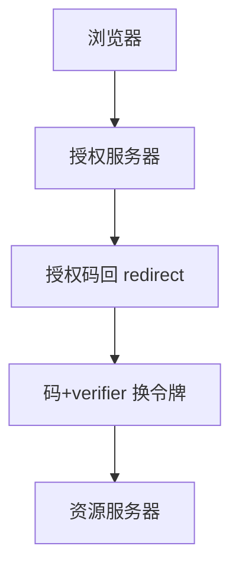

# OAuth 攻击面

OAuth 让客户端在用户同意下访问资源服务器，本身不是登录协议。重定向 URI、state、PKCE、混淆代理，决定这次同意是否被掉包。

<footer>—— RFC 6749；RFC 8252；RFC 6819；RFC 7636 PKCE</footer>

## 定位

上一课[会话](/cs/session-management)管第一方会话。缺口是**委托授权**：第三方拿到的是访问令牌，不是用户口令。把 OAuth 当登录要 OpenID Connect，本课先收授权码流的攻击面，不给钓鱼操作步骤。

后课默认已经读完本课钉下的合同，只补差，不从该领域第一性原理重开。

## 问题

开放重定向接 authorization code、缺 state 导致 CSRF 同意、公客户端缺 PKCE、令牌进 URL 日志、scope 过宽。缺口是重定向与客户端档案，不是再讲「社交登录」产品。

### access token 当会话

资源服务器要验 aud 与签名/内省。把令牌当不透明 cookie 乱存会回到 JWT 课的陷阱。

RFC 6819 威胁模型。PKCE 原为公客户端，现成建议默认。本课禁止配置恶意客户端的教程。

## 方法

按授权码流标检查点：注册精确 redirect_uri、state/nonce、PKCE、后信道 token、最小 scope。对照隐式流为何退出。SAML 下一课是企业里另一套 XML 委托。

图中节点是本课的机制骨架；课程不把图展开成可运行的攻击步骤。

## 机制

委托把身份提供者做成 TCB。失败在绑定：码与客户端、码与 redirect、令牌与 aud。下一课 SAML：断言与 XML 包装的同类绑定问题。

前提写进合同之后，游戏外的误用只当失败模式点名，不在本课写成操作程序。

## 边界

本课不写全部 grant 类型。SAML 下一课。

## 小结

- 会话是第一方；OAuth 是委托。
- redirect、state、PKCE、scope 是合同。
- OAuth≠登录；OIDC 才带身份令牌。
- 下一课 SAML。
- 出处：RFC 6749；RFC 6819；RFC 7636；RFC 8252。
