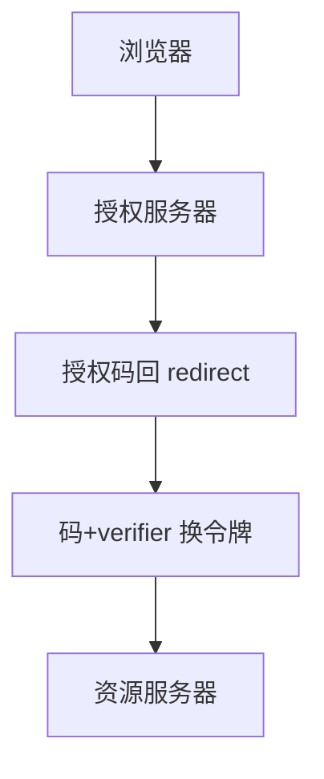

# OAuth 攻击面

OAuth 让客户端在用户同意下访问资源服务器，本身不是登录协议。重定向 URI、state、PKCE、混淆代理，决定这次同意是否被掉包。

<footer>—— RFC 6749；RFC 8252；RFC 6819；RFC 7636 PKCE</footer>

上一课[会话](/cs/session-management)管的是第一方会话。本课补**委托授权**：第三方应用拿到的应是访问令牌，而不是用户口令。注意 OAuth 本身不是登录协议，当登录用需要 OpenID Connect。本课先收授权码流的攻击面，不给钓鱼操作步骤。

后课默认已经读完本课钉下的合同，只补差，不从该领域第一性原理重开。

## 问题

把攻击面按授权码流的环节数下来：授权服务器的重定向端点若接受外部 URL，授权码就送到攻击者手里；缺 state，浏览器会在用户不知情下替攻击者完成「同意」，属 CSRF 式绑定；公客户端（存不住密钥）缺 PKCE，被截的码可换令牌；令牌进了 URL 前段就落进日志与 Referer；scope 给得过宽，一次泄漏等于全部权限。缺口集中在重定向与客户端档案两处，不是再讲「社交登录」产品。

### access token 当会话

常见误用是把 access token 当会话。资源服务器必须验 aud 与签名（或走内省端点），确认令牌真是发给自己的；把令牌当不透明 cookie 到处存，会回到 JWT 课的陷阱——但没有那课的验签纪律。

RFC 6819 威胁模型。PKCE 原为公客户端，现成建议默认。本课禁止配置恶意客户端的教程。

## 方法

方法是把检查点钉在流的每一环：客户端注册时 redirect_uri 精确匹配；授权请求带 state，OIDC 再加 nonce；公客户端一律 PKCE；令牌交换走后信道，不经过前端；scope 按需最小授予。对照隐式流为何退出：它把令牌直接放进 URL 前段，泄漏面无法收敛，已被 OAuth 2.1 弃用。SAML 下一课，是企业里另一套 XML 委托。

```mermaid
flowchart TD
  UA["浏览器"] --> AS["授权服务器"]
  AS --> CODE["授权码回 redirect"]
  CODE --> PKCE["码+verifier 换令牌"]
  PKCE --> RS["资源服务器"]
```

## 机制

机制上，委托把授权服务器做成了 TCB：客户端不再经手口令，但每一处绑定都要对准——授权码绑定到发起的客户端（PKCE/state）、码只能配注册过的 redirect、令牌绑定到预期 aud。三处绑定任一松弛，「同意」就被掉包。下一课 SAML：断言与 XML 包装是同类绑定问题。

## 边界

本课不写全部 grant 类型，设备流、客户端凭证从略。SAML 下一课。

## 小结

- 会话管第一方，OAuth 管第三方委托。
- redirect_uri、state、PKCE、scope 是四条合同线。
- OAuth 不是登录；带身份令牌的是 OIDC。
- 下一课 SAML。
- 出处：RFC 6749；RFC 6819；RFC 7636；RFC 8252。
