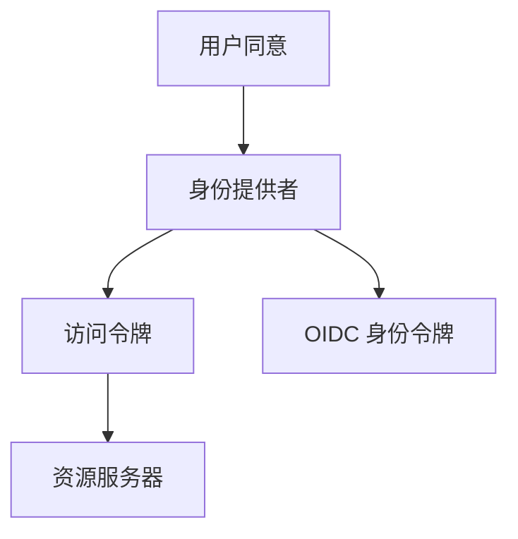

# OAuth / OIDC 入口

OAuth 让用户把对某 API 的有限访问委托给客户端，而不交出账号口令；OIDC 在其上加一层身份令牌。

<footer>—— 据 RFC 6749 OAuth 2.0；OpenID Connect 核心；Anderson 对委托的整理</footer>

[上一课](/cs/kerberos)用 KDC 票据做域内 SSO。本课不重画 TGT。缺口是开放互联网：第三方应用要读用户在另一服务上的数据，不能把用户口令交给第三方。OAuth 发访问令牌；OIDC 的 ID Token 回答「是谁」。访问控制矩阵下一课。

## 问题

Kerberos 假设共享的组织 KDC。Web 上身份提供者、资源服务器、客户端是不同主体。浏览器重定向完成用户同意。缺口是**委托与认证分层**：OAuth 本意是授权，OIDC 把认证声明做成 JWT 一类令牌。本课不把全部 grant 类型写成百科，只钉授权码直觉与令牌不是口令。

把访问令牌当万能 Cookie 会破坏最小特权。PKCE 约束公共客户端，是防御合同，不是攻击说明。

## 方法

授权码：客户端把用户送到 IdP，用户同意后客户端用码换令牌，资源服务器验令牌。OIDC：额外得到 ID Token，应用读身份声明。TLS 保护重定向与换票。本课不实现某家登录按钮。

## 机制

口令只进 IdP；客户端持有限范围令牌。这是[最小特权](/cs/acl-least-priv) 在 Web 上的一种实现。令牌泄露的影响面是范围与期限，故要短寿命与绑定。后课 ACL 决定资源服务器内部谁能碰哪一行。

## 边界

本课不把 SAML 插成第二条主干。登录成功之后对象上的权限如何表示，下一课访问控制。

后课默认：Web 委托用令牌。客体上的允许集合是保护矩阵。

## 小结

- OAuth 委托访问；OIDC 附加身份声明。
- 第三方不应拿到用户长期口令。
- 访问控制下一课。
- 出处：RFC 6749；OpenID Connect；Anderson。
