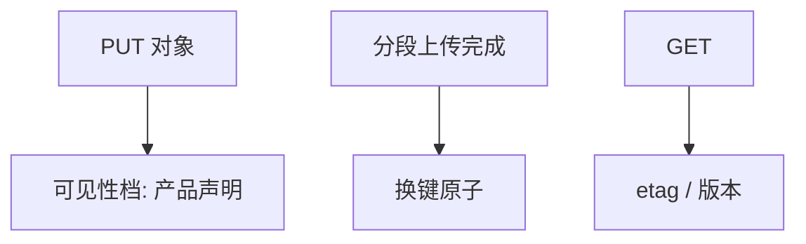

# S3 对象存储语义

对象是不可改字节的 PUT/GET，键空间扁平。成功 PUT 的可见性曾是最终一致，后来读己之写加强，仍不是任意并发的线性一致文件。

<footer>—— 据 Amazon S3 公开一致性声明的演进；对象存储与 POSIX 对照整理</footer>

上一课[GFS](/cs/gfs-hdfs)是层次文件与可追加块。缺口是**另一种 API**：整对象替换、HTTP、无限键。本课钉对象语义与一致性档，不把 AWS 商业条款当定理。后课分布式文件元数据对比「目录与 inode」为什么更难。

## 问题

对象：不可部分改（除了分段上传合成）。覆盖 PUT 是新世代。列表、覆盖、删除的交错曾出现「旧对象仍 GET 到」。2015 年后许多区域对新 PUT 提供 read-after-write；2020 年 Amazon 宣布强一致列表与覆盖——工程演进，应用仍须读当前文档，本课记：**对象存储的 C 是产品档，不是 POSIX mtime 定理**。

分段上传：完成前部分不可见；完成是原子换对象。并发两个 PUT 同一键：谁赢取决于服务的并发控制，不要假设与墙钟一致。

不要发明内部论文编号。公开设计谈话与产品文档是对象课的文献；内部 Dynamo 论文讲的是键值，不是 S3 API 全文。

## 方法

用 etag/版本号做条件写，接 fencing 思路。列表分页会在并发更新下漏或重，若要精确目录用自己的索引（元数据课）。不要把 S3 当 NFS。

与[最终一致](/cs/eventual-consistency)：旧 S3 列表是最终；新声明更强，跨区域复制仍常异步——地理复制后课。

## 机制

吞吐：大对象并行分段。小对象海量：元数据与 QPS 成为账单与限流，不是块大小 64MB 能救。与 GFS 主：对象存储把命名空间做成可水平扩展的索引，避免单 NameNode，代价是目录 listing 的规格更弱或更贵。

本课不写 Glacier 归档。也不写 Transformer 权重文件——那是另一栏，这里只是 blob。

失败：PUT 超时后可能已成功，重试无幂等键会双对象（不同键）或同一键覆盖。分段上传要 abort 孤儿。接[幂等键](/cs/idempotency-keys)与[RPC](/cs/rpc-semantics)。

## 边界

本课不保证某云某日的一致性句子永远真，要读当时文档。后课默认：整对象原子替换；跨对象事务没有；listing 与跨区是弱档除非声明。下一课回到有目录树时元数据如何分片。

API 比文件系统简单，简单换来扩展；复杂语义要自己做。

## 小结

- 对象 PUT 替换；分段完成才原子可见。
- 一致性档随产品演进，跨区复制仍常异步。
- 条件写用 etag；超时重试要当可能已成功。
- 出处：S3 公开一致性声明；对照 GFS POSIX 差距。
